# Product Requirements Document (PRD)
## Event-Based Matchmaking Platform

**Last Updated:** 2025-10-31  
**Version:** 3.1 - Matchmaking UX & Date Format Updates  
**Status:** Pre-Launch Ready

---

## Table of Contents
1. [Product Overview](#product-overview)
2. [Core Features](#core-features)
3. [Page-by-Page Functionality Guide](#page-by-page-functionality-guide)
4. [User Roles & Permissions](#user-roles--permissions)
5. [Database Schema](#database-schema)
6. [Database Functions](#database-functions)
7. [Row-Level Security Policies](#row-level-security-policies)
8. [User Flows](#user-flows)
9. [Technical Architecture](#technical-architecture)
10. [Internationalization](#internationalization)
11. [UI/UX Design System](#uiux-design-system)
12. [Feature Status Matrix](#feature-status-matrix)
13. [Future Roadmap](#future-roadmap)
14. [Security Considerations](#security-considerations)
15. [Pre-Launch Checklist](#pre-launch-checklist)
16. [Appendix](#appendix)

---

## Product Overview

### Vision
An event-based matchmaking platform that enables hosts to create exclusive dating/networking events where attendees can browse profiles, swipe on potential matches, and connect with mutual interests.

### Core Value Proposition
- **For Event Hosts:** Create and manage dating/networking events with full control over attendee matching, scheduling, and guest limits
- **For Attendees:** Discover potential matches within curated, event-specific communities with scheduled matchmaking windows
- **Unique Features:** Host-facilitated introductions, time-gated intro requests, event-scoped matching, privacy-first design, scheduled matchmaking, event images, hidden events, internationalization

### Target Users
1. **Event Hosts:** Individuals or organizations creating matchmaking events (weddings, parties, social gatherings)
2. **Event Attendees:** Users joining events to meet potential matches
3. **Matched Users:** Pairs who have mutually liked each other or been introduced by hosts

---

## Core Features

### 1. Authentication & User Profiles

#### Authentication
- **Email/Password Authentication** with auto-confirmation
- **Social Authentication:** Google OAuth (single sign-on option)
- **Multi-language Support:** English and Spanish available
- **Settings Page:** Dedicated account management interface

#### Profile Management
- Name, age, gender, bio
- Multiple photo uploads (up to 6, enforced via DB constraint)
- Custom interests (tags)
- Custom prompts (Q&A format, max 3)
- Theme preference (sunset/dark modes)
- Interested in (men/women/both)
- Age preferences (min/max range)
- **Profile Photo Storage:** Private cloud storage in `profile-photos` bucket with signed URLs
- **Image Cropping:** Built-in image crop functionality for profile photos

#### Account Management (Settings Page)
- Change email address
- Change password
- Language switcher (English/Spanish)
- Logout functionality
- Professional card-based layout

### 2. Event Management

#### Event Creation & Editing
- Event name and description
- **Event cover image** with upload and crop functionality
- Event date (cannot be set to past dates)
- **Matchmaking scheduling:**
  - "When should matchmaking open?" dropdown with options:
    - Opens when event is created (default: "1 week before")
    - 1 day before event
    - 1 week before event
    - 2 weeks before event
    - Custom date and time
  - Matchmaking close date (separate from event close date)
  - **Matchmaking Open Date Display:** Shows calculated opening date/time with notification reminder
- Close date (auto-calculated: 3 days after event date)
- Invite code generation (unique per event)
- Status management (draft/active/closed via date-based calculation)
- **Pricing Plans:** Free (up to 10 guests) or Premium (unlimited guests)
- **Draft System:** Auto-save events as drafts during creation
- **Edit Functionality:** Hosts can edit all event details including image
- **Date Validation:** Prevents setting event dates in the past

#### Event Discovery & Joining
- Join via invite code
- Join via shareable link with preview
- View event details before joining
- Side selection for coupled events (bride/groom, etc.)
- Guest count display
- Event image preview
- **Auto-Close Enforcement:** Events automatically close after `close_date`
- **Guest Limits:** Free plan limited to 10 guests, Premium unlimited

#### Event Dashboard
**Tabbed Interface:**
- **Guests Tab:** 
  - View all attendees with avatars
  - Guest count display
  - Remove guest functionality (host only)
  - Real-time guest list updates
- **Stats Tab:**
  - Total matches count
  - Total swipes count
  - Match rate percentage
  - Visual charts and metrics
- **Settings Tab:**
  - Edit event details
  - Upload/change event image
  - Close event manually
  - Upgrade to premium plan

**Host Actions:**
- Edit event name, description, date, image
- View comprehensive event statistics
- Manage guest list
- Remove attendees (with cascade delete)
- Upgrade event plan
- Close event

### 3. Home Page - Event Management Dashboard

#### Tabbed Interface
**Two tabs with distinct functionality:**

1. **I'm Attending Tab:**
   - Shows events the user has joined
   - Event cards with:
     - Event name and date
     - Event cover image
     - Status badge (Draft/Active/Closed) - color-coded
     - Invite code (if not draft)
     - Host name
     - Navigation to matchmaking/event details
   - Filter by status (All/Draft/Active/Closed)
   - Sort by (Name/Date/Status)
   - Selection mode for bulk operations
   - Hide/unhide events toggle
   - Leave event functionality

2. **I'm Hosting Tab:**
   - Shows events the user created
   - Event cards with same layout PLUS:
     - **Guest count preview** (e.g., "5 guests")
     - Users icon with count
   - Edit event navigation
   - Same filter and sort options

#### Actions & Features
- **Create Event:** Floating action button (FAB) with gradient styling
- **Hide Events:** Bulk hide/unhide events from view
- **Selection Mode:** Multi-select cards for batch operations
- **Filter & Sort:** Dynamic filtering and sorting controls
- **Leave Event:** Exit events with optional reason
- **Status Calculation:** Real-time status based on dates
- **Empty States:** Friendly messages when no events exist

#### Status Badge Logic
- **Draft** (Yellow): No date set or event not finalized
- **Active** (Green): Current date ≤ close_date
- **Closed** (Red): Current date > close_date

### 4. Matchmaking System

#### Scheduled Matchmaking
- **Matchmaking Start Date/Time:** Events can schedule when matchmaking opens
- **Matchmaking Close Date:** Separate from event close date
- **Countdown Timer:** Shows time until matchmaking opens for upcoming events
- **Event Selection Dialog:** Modal to switch between multiple events with:
  - "Live Now" section (currently active matchmaking)
  - "Upcoming" section (future matchmaking events)
  - "Past" section (closed events)
  - Profile count per event
  - Status indicators
  - Date-based categorization

#### Swipe Mechanism
- **Card-based interface** for browsing profiles
- **Left/Right swiping** (pass/like) with ENUM validation
- **Undo Last Swipe:** 5-second window to undo last swipe action (deletes swipe record, reverts profile)
- **Event-scoped:** Only see profiles from selected event
- **Event Switching:** Select from multiple events via dialog
- **Match Creation:** Automatic match when mutual right swipes occur (orderless pair uniqueness)
- **Profile Details:** View photos, bio, age, interests, prompts
- **Block Filter:** Blocked users excluded from swipe decks
- **Matchmaking Schedule Protection:** Swiping blocked before start time or after close date
- **Profile Count Display:** Shows available profiles per event

#### Match Management
- View all matches
- Access match chat threads
- See match creation date
- Match tied to specific event
- **Orderless Uniqueness:** Prevents duplicate matches (A,B) and (B,A)
- **Unmatch Functionality:** Users can unmatch with reason tracking
- **Report Functionality:** Report inappropriate behavior

### 5. Messaging System
- **Match-based Messaging:** Only matched users can message
- **Real-time Messaging:** Instant message delivery via Supabase Realtime
- **Message Status:** Created timestamp, read status
- **Host Introduction Messages:** Host can send initial intro message when facilitating matches
- **Thread View:** Chronological message display with sender identification
- **Read-Only Updates:** Recipients can only mark messages as read (content immutable)
- **Unmatch with Cascade:** Unmatching deletes all messages
- **Report with Unmatch:** Reporting auto-unmatches and deletes messages

### 6. "Liked You" Feature
- View users who have right-swiped you
- See their profile information
- Make decision to match or pass
- Event-scoped visibility
- **Block Filter:** Blocked users excluded from liked you list
- Like/Unlike actions
- Pass functionality

### 7. Event Image Management (NEW FEATURE)

#### Image Upload & Storage
- **Event Cover Images:** Upload during creation or edit
- **Image Cropping:** Built-in crop dialog for perfect framing
- **Public Storage:** `event-photos` bucket with public access
- **Supported Formats:** JPEG, PNG, WebP
- **Display Locations:**
  - Event cards on home page
  - Event dashboard header
  - Join event preview
  - Matchmaking event selection

#### Image Actions
- Upload new image during event creation
- Replace existing image in edit mode
- Crop image before saving
- Remove image (revert to default)
- **File Structure:** `{event_id}/{filename}`

### 8. Hidden Events Feature (NEW FEATURE)

#### Functionality
- **Hide/Unhide Events:** Users can hide events from their event list
- **Selection Mode:** Bulk hide/unhide multiple events at once
- **Toggle Display:** Hidden events toggle shows/hides hidden events
- **Persistence:** Hidden status stored per user in `hidden_events` table
- **UI Indicators:** Visual distinction for hidden events when toggle is on

#### Use Cases
- Clean up event list without leaving events
- Temporarily hide old/closed events
- Organize active vs past events
- Maintain event membership while reducing clutter

### 9. Event Departure System (NEW FEATURE)

#### Leave Event Functionality
- **Optional Reason:** Users can provide reason for leaving
- **Cascade Delete:** Automatically removes:
  - Attendee record
  - All swipes for that event
  - All matches in that event
  - All messages from those matches
  - All intro requests
- **Audit Trail:** Departures logged in `event_departures` table
- **Host Visibility:** Hosts can view departure logs
- **Privacy:** User's profile hidden from event after departure

### 10. Unmatch & Report System (NEW FEATURES)

#### Unmatch Transaction
- **Reason Required:** User selects reason for unmatching
- **Optional Description:** Additional details (max 500 chars)
- **Atomic Transaction:** Via `unmatch_user_transaction()` function
  - Creates unmatch record
  - Deletes swipe (allows re-swiping)
  - Deletes all messages
  - Deletes match
  - Logs action in audit_logs
- **Validation:** UUID format validation, user verification
- **Idempotent:** Duplicate unmatch prevention

#### Report Transaction
- **Report Reasons:** Predefined reasons (inappropriate, harassment, etc.)
- **Custom Reason:** Optional detailed explanation
- **Atomic Transaction:** Via `report_user_transaction()` function
  - Creates report record
  - Automatically unmatches users
  - Deletes swipe
  - Deletes messages
  - Deletes match
  - Logs in audit_logs
- **Moderation:** Reports visible to event hosts
- **Safety:** Immediate separation of reported users

### 11. Safety & Moderation

#### Blocking System
- Users can block others (bi-directional prevention)
- Blocked users excluded from:
  - Swipe decks
  - Liked you lists
  - Profile searches
  - Event interactions
- **Block Table:** Tracks all block relationships

#### Reporting System
- Report users with reason
- Custom details option
- Event context included
- **Reports Table:** Stores all moderation reports
- Host visibility for event-related reports
- Automatic unmatch on report

#### Audit System (NEW)
- **Audit Logs Table:** Tracks all moderation actions
- Logged actions:
  - Unmatches with reason
  - Reports with details
  - Attendee removals
- Event hosts can review audit logs
- Actor/target tracking
- Metadata support for additional context

---

## Page-by-Page Functionality Guide

### Authentication Page (`/auth`)

#### UI Elements
- Email input field
- Password input field
- "Sign In" button
- "Sign Up" button
- Google OAuth button
- Language switcher (top-right)
- Logo and branding

#### Actions
1. **Sign In:**
   - Input: Email + Password
   - Result: Authenticate user → Redirect to `/`
   - Error: Display toast with error message

2. **Sign Up:**
   - Input: Email + Password
   - Result: Create account → Auto-create profile → Redirect to `/edit-profile`
   - Error: Display validation errors

3. **Google Sign In:**
   - Input: Click Google button
   - Result: OAuth flow → Create/login → Redirect to `/`

4. **Switch Language:**
   - Input: Select language from dropdown
   - Result: UI updates to selected language (persisted in localStorage)

#### Design
- Gradient background from design system
- Card-based form with shadow
- Primary button variant for submit
- Ghost button variant for secondary actions

#### Navigation
- Success → Home page (`/`)
- New user → Edit Profile page (`/edit-profile`)

---

### Home Page (`/`)

#### UI Elements
**Header:**
- Konfetti logo (themed: black for sunset, white for dark)
- Page title: "My Events"
- Language switcher button
- Theme toggle button

**Tabs:**
- "I'm Attending" tab
- "I'm Hosting" tab

**Controls (per tab):**
- Filter dropdown (All Events / Draft / Active / Closed)
- Sort dropdown (Name / Date / Status)
- Selection mode toggle (shows checkboxes)
- Hidden events toggle (I'm Attending only)
- FAB (Floating Action Button) - Create Event

**Event Cards:**
- Event cover image (if set)
- Event name
- Event date
- Status badge (Draft/Active/Closed with colors)
- Invite code (non-draft events)
- Host name (Attending tab)
- Guest count (Hosting tab): "{count} guest(s)" with Users icon
- Checkbox (selection mode)
- Click area for navigation

**Bulk Actions Bar (selection mode):**
- "Hide Selected" button (Attending tab)
- "Unhide Selected" button (when hidden toggle on)
- "{count} selected" counter

**Empty States:**
- "No events found" with friendly message
- Create event prompt

#### Actions

1. **Create Event (FAB Click):**
   - Input: Click floating action button
   - Result: Navigate to `/create-event`
   - UI: Gradient-styled FAB in bottom-right

2. **View Event Details (Card Click):**
   - Input: Click event card
   - Result: 
     - Attending tab → Navigate to `/matchmaking?eventId={id}` (if active)
     - Attending tab → Navigate to `/join-event/{id}` (if draft/closed for info)
     - Hosting tab → Navigate to `/event-dashboard/{id}`

3. **Filter Events:**
   - Input: Select filter option (All/Draft/Active/Closed)
   - Result: Filter events in current tab by status
   - UI: Dropdown with muted styling

4. **Sort Events:**
   - Input: Select sort option (Name/Date/Status)
   - Result: Re-order events in current tab
   - UI: Dropdown with muted styling

5. **Enter Selection Mode:**
   - Input: Toggle selection mode
   - Result: Show checkboxes on all cards + bulk actions bar
   - UI: Toggle button with icon

6. **Select/Deselect Events:**
   - Input: Click card checkboxes in selection mode
   - Result: Add/remove from selection → Update counter
   - UI: Checkbox overlay on cards

7. **Hide Selected Events:**
   - Input: Click "Hide Selected" in bulk actions
   - Result: Insert records to `hidden_events` → Hide cards from view
   - Success: Toast notification
   - UI: Destructive button variant

8. **Toggle Hidden Events:**
   - Input: Click hidden events toggle
   - Result: Show/hide events in `hidden_events` table
   - UI: Toggle switch (Attending tab only)

9. **Unhide Events:**
   - Input: Select hidden events → Click "Unhide Selected"
   - Result: Delete from `hidden_events` → Show in main view
   - Success: Toast notification

10. **Leave Event:**
    - Input: Long-press or context menu → Select "Leave Event"
    - Result: Show confirmation dialog with optional reason
    - Confirmation: Call `event_departures` insert → Remove attendee record
    - Success: Toast + remove card from view
    - UI: Destructive action with confirmation

11. **Switch Tabs:**
    - Input: Click "I'm Attending" or "I'm Hosting"
    - Result: Load and display respective events
    - UI: Tab highlights, smooth transition

#### Design
- **Status Badges:**
  - Draft: Yellow background, dark text
  - Active: Green background, white text
  - Closed: Red background, white text
- **Event Cards:**
  - `shadow-card` class for elevation
  - `hover-lift` for interaction feedback
  - Border on selection
  - Gradient border for selected cards
- **FAB:**
  - Gradient background from design system
  - Fixed bottom-right positioning
  - Plus icon
  - Elevation shadow
- **Bulk Actions Bar:**
  - Fixed bottom positioning
  - Gradient background
  - White text
  - Slide-up animation

#### Navigation
- Card click → `/matchmaking?eventId={id}` (attending, active)
- Card click → `/event-dashboard/{id}` (hosting)
- FAB click → `/create-event`
- Leave event → Removes from list (stays on page)

---

### Create/Edit Event Page (`/create-event`)

#### UI Elements
**Form Fields:**
- Event name input
- Event description textarea
- Event date picker (min: today)
- Event image upload area
- "When should matchmaking open?" dropdown (default: "1 week before")
  - Opens when event is created
  - 1 day before event
  - 1 week before event
  - 2 weeks before event
  - Custom date and time (shows date/time pickers)
- Matchmaking open date display (calculated, with notification text)
- Matchmaking close date picker
- Plan selection (Free/Premium)
- "Create Event" / "Save Changes" button
- "Cancel" button

**Image Upload Section:**
- Image preview (if set)
- "Upload Image" button
- "Remove Image" button (if image exists)
- Crop dialog trigger

**Plan Cards:**
- Free Plan: Up to 10 guests, basic features
- Premium Plan: Unlimited guests, $299

#### Actions

1. **Upload Event Image:**
   - Input: Click upload button → Select image file
   - Result: Open crop dialog → Crop image → Upload to `event-photos` bucket → Set `image_url`
   - Success: Show preview
   - UI: Image preview with rounded corners

2. **Crop Event Image:**
   - Input: Adjust crop area in dialog
   - Result: Generate cropped image → Save
   - UI: Modal dialog with crop controls

3. **Remove Event Image:**
   - Input: Click remove button
   - Result: Set `image_url` to null → Remove preview
   - UI: Confirmation dialog

4. **Select Event Date:**
   - Input: Click date picker → Select date
   - Validation: Cannot select past dates (min: today)
   - Result: Set `date` → Auto-calculate `close_date` (+3 days)
   - Error: "Cannot set event date in the past"

5. **Set Matchmaking Schedule:**
   - Input: Select option from "When should matchmaking open?" dropdown
   - Options: Event creation / 1 day before / 1 week before / 2 weeks before / Custom
   - Default: "1 week before"
   - Result: Calculate and display matchmaking start date/time, show notification text
   - Custom: Reveals date/time pickers for manual selection
   - Validation: Start < Close, logical ordering
   - UI: Dropdown with conditional date/time pickers, calculated date display

6. **Select Plan:**
   - Input: Click Free or Premium card
   - Result: Highlight selected plan → Set `plan` field
   - UI: Card with border highlight, checkmark

7. **Create Event:**
   - Input: Fill form → Click "Create Event"
   - Validation: Required fields (name, date)
   - Result: Insert to `events` → Generate invite code → Navigate to `/event-dashboard/{id}`
   - Success: Toast notification
   - Error: Display validation errors

8. **Edit Event (Edit Mode):**
   - Input: Modify fields → Click "Save Changes"
   - Validation: Same as create + no past dates
   - Result: Update `events` table → Refresh event data
   - Success: Toast notification
   - Navigation: Return to `/event-dashboard/{id}`

9. **Cancel:**
   - Input: Click cancel button
   - Result: Navigate back (history) or to `/`
   - UI: Secondary button variant

10. **Upgrade Plan (Free → Premium):**
    - Input: Click "Upgrade to Premium"
    - Result: Navigate to Stripe checkout flow
    - Return: After payment → Update `plan` to premium
    - Success: Toast + unlock unlimited guests

#### Design
- **Form Layout:** Card-based with sections
- **Image Upload:** Dashed border, hover effect
- **Plan Cards:** Grid layout, border on selection
- **Date Pickers:** Calendar UI, disabled past dates
- **Buttons:** Primary for submit, ghost for cancel

#### Navigation
- Success → `/event-dashboard/{id}` (new event)
- Cancel → Return to previous page
- Edit mode → Back to event dashboard

---

### Event Dashboard Page (`/event-dashboard/:id`)

#### UI Elements
**Header:**
- Event cover image (large, hero-style)
- Event name (editable)
- Event date (editable)
- Edit mode toggle button
- Back button

**Tabs:**
- Guests tab
- Stats tab
- Settings tab

**Guests Tab:**
- Guest count: "{count} Guests"
- Guest grid with avatars
- Guest name labels
- Remove button per guest (host only)
- Empty state

**Stats Tab:**
- Total Matches card with count
- Total Swipes card with count
- Match Rate card with percentage
- Visual charts (if implemented)
- Event metrics

**Settings Tab:**
- Edit event details section
- Invite code display with copy button
- Guest limit indicator (Free: "5/10 guests")
- Upgrade to Premium CTA (Free plans only)
- Close Event button (destructive)

#### Actions

1. **Enter Edit Mode:**
   - Input: Click edit button
   - Result: Enable inline editing for name, description, date, image
   - UI: Input fields replace display text, save/cancel buttons appear

2. **Edit Event Name:**
   - Input: Type new name in edit mode
   - Result: Update field value
   - Validation: Required, max 100 chars

3. **Edit Event Description:**
   - Input: Type new description
   - Result: Update field value
   - Validation: Max 500 chars

4. **Edit Event Date:**
   - Input: Select new date from picker
   - Validation: Cannot set to past dates (min: today)
   - Result: Update `date` → Recalculate `close_date`
   - Error: Toast if validation fails

5. **Upload/Change Event Image:**
   - Input: Click image → Upload new file
   - Result: Open crop dialog → Crop → Upload to storage → Update `image_url`
   - Success: Preview updated

6. **Save Changes:**
   - Input: Click "Save" in edit mode
   - Result: Update `events` table → Exit edit mode → Refresh display
   - Success: Toast notification

7. **Cancel Edit:**
   - Input: Click "Cancel" in edit mode
   - Result: Discard changes → Exit edit mode

8. **Remove Guest:**
   - Input: Click remove icon on guest card
   - Confirmation: "Remove {name} from event?"
   - Result: Call `remove_attendee_cascade()` → Delete attendee + cascade data
   - Success: Toast + remove from guest list
   - UI: Confirmation dialog, destructive action

9. **Copy Invite Code:**
   - Input: Click copy button next to invite code
   - Result: Copy code to clipboard
   - Success: Toast "Code copied!"
   - UI: Copy icon button

10. **Upgrade to Premium:**
    - Input: Click "Upgrade to Premium" button (Settings tab)
    - Result: Navigate to `/create-event?upgrade={id}` → Stripe checkout
    - Return: Update `plan` → Unlock unlimited guests
    - Success: Toast notification

11. **Close Event:**
    - Input: Click "Close Event" (Settings tab)
    - Confirmation: "This will end matchmaking. Continue?"
    - Result: Update `status` to 'closed' → Stop matchmaking
    - Success: Toast + UI updates
    - UI: Destructive button, confirmation dialog

12. **Switch Tabs:**
    - Input: Click Guests/Stats/Settings tab
    - Result: Display tab content
    - UI: Tab highlight, smooth content transition

#### Design
- **Hero Image:** Full-width event cover with overlay for name
- **Edit Mode:** Inline fields with save/cancel buttons
- **Guest Grid:** Responsive grid, avatar + name
- **Stat Cards:** Card layout with numbers, icons, colors
- **Tabs:** Underline indicator, smooth transition
- **Buttons:** Primary for save, destructive for remove/close

#### Navigation
- Back button → `/` (home)
- Upgrade → Stripe checkout → Return to dashboard
- Close event → Stays on dashboard (updates UI)

---

### Matchmaking Page (`/matchmaking`)

#### UI Elements
**Header:**
- Current event name (clickable to switch)
- Event selection button
- Profile count: "{count} profiles available"
- Back button
- Undo button (5-second window)

**Event Selection Dialog:**
- Modal title: "Select Event"
- Three sections:
  - "Live Now" - Active matchmaking events
  - "Upcoming" - Future events with countdown
  - "Past" - Closed/past events
- Per event card:
  - Event name
  - Event date
  - Profile count
  - Status indicator
  - Countdown timer (upcoming)
- Close button

**Main Content:**
- **If Before Matchmaking Start:**
  - Countdown timer to start
  - Message: "Matchmaking opens in..."
  - Days, hours, minutes, seconds display
  
- **If Active Matchmaking:**
  - Profile card (large, centered)
  - Profile photos carousel
  - Profile name, age
  - Bio
  - Interests (pills)
  - Prompts (Q&A)
  - Swipe buttons (left/right)
  
- **If After Close Date:**
  - Message: "Matchmaking has closed"
  - No swiping available

**Swipe Controls:**
- Left button (Pass) - Red, X icon
- Right button (Like) - Green, Heart icon
- Undo button (top) - Only visible for 5 seconds after swipe

**Empty State:**
- "No more profiles" message
- Return home button

#### Actions

1. **Open Event Selection:**
   - Input: Click event name or selection button
   - Result: Open modal with event list
   - UI: Slide-up modal animation

2. **Switch Event:**
   - Input: Click event in selection dialog
   - Result: Change `eventId` query param → Reload profiles for new event → Close modal
   - Success: Toast "Switched to {event name}"
   - UI: Highlight selected event

3. **View Countdown (Upcoming Event):**
   - Input: Automatic display if before start time
   - Result: Real-time countdown timer
   - UI: Large timer display with labels
   - Updates: Every second

4. **Swipe Left (Pass):**
   - Input: Click left button or swipe gesture left
   - Validation: Matchmaking must be active (start ≤ now < close)
   - Result: Insert swipe (direction: 'left') → Load next profile → Start 5s undo timer
   - Error: "Matchmaking not active" if outside window
   - UI: Card slides left, fade out

5. **Swipe Right (Like):**
   - Input: Click right button or swipe gesture right
   - Validation: Matchmaking must be active
   - Result: Insert swipe (direction: 'right') → Check for mutual match → Load next profile → Start undo timer
   - Match: Show FullScreenMatchDialog with confetti
   - UI: Card slides right, fade out

6. **Undo Last Swipe:**
   - Input: Click undo button (within 5 seconds)
   - Result: Delete last swipe record → Reload previous profile
   - Success: Toast "Swipe undone"
   - UI: Undo button visible for 5s, then fade out
   - Disabled: After 5 seconds

7. **View Match Dialog:**
   - Input: Automatic on mutual match
   - Result: Show full-screen modal with:
     - Confetti animation
     - Matched user's avatar
     - "It's a Match!" message
     - "Start Chatting" button
     - "Keep Matching" button
   - UI: Full-screen overlay, celebration animation

8. **Start Chat (from match):**
   - Input: Click "Start Chatting" in match dialog
   - Result: Navigate to `/chat-thread/{matchId}`
   - UI: Close dialog, navigate

9. **Keep Matching (from match):**
   - Input: Click "Keep Matching"
   - Result: Close dialog → Continue to next profile
   - UI: Close dialog, resume swiping

10. **View Profile Details:**
    - Input: Automatic display on profile card
    - Result: Show all photos, bio, interests, prompts
    - UI: Scrollable card content

#### Design
- **Profile Card:**
  - Large card with shadow
  - Photo carousel with dots indicator
  - Gradient overlay for readability
  - Pill-style interest tags
  - Card layout for prompts
- **Swipe Buttons:**
  - Left: Destructive variant (red)
  - Right: Success variant (green)
  - Large, circular, with icons
  - Fixed bottom positioning
- **Countdown:**
  - Large numbers
  - Grid layout for time units
  - Gradient text
  - Centered display
- **Event Selection:**
  - Modal dialog
  - Categorized sections
  - Event cards with status badges
  - Scrollable lists
- **Match Dialog:**
  - Full-screen takeover
  - Confetti animation (react-confetti)
  - Avatar display
  - Celebration message
  - Action buttons

#### Navigation
- Event switch → Reload page with new eventId
- Match → Chat thread (`/chat-thread/{matchId}`)
- Back → Home (`/`)
- No profiles → Stays on page with empty state

---

### Chats Page (`/chats`)

#### UI Elements
**Header:**
- Page title: "Chats"
- Back button

**Chat List:**
- Chat items (per match):
  - Other user's avatar
  - Other user's name
  - Last message preview
  - Timestamp
  - Unread indicator (if unread)
  - Event name badge
- Empty state: "No chats yet"

**Actions per chat:**
- Click to open thread
- Swipe actions (mobile):
  - Unmatch
  - Report

#### Actions

1. **View Chat List:**
   - Input: Navigate to `/chats`
   - Result: Load all matches → Display sorted by most recent message
   - Query: Join matches + messages + profiles

2. **Open Chat Thread:**
   - Input: Click chat item
   - Result: Navigate to `/chat-thread/{matchId}`
   - UI: Highlight on press

3. **Unmatch User:**
   - Input: Click unmatch option
   - Result: Open UnmatchDialog → Select reason → Confirm
   - Confirmation: Call `unmatch_user_transaction()` → Remove from chat list
   - Success: Toast "User unmatched"
   - UI: Confirmation dialog with reason selection

4. **Report User:**
   - Input: Click report option
   - Result: Open ReportDialog → Select reason → Submit
   - Confirmation: Call `report_user_transaction()` → Remove from chat list
   - Success: Toast "User reported"
   - UI: Report dialog with predefined reasons

#### Design
- **Chat Items:**
  - Avatar on left
  - Name and preview on right
  - Timestamp in top-right
  - Unread badge (dot indicator)
  - Divider between items
- **Empty State:**
  - Centered message
  - Icon
  - Muted color
- **Swipe Actions:**
  - Red background for destructive
  - Icon + label

#### Navigation
- Chat item click → `/chat-thread/{matchId}`
- Back → Home (`/`)

---

### Chat Thread Page (`/chat-thread/:matchId`)

#### UI Elements
**Header:**
- Other user's avatar
- Other user's name
- Actions menu (three dots):
  - View Profile
  - Unmatch
  - Report

**Message List:**
- Messages (chronological):
  - Sender avatar (if other user)
  - Message bubble
  - Timestamp
  - Read indicator
- Real-time updates
- Auto-scroll to bottom

**Input Area:**
- Message input field
- Send button
- Emoji button (optional)

#### Actions

1. **Load Messages:**
   - Input: Navigate to thread
   - Result: Fetch all messages for match → Display chronologically
   - Real-time: Subscribe to new messages via Supabase Realtime
   - UI: Loading skeleton

2. **Send Message:**
   - Input: Type message → Click send
   - Validation: Non-empty (max 5000 chars)
   - Result: Insert message → Broadcast via Realtime → Clear input → Scroll to bottom
   - Success: Message appears in thread
   - Error: Toast if failed

3. **View Profile:**
   - Input: Click avatar or "View Profile" in menu
   - Result: Open ProfileViewDialog with other user's details
   - UI: Modal dialog with profile info

4. **Unmatch User:**
   - Input: Select "Unmatch" from menu
   - Result: Open UnmatchDialog → Select reason → Confirm
   - Confirmation: Call `unmatch_user_transaction()` → Navigate to `/chats`
   - Success: Toast + redirect

5. **Report User:**
   - Input: Select "Report" from menu
   - Result: Open ReportDialog → Select reason → Submit
   - Confirmation: Call `report_user_transaction()` → Navigate to `/chats`
   - Success: Toast + redirect

6. **Mark as Read:**
   - Input: Automatic when viewing thread
   - Result: Update `read_at` for unread messages where recipient is current user
   - UI: Read indicator updates

7. **Receive New Message (Real-time):**
   - Input: Other user sends message
   - Result: Message appears in thread → Auto-scroll to bottom → Play sound (optional)
   - UI: Smooth insert animation

#### Design
- **Message Bubbles:**
  - Sent (right): Primary color background
  - Received (left): Secondary background
  - Rounded corners
  - Timestamp below
  - Avatar for received messages
- **Input Area:**
  - Fixed bottom positioning
  - Border top
  - Send button (primary variant)
- **Header:**
  - Avatar + name
  - Actions menu (three dots icon)
- **Real-time Indicator:**
  - Typing indicator (future)
  - Online status (future)

#### Navigation
- Back → `/chats`
- Unmatch/Report → `/chats` (after action)
- View profile → Modal (stays on page)

---

### Liked You Page (`/liked-you`)

#### UI Elements
**Header:**
- Page title: "Liked You"
- Back button

**Liked Users Grid:**
- User cards (per right swipe on current user):
  - User avatar
  - User name
  - Age
  - Event badge
  - Like button (heart icon)
  - Pass button (X icon)
- Empty state: "No likes yet"

**Filters:**
- Event filter dropdown (if multiple events)

#### Actions

1. **View Liked Users:**
   - Input: Navigate to `/liked-you`
   - Result: Load users who swiped right on current user → Display grid
   - Query: Filter swipes where `swiped_user_id = current_user` AND `direction = 'right'`
   - Filter: Exclude blocked users

2. **Like User:**
   - Input: Click heart button
   - Result: Insert right swipe → Check for mutual match → Remove from grid
   - Match: Show FullScreenMatchDialog
   - Success: Toast "Match created!" (if mutual)
   - UI: Card animation, confetti if match

3. **Pass User:**
   - Input: Click X button
   - Result: Insert left swipe → Remove from grid
   - Success: Silent removal
   - UI: Card slides away

4. **Filter by Event:**
   - Input: Select event from dropdown
   - Result: Filter grid to show only likes from selected event
   - UI: Dropdown selection

5. **View User Profile:**
   - Input: Click on user card
   - Result: Open ProfileViewDialog with full profile
   - UI: Modal dialog

#### Design
- **User Cards:**
  - Grid layout (responsive)
  - Avatar at top
  - Name and age below
  - Action buttons at bottom
  - Card shadow and hover effect
- **Action Buttons:**
  - Like: Green, heart icon
  - Pass: Red, X icon
  - Side by side, full width
- **Empty State:**
  - Centered message
  - Icon
  - Encouragement text
- **Event Badge:**
  - Small pill on card
  - Event name

#### Navigation
- Back → Home (`/`)
- Match → FullScreenMatchDialog → `/chat-thread/{matchId}` or continue

---

### Profile Page (`/profile`)

#### UI Elements
**Header:**
- Page title: "Profile"
- Edit button
- Back button

**Profile Display:**
- Photo carousel (up to 6 photos)
- Name, Age
- Gender
- Interested In
- Age Preferences (min-max)
- Bio
- Interests (pills)
- Prompts (Q&A cards)

#### Actions

1. **View Own Profile:**
   - Input: Navigate to `/profile`
   - Result: Load current user's profile → Display all fields
   - UI: Read-only display

2. **Edit Profile:**
   - Input: Click edit button
   - Result: Navigate to `/edit-profile`
   - UI: Primary button

#### Design
- **Photo Carousel:**
  - Large images
  - Dot indicators
  - Swipe navigation
- **Info Cards:**
  - Card layout for sections
  - Icon + label + value
- **Interests:**
  - Pill-style tags
  - Wrapped grid
- **Prompts:**
  - Card per prompt
  - Question in bold
  - Answer below

#### Navigation
- Edit → `/edit-profile`
- Back → Home (`/`)

---

### Edit Profile Page (`/edit-profile`)

#### UI Elements
**Form Sections:**

1. **Photos Section:**
   - Photo grid (up to 6)
   - Add photo buttons
   - Crop dialog
   - Remove buttons
   - Sortable (drag-drop)

2. **Basic Info:**
   - Name input
   - Age input
   - Gender select
   - Interested In select

3. **Preferences:**
   - Age Min slider
   - Age Max slider

4. **About Section:**
   - Bio textarea (max 500 chars)
   - Interests input (tags)
   - Max 10 interests

5. **Prompts Section:**
   - Up to 3 prompts
   - Question + Answer pairs
   - Add/remove prompt

6. **Actions:**
   - Save button
   - Cancel button

#### Actions

1. **Upload Photo:**
   - Input: Click add photo → Select file
   - Result: Open ImageCropDialog → Crop → Upload to `profile-photos` → Add to photos array
   - Validation: Max 6 photos
   - Success: Photo appears in grid
   - Error: Toast if limit reached

2. **Crop Photo:**
   - Input: Adjust crop area in dialog
   - Result: Save cropped image → Update preview
   - UI: Modal with crop controls

3. **Remove Photo:**
   - Input: Click remove icon on photo
   - Result: Remove from photos array → Delete from storage
   - Success: Photo removed from grid

4. **Reorder Photos:**
   - Input: Drag and drop photos
   - Result: Update photos array order
   - UI: Drag handles, sortable grid (@dnd-kit)

5. **Edit Name:**
   - Input: Type in name field
   - Validation: Required, max 100 chars
   - Result: Update field value

6. **Edit Age:**
   - Input: Type in age field
   - Validation: 18-120
   - Result: Update field value

7. **Select Gender:**
   - Input: Click gender option
   - Result: Update gender field
   - Options: Man / Woman / Non-binary

8. **Select Interested In:**
   - Input: Click interested in option
   - Result: Update interested_in field
   - Options: Men / Women / Both

9. **Set Age Preferences:**
   - Input: Adjust min/max sliders
   - Validation: Min < Max, 18-99 range
   - Result: Update age_min, age_max

10. **Edit Bio:**
    - Input: Type in bio textarea
    - Validation: Max 500 chars
    - Result: Update bio field
    - UI: Character counter

11. **Add Interest:**
    - Input: Type interest → Press enter/comma
    - Validation: Max 10 interests
    - Result: Add to interests array
    - UI: Pill appears, input clears

12. **Remove Interest:**
    - Input: Click X on interest pill
    - Result: Remove from interests array

13. **Add Prompt:**
    - Input: Click "Add Prompt" → Select question → Type answer
    - Validation: Max 3 prompts
    - Result: Add to prompts array
    - UI: New prompt card appears

14. **Edit Prompt:**
    - Input: Modify question/answer
    - Result: Update prompts array

15. **Remove Prompt:**
    - Input: Click remove on prompt
    - Result: Remove from prompts array

16. **Save Profile:**
    - Input: Click save button
    - Validation: Name required, age 18+
    - Result: Update `profiles` table → Navigate to `/profile`
    - Success: Toast "Profile updated"
    - Error: Display validation errors

17. **Cancel:**
    - Input: Click cancel
    - Result: Discard changes → Navigate to `/profile`

#### Design
- **Photo Grid:**
  - 3 columns on desktop
  - 2 columns on mobile
  - Dashed border for add buttons
  - Drag handles visible
- **Form Sections:**
  - Card-based layout
  - Grouped by category
  - Clear labels
- **Sliders:**
  - Range display
  - Tooltip on drag
- **Prompts:**
  - Card per prompt
  - Dropdown for questions
  - Textarea for answers
- **Buttons:**
  - Primary for save
  - Ghost for cancel
  - Fixed bottom on mobile

#### Navigation
- Save → `/profile`
- Cancel → `/profile`

---

### Settings Page (`/settings`)

#### UI Elements
**Header:**
- Page title: "Settings"
- Back button

**Account Section:**
- Current email display
- Change Email button
- Change Password button

**Preferences Section:**
- Language selection dropdown
- Theme toggle (future)

**Actions Section:**
- Logout button (destructive)

**Change Email Dialog:**
- New email input
- Confirm button
- Cancel button

**Change Password Dialog:**
- Current password input
- New password input
- Confirm password input
- Confirm button
- Cancel button

#### Actions

1. **View Settings:**
   - Input: Navigate to `/settings`
   - Result: Display current user settings
   - UI: Card-based layout

2. **Change Email:**
   - Input: Click "Change Email" → Enter new email → Confirm
   - Validation: Valid email format
   - Result: Call `supabase.auth.updateUser({ email })` → Send verification email
   - Success: Toast "Verification email sent to {email}"
   - Error: Toast with error message
   - UI: Dialog with input field

3. **Change Password:**
   - Input: Click "Change Password" → Enter current + new password → Confirm
   - Validation: New password strength requirements
   - Result: Call `supabase.auth.updateUser({ password })`
   - Success: Toast "Password updated"
   - Error: Toast with error message
   - UI: Dialog with password fields

4. **Change Language:**
   - Input: Select language from dropdown
   - Options: English, Spanish
   - Result: Call `i18n.changeLanguage(lng)` → Update UI language → Save to localStorage
   - Success: UI updates immediately
   - UI: Dropdown with flag icons

5. **Logout:**
   - Input: Click "Logout"
   - Confirmation: Optional "Are you sure?"
   - Result: Call `supabase.auth.signOut()` → Clear session → Navigate to `/auth`
   - Success: Redirect to login
   - UI: Destructive button variant

#### Design
- **Card Layout:**
  - Sections in separate cards
  - Clear section headers
  - Icon + label + action button
- **Buttons:**
  - Secondary for change actions
  - Destructive for logout
  - Full width on mobile
- **Dialogs:**
  - Modal overlays
  - Form inputs
  - Primary button for confirm
  - Ghost for cancel

#### Navigation
- Back → Home (`/`)
- Logout → `/auth`
- Other actions → Stay on page

---

### Join Event by Code Page (`/join-event`)

#### UI Elements
**Header:**
- Page title: "Join Event"
- Back button

**Form:**
- Invite code input (6 chars)
- "Join Event" button

**Validation:**
- Real-time code format validation
- Event existence check

#### Actions

1. **Enter Invite Code:**
   - Input: Type 6-character code
   - Validation: Alphanumeric, 6 chars
   - Result: Enable join button when valid
   - UI: Input field, auto-uppercase

2. **Join Event:**
   - Input: Click "Join Event"
   - Validation: Code exists, event is active
   - Result: Insert to `event_attendees` → Navigate to `/join-event-by-link/{eventId}`
   - Success: Show event preview
   - Error: Toast "Invalid code" or "Event full" (Free plan limit)

3. **Cancel:**
   - Input: Click back or cancel
   - Result: Navigate to `/`

#### Design
- **Code Input:**
  - Large, centered
  - Monospace font
  - Auto-focus
  - Character limit
- **Button:**
  - Primary variant
  - Disabled until valid
  - Full width

#### Navigation
- Valid code → `/join-event-by-link/{eventId}`
- Back → Home (`/`)

---

### Join Event by Link Page (`/join-event-by-link/:eventId`)

#### UI Elements
**Event Preview:**
- Event cover image
- Event name
- Event date
- Event description
- Host name
- Guest count: "{count} attending"

**Side Selection (if applicable):**
- "Bride's Side" button
- "Groom's Side" button
- (Or other side labels based on event)

**Actions:**
- "Join Event" button
- "Cancel" button

#### Actions

1. **View Event Details:**
   - Input: Navigate to page with eventId
   - Result: Load event details → Display preview
   - Query: Fetch event + host profile + attendee count
   - UI: Hero image + info cards

2. **Select Side (if applicable):**
   - Input: Click side button
   - Result: Highlight selection
   - UI: Border highlight

3. **Join Event:**
   - Input: Click "Join Event"
   - Validation: Not already joined, event active, guest limit not reached
   - Result: Insert to `event_attendees` with side → Navigate to `/matchmaking?eventId={id}`
   - Success: Toast "Joined {event name}!"
   - Error: Toast "Event is full" or "Already joined"

4. **Cancel:**
   - Input: Click cancel
   - Result: Navigate to `/`

#### Design
- **Hero Image:**
  - Full width
  - Gradient overlay
  - Event name on image
- **Info Cards:**
  - Date card
  - Description card
  - Guest count card
- **Side Buttons:**
  - Large, full width
  - Icon + label
  - Border on selection
- **Join Button:**
  - Primary variant
  - Full width
  - Fixed bottom on mobile

#### Navigation
- Join → `/matchmaking?eventId={id}` or `/` (if already joined)
- Cancel → Home (`/`)

---

### Not Found Page (`/404`)

#### UI Elements
- "404" large text
- "Page not found" message
- "Go Home" button
- Friendly illustration/icon

#### Actions

1. **Return Home:**
   - Input: Click "Go Home"
   - Result: Navigate to `/`

#### Design
- **Centered Layout:**
  - Large 404 text
  - Friendly message
  - Button below
- **Colors:**
  - Muted colors
  - Primary button

#### Navigation
- Button → Home (`/`)

---

## User Roles & Permissions

### Event Host

**Create & Manage Events:**
- Create events with name, description, date, image
- Set matchmaking schedule (start date/time, close date)
- Edit all event details (name, description, date, image)
- Upload and crop event cover images
- Select pricing plan (Free/Premium)
- Close events manually
- Upgrade event plan (Free → Premium)

**Guest Management:**
- View all event attendees with details
- View real-time guest count
- Remove attendees from events (with cascade delete)
- View departure logs for left attendees

**Matchmaking Control:**
- Set matchmaking start date and time
- Set matchmaking close date (separate from event)
- View matchmaking statistics

**Moderation:**
- View intro requests for their events (future)
- Approve/reject intro requests (future)
- View reports for event-related issues
- View audit logs for event actions
- Access comprehensive event statistics

**Communication:**
- Send introduction messages when facilitating matches (future)

### Event Attendee

**Event Participation:**
- Join events via invite code or shareable link
- View event details before joining
- Leave events with optional reason
- Select side (bride/groom) when joining coupled events
- View own attended events list
- Hide/unhide events from personal list

**Profile Browsing:**
- Browse profiles of other attendees in shared events
- View profiles only during active matchmaking windows
- View profile photos, bio, interests, prompts
- Filter by event when viewing likes

**Matchmaking:**
- Swipe on profiles (left/right) during active matchmaking
- Undo last swipe within 5-second window
- Switch between multiple events in matchmaking
- View countdown for upcoming matchmaking events
- View profile count per event
- Create intro requests (if eligible - future)
- Delete own pending intro requests (future)

**Matches & Messaging:**
- View all own matches
- Send/receive messages in match threads
- Mark messages as read
- View match statistics
- Real-time message updates

**Safety & Privacy:**
- Report other users with reason
- Block other users (bi-directional)
- Unmatch from matches with reason
- View "Liked You" list (who swiped right)
- Blocked users excluded from swipe decks and liked lists

**Account Management:**
- Change email address
- Change password
- Switch language (English/Spanish)
- Logout

### Profile Owner

**Profile Management:**
- Update own profile (name, age, gender, bio, interests, prompts)
- Upload photos (max 6, private storage)
- Crop profile photos
- Reorder photos (drag and drop)
- Delete own photos
- Set gender (man/woman/non-binary)
- Set interested in (men/women/both)
- Set age preferences (min/max range)
- Add/edit/remove interests (max 10)
- Add/edit/remove prompts (max 3)
- Select theme preference (sunset/dark)

**Privacy:**
- Profile visible only to users in shared active events
- Photos accessible only via signed URLs to shared event members
- Profile hidden after leaving event
- Departure tracked but user data not exposed

---

## Database Schema

### Tables Overview
```
profiles (+ theme_preference, interested_in, age preferences)
├── event_attendees (via user_id)
├── events (as created_by, + image_url, matchmaking schedule, plan)
├── swipes (as user_id or swiped_user_id, ENUM direction)
├── matches (as user1_id or user2_id, + orderless uniqueness)
├── messages (as sender_id or recipient_id)
├── intro_requests (as requester_id or target_id, ENUM status)
├── blocks (as user_id or blocked_user_id)
├── reports (as reporter_id or reported_user_id)
├── unmatches (NEW - as unmatcher_id or unmatched_user_id)
├── audit_logs (NEW - as actor_id or target_id)
├── hidden_events (NEW - user's hidden events)
└── event_departures (NEW - leave event tracking)

events (ENUM status, + image_url, matchmaking schedule, plan)
├── event_attendees
├── matches
├── swipes
├── intro_requests
├── hidden_events
└── event_departures

matches (+ orderless pair keys)
├── messages
└── unmatches

subscriptions (NEW - Premium plan tracking)
user_roles (NEW - Role management)
notification_logs (NEW - Notification tracking)
```

### Table: `profiles`
**Purpose:** Store user profile information

| Column | Type | Nullable | Default | Description |
|--------|------|----------|---------|-------------|
| id | uuid | No | gen_random_uuid() | Primary key |
| user_id | uuid | No | - | Foreign key to auth.users |
| name | text | No | - | User's display name |
| age | integer | Yes | - | User's age |
| gender | text | Yes | - | User's gender (man/woman/non-binary) |
| **interested_in** | **text** | **Yes** | **-** | **Who user is interested in (men/women/both)** |
| bio | text | Yes | - | User biography |
| photos | text[] | Yes | {} | Array of photo URLs **(max 6)** |
| interests | text[] | Yes | {} | Array of interest tags **(max 10)** |
| prompts | jsonb | Yes | [] | Array of {question, answer} objects **(max 3)** |
| **theme_preference** | **text** | **Yes** | **'sunset'** | **UI theme (sunset/dark)** |
| **age_min** | **integer** | **Yes** | **18** | **Minimum age preference** |
| **age_max** | **integer** | **Yes** | **99** | **Maximum age preference** |
| created_at | timestamptz | No | now() | Record creation timestamp |
| updated_at | timestamptz | No | now() | Last update timestamp |

**Constraints:**
- `CHECK (cardinality(photos) <= 6)` - Max 6 photos
- `CHECK (cardinality(interests) <= 10)` - Max 10 interests

**Indexes:** Primary key on `id`, unique constraint on `user_id`

---

### Table: `events`
**Purpose:** Store event information

| Column | Type | Nullable | Default | Description |
|--------|------|----------|---------|-------------|
| id | uuid | No | gen_random_uuid() | Primary key |
| created_by | uuid | No | - | Host user_id |
| name | text | No | - | Event name |
| description | text | Yes | - | Event description |
| **image_url** | **text** | **Yes** | **-** | **Event cover image URL** |
| date | date | Yes | - | Event date |
| close_date | date | No | CURRENT_DATE + 3 days | When event closes |
| **matchmaking_start_date** | **date** | **Yes** | **-** | **When matchmaking opens (date)** |
| **matchmaking_start_time** | **time** | **Yes** | **'09:00:00'** | **When matchmaking opens (time)** |
| **matchmaking_close_date** | **date** | **Yes** | **-** | **When matchmaking closes** |
| status | text | No | 'active' | Event status (active/closed) |
| invite_code | text | No | - | Unique invite code |
| **plan** | **text** | **No** | **'free'** | **Pricing plan (free/premium)** |
| created_at | timestamptz | No | now() | Record creation timestamp |
| updated_at | timestamptz | No | now() | Last update timestamp |

**Constraints:**
- Unique constraint on `invite_code`
- Trigger: `set_event_close_date()` auto-calculates close_date

**Indexes:** 
- Primary key on `id`
- Unique constraint on `invite_code`

---

### Table: `event_attendees`
**Purpose:** Track event participation

| Column | Type | Nullable | Default | Description |
|--------|------|----------|---------|-------------|
| id | uuid | No | gen_random_uuid() | Primary key |
| event_id | uuid | No | - | Foreign key to events |
| user_id | uuid | No | - | Foreign key to profiles |
| joined_at | timestamptz | No | now() | Join timestamp |

**Indexes:** 
- Primary key on `id`
- Unique constraint on `(event_id, user_id)`
- **Performance index:** `idx_event_attendees_event` on `event_id`

---

### Table: `swipes`
**Purpose:** Record user swipe actions

| Column | Type | Nullable | Default | Description |
|--------|------|----------|---------|-------------|
| id | uuid | No | gen_random_uuid() | Primary key |
| event_id | uuid | No | - | Event context |
| user_id | uuid | No | - | User who swiped |
| swiped_user_id | uuid | No | - | User being swiped |
| direction | text | No | - | 'left' or 'right' |
| created_at | timestamptz | No | now() | Swipe timestamp |

**Indexes:** 
- Primary key on `id`
- Unique constraint on `(event_id, user_id, swiped_user_id)`
- **Performance indexes:**
  - `idx_swipes_event_user` on `(event_id, user_id)`
  - `idx_swipes_event_swiped_direction` on `(event_id, swiped_user_id, direction)`

---

### Table: `matches`
**Purpose:** Store matched user pairs

| Column | Type | Nullable | Default | Description |
|--------|------|----------|---------|-------------|
| id | uuid | No | gen_random_uuid() | Primary key |
| event_id | uuid | No | - | Event where match occurred |
| user1_id | uuid | No | - | First user in match |
| user2_id | uuid | No | - | Second user in match |
| matched_at | timestamptz | No | now() | Match creation timestamp |

**Indexes:** 
- Primary key on `id`
- **Performance indexes:**
  - `idx_matches_event_user1` on `(event_id, user1_id)`
  - `idx_matches_event_user2` on `(event_id, user2_id)`

---

### Table: `messages`
**Purpose:** Store chat messages between matches

| Column | Type | Nullable | Default | Description |
|--------|------|----------|---------|-------------|
| id | uuid | No | gen_random_uuid() | Primary key |
| match_id | uuid | Yes | - | Foreign key to matches (null for host messages) |
| event_id | uuid | Yes | - | Event context (for host messages) |
| sender_id | uuid | No | - | Message sender |
| recipient_id | uuid | Yes | - | Message recipient (for host messages) |
| content | text | No | - | Message content |
| created_at | timestamptz | No | now() | Send timestamp |
| read_at | timestamptz | Yes | - | Read timestamp |

**Indexes:** 
- Primary key on `id`
- **Performance index:** `idx_messages_match_created` on `(match_id, created_at)`

---

### Table: `intro_requests`
**Purpose:** Track host-facilitated introduction requests

| Column | Type | Nullable | Default | Description |
|--------|------|----------|---------|-------------|
| id | uuid | No | gen_random_uuid() | Primary key |
| event_id | uuid | No | - | Event context |
| requester_id | uuid | No | - | User requesting intro |
| target_id | uuid | No | - | User being requested |
| message | text | Yes | - | Requester's message |
| status | text | No | 'pending' | 'pending', 'approved', 'rejected' |
| host_note | text | Yes | - | Host's note when approving |
| created_at | timestamptz | No | now() | Request timestamp |
| updated_at | timestamptz | No | now() | Last update timestamp |

**Indexes:** 
- Primary key on `id`
- Unique constraint on `(event_id, requester_id, target_id)`
- **Performance index:** `idx_intro_requests_event_status` on `(event_id, status)`

---

### Table: `blocks`
**Purpose:** User blocking system for safety

| Column | Type | Nullable | Default | Description |
|--------|------|----------|---------|-------------|
| id | uuid | No | gen_random_uuid() | Primary key |
| user_id | uuid | No | - | User who blocked |
| blocked_user_id | uuid | No | - | User being blocked |
| created_at | timestamptz | No | now() | Block timestamp |

**Constraints:**
- Unique constraint on `(user_id, blocked_user_id)`
- `CHECK (user_id != blocked_user_id)` - Cannot block self

**Indexes:**
- Primary key on `id`
- **Performance indexes:**
  - `idx_blocks_user` on `user_id`
  - `idx_blocks_blocked_user` on `blocked_user_id`

---

### Table: `reports`
**Purpose:** Content moderation and safety reporting

| Column | Type | Nullable | Default | Description |
|--------|------|----------|---------|-------------|
| id | uuid | No | gen_random_uuid() | Primary key |
| reporter_id | uuid | No | - | User reporting |
| reported_user_id | uuid | No | - | User being reported |
| event_id | uuid | No | - | Event context |
| match_id | uuid | No | - | Match context |
| reason | text | No | - | Report reason |
| custom_reason | text | Yes | - | Custom details (max 500 chars) |
| created_at | timestamptz | No | now() | Report timestamp |

**Constraints:**
- `CHECK (reporter_id != reported_user_id)` - Cannot report self

---

### Table: `unmatches` (NEW)
**Purpose:** Track unmatch actions to prevent re-matching and for moderation

| Column | Type | Nullable | Default | Description |
|--------|------|----------|---------|-------------|
| id | uuid | No | gen_random_uuid() | Primary key |
| unmatcher_id | uuid | No | - | User who unmatched |
| unmatched_user_id | uuid | No | - | User being unmatched |
| event_id | uuid | No | - | Event context |
| match_id | uuid | Yes | - | Original match ID (may be deleted) |
| reason | text | No | - | Unmatch reason (max 100 chars) |
| description | text | Yes | - | Optional details (max 500 chars) |
| created_at | timestamptz | No | now() | Unmatch timestamp |

**Constraints:**
- Unique constraint on `(unmatcher_id, unmatched_user_id, event_id)` - One unmatch per pair per event

**Indexes:**
- Primary key on `id`
- **Performance index:** on `(event_id, unmatcher_id)`

---

### Table: `audit_logs` (NEW)
**Purpose:** Comprehensive audit trail for moderation and safety actions

| Column | Type | Nullable | Default | Description |
|--------|------|----------|---------|-------------|
| id | uuid | No | gen_random_uuid() | Primary key |
| action_type | text | No | - | Type of action (unmatch/report/remove) |
| actor_id | uuid | No | - | User who performed action |
| target_id | uuid | No | - | User affected by action |
| event_id | uuid | Yes | - | Event context |
| match_id | uuid | Yes | - | Match context (if applicable) |
| reason | text | No | - | Action reason |
| description | text | Yes | - | Additional details |
| metadata | jsonb | Yes | - | Additional structured data |
| created_at | timestamptz | No | now() | Action timestamp |

**Indexes:**
- Primary key on `id`
- **Performance indexes:**
  - on `(event_id, created_at)` - Event audit logs
  - on `(actor_id, created_at)` - User action history

---

### Table: `hidden_events` (NEW)
**Purpose:** Track which events users have hidden from their view

| Column | Type | Nullable | Default | Description |
|--------|------|----------|---------|-------------|
| id | uuid | No | gen_random_uuid() | Primary key |
| user_id | uuid | No | - | User who hid the event |
| event_id | uuid | No | - | Event being hidden |
| hidden_at | timestamptz | No | now() | When event was hidden |

**Constraints:**
- Unique constraint on `(user_id, event_id)` - One hide record per user per event

**Indexes:**
- Primary key on `id`
- **Performance index:** on `(user_id, event_id)`

---

### Table: `event_departures` (NEW)
**Purpose:** Track when users leave events (for audit and analytics)

| Column | Type | Nullable | Default | Description |
|--------|------|----------|---------|-------------|
| id | uuid | No | gen_random_uuid() | Primary key |
| user_id | uuid | No | - | User who left |
| event_id | uuid | No | - | Event they left |
| reason | text | Yes | - | Optional reason for leaving |
| left_at | timestamptz | No | now() | When they left |

**Indexes:**
- Primary key on `id`
- **Performance index:** on `(event_id, left_at)` - Event departure history

---

### Table: `subscriptions` (NEW)
**Purpose:** Track premium subscriptions and payments

| Column | Type | Nullable | Default | Description |
|--------|------|----------|---------|-------------|
| id | uuid | No | gen_random_uuid() | Primary key |
| user_id | uuid | No | - | User who purchased |
| event_id | uuid | No | - | Event upgraded |
| transaction_id | text | No | - | Stripe transaction ID |
| platform | enum | No | - | Platform (web/ios/android) |
| status | enum | No | 'pending' | Status (pending/active/cancelled/expired) |
| amount_cents | integer | No | - | Amount paid in cents |
| currency | text | No | 'USD' | Currency code |
| expires_at | timestamptz | Yes | - | Subscription expiry |
| cancelled_at | timestamptz | Yes | - | Cancellation timestamp |
| metadata | jsonb | Yes | - | Additional payment metadata |
| created_at | timestamptz | No | now() | Purchase timestamp |
| updated_at | timestamptz | No | now() | Last update timestamp |

**Indexes:**
- Primary key on `id`
- **Performance indexes:**
  - on `(user_id, status)`
  - on `(event_id, status)`

---

### Table: `user_roles` (NEW)
**Purpose:** Track user role assignments (free/premium)

| Column | Type | Nullable | Default | Description |
|--------|------|----------|---------|-------------|
| id | uuid | No | gen_random_uuid() | Primary key |
| user_id | uuid | No | - | User ID |
| role | enum | No | 'free' | Role (free/premium) |
| granted_at | timestamptz | No | now() | When role was granted |

**Indexes:**
- Primary key on `id`
- **Performance index:** on `(user_id, role)`

---

### Table: `notification_logs` (NEW)
**Purpose:** Track sent notifications (for future notification system)

| Column | Type | Nullable | Default | Description |
|--------|------|----------|---------|-------------|
| id | uuid | No | gen_random_uuid() | Primary key |
| user_id | uuid | No | - | Recipient user ID |
| event_id | uuid | No | - | Event context |
| notification_type | text | No | - | Type of notification |
| sent_at | timestamptz | No | now() | Send timestamp |

**Indexes:**
- Primary key on `id`
- **Performance index:** on `(user_id, event_id)`

---

### Storage Buckets

#### `profile-photos`
- **Public Access:** ❌ **No (PRIVATE)**
- **Purpose:** Store user profile photos
- **File Structure:** `{user_id}/{filename}`
- **Supported Formats:** JPEG, PNG, WebP
- **Max File Size:** 5MB per image
- **Access Method:** Signed URLs with event-scoped RLS
- **Privacy:** Photos only accessible to users in shared active events

#### `event-photos` (NEW)
- **Public Access:** ✅ **Yes (PUBLIC)**
- **Purpose:** Store event cover images
- **File Structure:** `{event_id}/{filename}`
- **Supported Formats:** JPEG, PNG, WebP
- **Max File Size:** 10MB per image
- **Access Method:** Public URLs
- **Privacy:** Public access for sharing event links

---

## Database Functions

### 1. `handle_new_user()`
**Type:** Trigger Function  
**Security:** DEFINER  
**Purpose:** Automatically create profile when user signs up

```sql
CREATE OR REPLACE FUNCTION public.handle_new_user()
RETURNS trigger
LANGUAGE plpgsql
SECURITY DEFINER
SET search_path TO 'public'
AS $$
BEGIN
  INSERT INTO public.profiles (user_id, name, age)
  VALUES (
    NEW.id,
    COALESCE(NEW.raw_user_meta_data->>'name', 'User'),
    COALESCE((NEW.raw_user_meta_data->>'age')::INTEGER, NULL)
  );
  RETURN NEW;
END;
$$;
```

**Trigger:** Fires AFTER INSERT on `auth.users`

---

### 2. `update_updated_at_column()`
**Type:** Trigger Function  
**Security:** DEFINER  
**Purpose:** Automatically update `updated_at` timestamp

```sql
CREATE OR REPLACE FUNCTION public.update_updated_at_column()
RETURNS trigger
LANGUAGE plpgsql
SECURITY DEFINER
SET search_path TO 'public'
AS $$
BEGIN
  NEW.updated_at = now();
  RETURN NEW;
END;
$$;
```

**Triggers:** Applied to `profiles`, `events`, `intro_requests`, `subscriptions`

---

### 3. `users_share_event(user_a uuid, user_b uuid)`
**Type:** Security Helper Function  
**Returns:** boolean  
**Security:** DEFINER, STABLE  
**Purpose:** Check if two users are in the same event (any event, including inactive)

```sql
CREATE OR REPLACE FUNCTION public.users_share_event(user_a uuid, user_b uuid)
RETURNS boolean
LANGUAGE sql
STABLE
SECURITY DEFINER
SET search_path TO 'public'
AS $$
  SELECT EXISTS (
    SELECT 1
    FROM public.event_attendees ea1
    INNER JOIN public.event_attendees ea2 ON ea1.event_id = ea2.event_id
    WHERE ea1.user_id = user_a
      AND ea2.user_id = user_b
  );
$$;
```

**Usage:** Used in RLS policies for profile visibility (legacy, being phased out)

---

### 4. `users_share_active_event(user_a uuid, user_b uuid)` (NEW)
**Type:** Security Helper Function  
**Returns:** boolean  
**Security:** DEFINER, STABLE  
**Purpose:** Check if two users share an ACTIVE event (considering departures)

```sql
CREATE OR REPLACE FUNCTION public.users_share_active_event(user_a uuid, user_b uuid)
RETURNS boolean
LANGUAGE sql
STABLE
SECURITY DEFINER
SET search_path TO 'public'
AS $$
  SELECT EXISTS (
    SELECT 1
    FROM public.event_attendees ea1
    INNER JOIN public.event_attendees ea2 ON ea1.event_id = ea2.event_id
    INNER JOIN public.events e ON e.id = ea1.event_id
    WHERE ea1.user_id = user_a
      AND ea2.user_id = user_b
      AND e.status = 'active'
      AND e.close_date >= CURRENT_DATE
      -- Check neither user has left the event
      AND NOT EXISTS (
        SELECT 1 FROM event_departures ed
        WHERE ed.event_id = e.id
          AND ed.user_id IN (user_a, user_b)
      )
  );
$$;
```

**Usage:** Enhanced profile visibility - only shows profiles in active, non-departed events

---

### 5. `user_is_event_attendee(_user_id uuid, _event_id uuid)`
**Type:** Security Helper Function  
**Returns:** boolean  
**Security:** DEFINER, STABLE  
**Purpose:** Check if user is attending specific event

```sql
CREATE OR REPLACE FUNCTION public.user_is_event_attendee(_user_id uuid, _event_id uuid)
RETURNS boolean
LANGUAGE sql
STABLE
SECURITY DEFINER
SET search_path TO 'public'
AS $$
  SELECT EXISTS (
    SELECT 1
    FROM public.event_attendees
    WHERE user_id = _user_id
      AND event_id = _event_id
  )
$$;
```

**Usage:** Used in RLS policies for event-scoped actions

---

### 6. `user_is_event_host(_user_id uuid, _event_id uuid)` (NEW)
**Type:** Security Helper Function  
**Returns:** boolean  
**Security:** DEFINER, STABLE  
**Purpose:** Check if user is the host of an event

```sql
CREATE OR REPLACE FUNCTION public.user_is_event_host(_user_id uuid, _event_id uuid)
RETURNS boolean
LANGUAGE sql
STABLE
SECURITY DEFINER
SET search_path TO 'public'
AS $$
  SELECT EXISTS (
    SELECT 1
    FROM public.events
    WHERE id = _event_id
      AND created_by = _user_id
  )
$$;
```

**Usage:** Used in RLS policies for host-only actions

---

### 7. `get_event_guest_count(_event_id uuid)` (NEW)
**Type:** Helper Function  
**Returns:** integer  
**Security:** DEFINER, STABLE  
**Purpose:** Get count of attendees for an event

```sql
CREATE OR REPLACE FUNCTION public.get_event_guest_count(_event_id uuid)
RETURNS integer
LANGUAGE sql
STABLE
SECURITY DEFINER
SET search_path TO 'public'
AS $$
  SELECT COUNT(*)::integer
  FROM event_attendees
  WHERE event_id = _event_id
$$;
```

**Usage:** Used in `can_join_event()` and UI displays

---

### 8. `can_join_event(_event_id uuid)` (NEW)
**Type:** Business Logic Function  
**Returns:** boolean  
**Security:** DEFINER, STABLE  
**Purpose:** Check if user can join event based on guest limits

```sql
CREATE OR REPLACE FUNCTION public.can_join_event(_event_id uuid)
RETURNS boolean
LANGUAGE plpgsql
STABLE
SECURITY DEFINER
SET search_path TO 'public'
AS $$
DECLARE
  event_plan text;
  guest_count integer;
BEGIN
  -- Get event plan
  SELECT plan INTO event_plan
  FROM events
  WHERE id = _event_id;
  
  -- If premium, always allow
  IF event_plan = 'premium' THEN
    RETURN true;
  END IF;
  
  -- For free plan, check guest count
  SELECT get_event_guest_count(_event_id) INTO guest_count;
  
  -- Allow if under 10 guests
  RETURN guest_count < 10;
END;
$$;
```

**Usage:** Frontend validation before joining events

---

### 9. `has_role(_user_id uuid, _role app_role)` (NEW)
**Type:** Security Helper Function  
**Returns:** boolean  
**Security:** DEFINER, STABLE  
**Purpose:** Check if user has specific role

```sql
CREATE OR REPLACE FUNCTION public.has_role(_user_id uuid, _role app_role)
RETURNS boolean
LANGUAGE sql
STABLE
SECURITY DEFINER
SET search_path TO 'public'
AS $$
  SELECT EXISTS (
    SELECT 1
    FROM public.user_roles
    WHERE user_id = _user_id
      AND role = _role
  )
$$;
```

**Usage:** Role-based access control (future features)

---

### 10. `has_active_premium(_user_id uuid)` (NEW)
**Type:** Security Helper Function  
**Returns:** boolean  
**Security:** DEFINER, STABLE  
**Purpose:** Check if user has active premium subscription

```sql
CREATE OR REPLACE FUNCTION public.has_active_premium(_user_id uuid)
RETURNS boolean
LANGUAGE sql
STABLE
SECURITY DEFINER
SET search_path TO 'public'
AS $$
  SELECT EXISTS (
    SELECT 1
    FROM public.subscriptions
    WHERE user_id = _user_id
      AND status = 'active'
      AND (expires_at IS NULL OR expires_at > now())
  )
$$;
```

**Usage:** Premium feature access control

---

### 11. `unmatch_user_transaction(...)` (NEW)
**Type:** Business Logic Function  
**Returns:** void  
**Security:** DEFINER  
**Purpose:** Atomic unmatch transaction with validation and cascade

**Parameters:**
- `_unmatcher_id uuid` - User initiating unmatch
- `_unmatched_user_id uuid` - User being unmatched
- `_event_id uuid` - Event context
- `_match_id uuid` - Match ID to delete
- `_reason text` - Reason for unmatch (max 100 chars)
- `_description text` - Optional details (max 500 chars)

**Actions:**
1. **Validate UUID formats** for all UUID parameters
2. **Sanitize text inputs** (trim whitespace)
3. **Verify both users are event attendees**
4. **Verify caller is authorized** (participant in match)
5. **Validate input lengths**
6. **Insert unmatch record** (idempotent with ON CONFLICT)
7. **Insert audit log**
8. **Delete swipe** (allows re-swiping)
9. **Delete messages** for the match
10. **Delete match**

```sql
CREATE OR REPLACE FUNCTION public.unmatch_user_transaction(
  _unmatcher_id uuid,
  _unmatched_user_id uuid,
  _event_id uuid,
  _match_id uuid,
  _reason text,
  _description text
)
RETURNS void
LANGUAGE plpgsql
SECURITY DEFINER
SET search_path TO 'public'
AS $$
BEGIN
  -- Validate UUID format for all UUID parameters
  IF _unmatcher_id::text !~ '^[0-9a-f]{8}-[0-9a-f]{4}-[0-9a-f]{4}-[0-9a-f]{4}-[0-9a-f]{12}$' THEN
    RAISE EXCEPTION 'Invalid UUID format for unmatcher_id';
  END IF;
  
  -- ... (additional validations)
  
  -- Insert unmatch record (idempotent)
  INSERT INTO unmatches (
    unmatcher_id, unmatched_user_id, event_id, match_id, reason, description
  )
  VALUES (
    _unmatcher_id, _unmatched_user_id, _event_id, _match_id, _reason, _description
  )
  ON CONFLICT (unmatcher_id, unmatched_user_id, event_id) DO NOTHING;
  
  -- Insert audit log
  INSERT INTO audit_logs (
    action_type, actor_id, target_id, event_id, match_id, reason, description
  )
  VALUES (
    'unmatch', _unmatcher_id, _unmatched_user_id, _event_id, _match_id, _reason, _description
  );
  
  -- Delete swipe, messages, match
  DELETE FROM swipes WHERE user_id = _unmatcher_id AND swiped_user_id = _unmatched_user_id AND event_id = _event_id;
  DELETE FROM messages WHERE match_id = _match_id;
  DELETE FROM matches WHERE id = _match_id;
END;
$$;
```

**Usage:** Called from frontend when user unmatches

---

### 12. `report_user_transaction(...)` (NEW)
**Type:** Business Logic Function  
**Returns:** void  
**Security:** DEFINER  
**Purpose:** Atomic report transaction with auto-unmatch

**Parameters:**
- `_reporter_id uuid` - User making report
- `_reported_user_id uuid` - User being reported
- `_event_id uuid` - Event context
- `_match_id uuid` - Match context
- `_reason text` - Report reason (max 100 chars)
- `_custom_reason text` - Optional custom details (max 500 chars)

**Actions:**
1. **Validate UUID formats**
2. **Sanitize text inputs**
3. **Verify both users are event attendees**
4. **Verify caller is authorized** (participant in match)
5. **Validate input lengths**
6. **Insert report record**
7. **Insert unmatch record** (auto-unmatch on report)
8. **Insert audit log**
9. **Delete swipe** (prevents re-matching)
10. **Delete messages**
11. **Delete match**

```sql
CREATE OR REPLACE FUNCTION public.report_user_transaction(
  _reporter_id uuid,
  _reported_user_id uuid,
  _event_id uuid,
  _match_id uuid,
  _reason text,
  _custom_reason text
)
RETURNS void
LANGUAGE plpgsql
SECURITY DEFINER
SET search_path TO 'public'
AS $$
BEGIN
  -- Validation similar to unmatch_user_transaction
  
  -- Insert report record
  INSERT INTO reports (
    reporter_id, reported_user_id, event_id, match_id, reason, custom_reason
  )
  VALUES (
    _reporter_id, _reported_user_id, _event_id, _match_id, _reason, _custom_reason
  );
  
  -- Auto-unmatch (same logic as unmatch_user_transaction)
  INSERT INTO unmatches (...) VALUES (...);
  INSERT INTO audit_logs (...) VALUES (...);
  DELETE FROM swipes ...;
  DELETE FROM messages ...;
  DELETE FROM matches ...;
END;
$$;
```

**Usage:** Called from frontend when user reports

---

### 13. `validate_invite_code(code text)` (NEW)
**Type:** Helper Function  
**Returns:** TABLE with event details  
**Security:** DEFINER  
**Purpose:** Validate invite code and return event details

```sql
CREATE OR REPLACE FUNCTION public.validate_invite_code(code text)
RETURNS TABLE(
  event_id uuid,
  event_name text,
  event_date date,
  event_description text,
  event_status text,
  event_theme text,
  guest_count bigint,
  image_url text
)
LANGUAGE plpgsql
SECURITY DEFINER
SET search_path TO 'public'
AS $$
BEGIN
  RETURN QUERY
  SELECT 
    e.id,
    e.name,
    e.date,
    e.description,
    e.status,
    COALESCE(e.description, 'sunset') as theme,
    COUNT(ea.user_id) as guest_count,
    e.image_url
  FROM events e
  LEFT JOIN event_attendees ea ON ea.event_id = e.id
  WHERE e.invite_code = code
    AND e.status = 'active'
  GROUP BY e.id, e.name, e.date, e.description, e.status, e.image_url
  LIMIT 1;
END;
$$;
```

**Usage:** Join event by code flow

---

### 14. `set_event_close_date()` (NEW)
**Type:** Trigger Function  
**Security:** DEFINER  
**Purpose:** Automatically set close_date when event date is set

```sql
CREATE OR REPLACE FUNCTION public.set_event_close_date()
RETURNS trigger
LANGUAGE plpgsql
SECURITY DEFINER
SET search_path TO 'public'
AS $$
BEGIN
  -- If date is provided, always set close_date to be 3 days after the event date
  IF NEW.date IS NOT NULL THEN
    NEW.close_date := (NEW.date + INTERVAL '3 days')::date;
  END IF;
  RETURN NEW;
END;
$$;
```

**Trigger:** Fires BEFORE INSERT OR UPDATE on `events`

---

## Row-Level Security Policies

### Table: `profiles`

#### SELECT Policy: "Users can view profiles in active shared events"
```sql
CREATE POLICY "Users can view profiles in active shared events"
ON profiles FOR SELECT
USING (
  user_id = auth.uid() 
  OR users_share_active_event(auth.uid(), user_id)
);
```
**Enhancement:** Now uses `users_share_active_event()` which checks:
- Event is active (status = 'active')
- Event hasn't closed (close_date >= CURRENT_DATE)
- Neither user has left the event (no record in event_departures)

#### INSERT Policy: "Users can insert their own profile"
```sql
CREATE POLICY "Users can insert their own profile"
ON profiles FOR INSERT
WITH CHECK (auth.uid() = user_id);
```

#### UPDATE Policy: "Users can update their own profile"
```sql
CREATE POLICY "Users can update their own profile"
ON profiles FOR UPDATE
USING (auth.uid() = user_id);
```

#### DELETE Policy: "Users can delete their own profile only"
```sql
CREATE POLICY "Users can delete their own profile only"
ON profiles FOR DELETE
USING (auth.uid() = user_id);
```

---

### Table: `events`

#### SELECT Policy: "Authenticated users can view their events"
```sql
CREATE POLICY "Authenticated users can view their events"
ON events FOR SELECT
USING (
  auth.uid() IS NOT NULL
  AND (
    created_by = auth.uid()
    OR EXISTS (
      SELECT 1 FROM event_attendees
      WHERE event_attendees.event_id = events.id
        AND event_attendees.user_id = auth.uid()
    )
  )
);
```

#### INSERT Policy: "Users can create events"
```sql
CREATE POLICY "Users can create events"
ON events FOR INSERT
WITH CHECK (auth.uid() = created_by);
```

#### UPDATE Policy: "Event creators can update their events"
```sql
CREATE POLICY "Event creators can update their events"
ON events FOR UPDATE
USING (auth.uid() = created_by);
```

---

### Table: `event_attendees`

#### SELECT Policy: "Users can view attendees of their events"
```sql
CREATE POLICY "Users can view attendees of their events"
ON event_attendees FOR SELECT
USING (
  user_is_event_attendee(auth.uid(), event_id)
  OR user_is_event_host(auth.uid(), event_id)
);
```

#### INSERT Policy: "Users can join events"
```sql
CREATE POLICY "Users can join events"
ON event_attendees FOR INSERT
WITH CHECK (auth.uid() = user_id);
```

#### DELETE Policy: "Users can leave events they joined"
```sql
CREATE POLICY "Users can leave events they joined"
ON event_attendees FOR DELETE
USING (auth.uid() = user_id);
```

---

### Table: `swipes`

#### SELECT Policy: "Users can view their own swipes and who liked them"
```sql
CREATE POLICY "Users can view their own swipes and who liked them"
ON swipes FOR SELECT
USING (
  user_is_event_attendee(auth.uid(), event_id)
  AND (
    user_id = auth.uid()
    OR (swiped_user_id = auth.uid() AND direction = 'right')
  )
);
```

#### INSERT Policy: "Users can create swipes in their events"
```sql
CREATE POLICY "Users can create swipes in their events"
ON swipes FOR INSERT
WITH CHECK (
  auth.uid() = user_id
  AND user_is_event_attendee(auth.uid(), event_id)
);
```

#### UPDATE Policy: "Users can update their own swipes"
```sql
CREATE POLICY "Users can update their own swipes"
ON swipes FOR UPDATE
USING (auth.uid() = user_id)
WITH CHECK (auth.uid() = user_id);
```

#### DELETE Policy: "Users can delete their own swipes"
```sql
CREATE POLICY "Users can delete their own swipes"
ON swipes FOR DELETE
USING (auth.uid() = user_id);
```
**Usage:** Undo swipe feature

---

### Table: `matches`

#### SELECT Policy: "Users can view their own matches only"
```sql
CREATE POLICY "Users can view their own matches only"
ON matches FOR SELECT
USING (
  (user1_id = auth.uid() OR user2_id = auth.uid())
  AND user_is_event_attendee(auth.uid(), event_id)
);
```

**Additional Policy: "Event hosts can view all event matches"**
```sql
CREATE POLICY "Event hosts can view all event matches"
ON matches FOR SELECT
USING (
  EXISTS (
    SELECT 1 FROM events
    WHERE events.id = matches.event_id
      AND events.created_by = auth.uid()
  )
);
```

#### INSERT Policy: "Users can create matches in their events"
```sql
CREATE POLICY "Users can create matches in their events"
ON matches FOR INSERT
WITH CHECK (
  (user1_id = auth.uid() OR user2_id = auth.uid())
  AND user_is_event_attendee(auth.uid(), event_id)
);
```

#### DELETE Policy: "Users can delete their own matches"
```sql
CREATE POLICY "Users can delete their own matches"
ON matches FOR DELETE
USING (
  (user1_id = auth.uid() OR user2_id = auth.uid())
  AND user_is_event_attendee(auth.uid(), event_id)
);
```

---

### Table: `messages`

#### SELECT Policy: "Users can view messages in their matches only"
```sql
CREATE POLICY "Users can view messages in their matches only"
ON messages FOR SELECT
USING (
  (
    match_id IS NOT NULL
    AND EXISTS (
      SELECT 1 FROM matches
      WHERE matches.id = messages.match_id
        AND (matches.user1_id = auth.uid() OR matches.user2_id = auth.uid())
    )
  )
  OR (
    event_id IS NOT NULL
    AND (sender_id = auth.uid() OR recipient_id = auth.uid())
  )
);
```
**Enhancement:** Now supports both match-based messages and host introduction messages

#### INSERT Policy: "Users can send messages"
```sql
CREATE POLICY "Users can send messages"
ON messages FOR INSERT
WITH CHECK (
  auth.uid() = sender_id
  AND (
    -- Match-based messages
    (
      match_id IS NOT NULL
      AND EXISTS (
        SELECT 1 FROM matches
        WHERE matches.id = messages.match_id
          AND (matches.user1_id = auth.uid() OR matches.user2_id = auth.uid())
      )
    )
    -- Host introduction messages
    OR (
      event_id IS NOT NULL
      AND recipient_id IS NOT NULL
      AND EXISTS (
        SELECT 1 FROM events
        WHERE events.id = messages.event_id
          AND events.created_by = auth.uid()
          AND EXISTS (
            SELECT 1 FROM event_attendees
            WHERE event_attendees.event_id = messages.event_id
              AND event_attendees.user_id = messages.recipient_id
          )
      )
    )
    -- Attendee to host messages
    OR (
      event_id IS NOT NULL
      AND recipient_id IS NOT NULL
      AND EXISTS (
        SELECT 1 FROM events
        WHERE events.id = messages.event_id
          AND messages.recipient_id = events.created_by
          AND EXISTS (
            SELECT 1 FROM event_attendees
            WHERE event_attendees.event_id = messages.event_id
              AND event_attendees.user_id = auth.uid()
          )
      )
    )
  )
);
```

#### UPDATE Policy: "Users can mark messages as read"
```sql
CREATE POLICY "Users can mark messages as read"
ON messages FOR UPDATE
USING (
  EXISTS (
    SELECT 1 FROM matches m
    WHERE m.id = messages.match_id
      AND (m.user1_id = auth.uid() OR m.user2_id = auth.uid())
  )
);
```

---

### Table: `hidden_events` (NEW)

#### SELECT Policy: "Users can view their own hidden events"
```sql
CREATE POLICY "Users can view their own hidden events"
ON hidden_events FOR SELECT
USING (auth.uid() = user_id);
```

#### INSERT Policy: "Users can hide events"
```sql
CREATE POLICY "Users can hide events"
ON hidden_events FOR INSERT
WITH CHECK (auth.uid() = user_id);
```

#### DELETE Policy: "Users can unhide their own events"
```sql
CREATE POLICY "Users can unhide their own events"
ON hidden_events FOR DELETE
USING (auth.uid() = user_id);
```

---

### Table: `event_departures` (NEW)

#### SELECT Policy: "Event hosts can view departures"
```sql
CREATE POLICY "Event hosts can view departures"
ON event_departures FOR SELECT
USING (
  EXISTS (
    SELECT 1 FROM events
    WHERE events.id = event_departures.event_id
      AND events.created_by = auth.uid()
  )
);
```

#### INSERT Policy: "Users can log their own departures"
```sql
CREATE POLICY "Users can log their own departures"
ON event_departures FOR INSERT
WITH CHECK (auth.uid() = user_id);
```

---

### Table: `unmatches` (NEW)

#### SELECT Policy: "Users can view their own unmatches"
```sql
CREATE POLICY "Users can view their own unmatches"
ON unmatches FOR SELECT
USING (auth.uid() = unmatcher_id);
```

**Additional Policy: "Event hosts can view event unmatches"**
```sql
CREATE POLICY "Event hosts can view event unmatches"
ON unmatches FOR SELECT
USING (
  EXISTS (
    SELECT 1 FROM events
    WHERE events.id = unmatches.event_id
      AND events.created_by = auth.uid()
  )
);
```

#### INSERT Policy: "Users can create unmatches"
```sql
CREATE POLICY "Users can create unmatches"
ON unmatches FOR INSERT
WITH CHECK (auth.uid() = unmatcher_id);
```

---

### Table: `audit_logs` (NEW)

#### SELECT Policy: "Users can view their own audit logs"
```sql
CREATE POLICY "Users can view their own audit logs"
ON audit_logs FOR SELECT
USING (
  auth.uid() = actor_id
  OR auth.uid() = target_id
);
```

**Additional Policy: "Event hosts can view event audit logs"**
```sql
CREATE POLICY "Event hosts can view event audit logs"
ON audit_logs FOR SELECT
USING (
  EXISTS (
    SELECT 1 FROM events
    WHERE events.id = audit_logs.event_id
      AND events.created_by = auth.uid()
  )
);
```

#### INSERT Policy: "Authenticated users can create audit logs"
```sql
CREATE POLICY "Authenticated users can create audit logs"
ON audit_logs FOR INSERT
WITH CHECK (auth.uid() = actor_id);
```

---

### Table: `reports` (NEW)

#### SELECT Policy: "Users can view their own reports"
```sql
CREATE POLICY "Users can view their own reports"
ON reports FOR SELECT
USING (auth.uid() = reporter_id);
```

**Additional Policy: "Event hosts can view reports for their events"**
```sql
CREATE POLICY "Event hosts can view reports for their events"
ON reports FOR SELECT
USING (
  EXISTS (
    SELECT 1 FROM events
    WHERE events.id = reports.event_id
      AND events.created_by = auth.uid()
  )
);
```

#### INSERT Policy: "Users can create reports"
```sql
CREATE POLICY "Users can create reports"
ON reports FOR INSERT
WITH CHECK (auth.uid() = reporter_id);
```

---

### Table: `subscriptions` (NEW)

#### SELECT Policy: "Users can view their own subscriptions"
```sql
CREATE POLICY "Users can view their own subscriptions"
ON subscriptions FOR SELECT
USING (auth.uid() = user_id);
```

**Additional Policy: "Event hosts can view event subscriptions"**
```sql
CREATE POLICY "Event hosts can view event subscriptions"
ON subscriptions FOR SELECT
USING (
  EXISTS (
    SELECT 1 FROM events
    WHERE events.id = subscriptions.event_id
      AND events.created_by = auth.uid()
  )
);
```

#### INSERT Policy: "Users can create their own subscriptions"
```sql
CREATE POLICY "Users can create their own subscriptions"
ON subscriptions FOR INSERT
WITH CHECK (auth.uid() = user_id);
```

---

### Table: `user_roles` (NEW)

#### SELECT Policy: "Users can view their own roles"
```sql
CREATE POLICY "Users can view their own roles"
ON user_roles FOR SELECT
USING (auth.uid() = user_id);
```

#### INSERT Policy: "System can insert roles"
```sql
CREATE POLICY "System can insert roles"
ON user_roles FOR INSERT
WITH CHECK (auth.uid() = user_id);
```

---

### Table: `notification_logs` (NEW)

#### SELECT Policy: "Event hosts can view notification logs"
```sql
CREATE POLICY "Event hosts can view notification logs"
ON notification_logs FOR SELECT
USING (
  EXISTS (
    SELECT 1 FROM events
    WHERE events.id = notification_logs.event_id
      AND events.created_by = auth.uid()
  )
);
```

#### INSERT Policy: "System can insert notification logs"
```sql
CREATE POLICY "System can insert notification logs"
ON notification_logs FOR INSERT
WITH CHECK (true);
```

---

### Storage: `profile-photos` (PRIVATE)

#### INSERT Policy: "Users can upload their own photos"
```sql
CREATE POLICY "Users can upload their own photos"
ON storage.objects FOR INSERT
WITH CHECK (
  bucket_id = 'profile-photos'
  AND auth.uid()::text = (storage.foldername(name))[1]
);
```

#### UPDATE Policy: "Users can update their own photos"
```sql
CREATE POLICY "Users can update their own photos"
ON storage.objects FOR UPDATE
USING (
  bucket_id = 'profile-photos'
  AND auth.uid()::text = (storage.foldername(name))[1]
);
```

#### DELETE Policy: "Users can delete their own photos"
```sql
CREATE POLICY "Users can delete their own photos"
ON storage.objects FOR DELETE
USING (
  bucket_id = 'profile-photos'
  AND auth.uid()::text = (storage.foldername(name))[1]
);
```

#### SELECT Policy: "Users can view photos of people in active shared events"
```sql
CREATE POLICY "Users can view photos of people in active shared events"
ON storage.objects FOR SELECT
USING (
  bucket_id = 'profile-photos'
  AND (
    auth.uid()::text = (storage.foldername(name))[1]
    OR users_share_active_event(auth.uid(), ((storage.foldername(name))[1])::uuid)
  )
);
```

---

### Storage: `event-photos` (PUBLIC - NEW)

**No RLS policies needed** - bucket is public for sharing

---

## User Flows

### 1. New User Onboarding

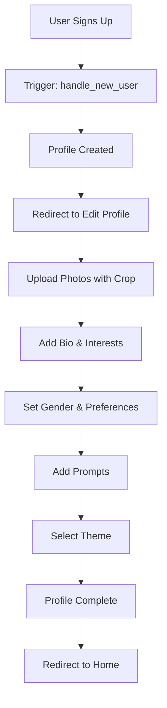

**Steps:**
1. User signs up with email/password or Google
2. System auto-creates profile via `handle_new_user()` trigger
3. User redirected to `/edit-profile`
4. User uploads photos (max 6) with crop dialog
5. User fills in bio, age, gender, interests (max 10)
6. User sets gender (man/woman/non-binary)
7. User sets interested in (men/women/both)
8. User sets age preferences (min-max sliders)
9. User answers custom prompts (max 3)
10. User selects theme preference
11. Profile ready → Redirect to Home page

---

### 2. Event Creation (Host Flow)

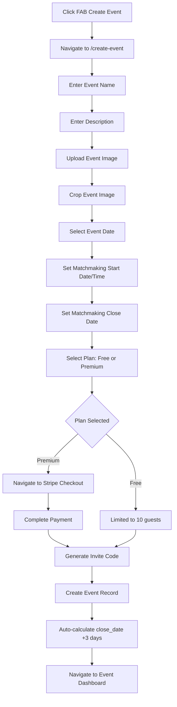

**Steps:**
1. User clicks FAB on Home page
2. Navigate to `/create-event`
3. Fill event name (required)
4. Fill description (optional)
5. Upload event cover image (optional)
6. Crop image in dialog
7. Select event date (min: today)
8. Set matchmaking start date and time
9. Set matchmaking close date
10. Select pricing plan (Free/Premium)
11. If Premium: Navigate to Stripe checkout → Complete payment
12. System generates unique invite code
13. Insert event record
14. Trigger auto-sets `close_date` to event date + 3 days
15. Navigate to `/event-dashboard/{id}`

---

### 3. Edit Event (Host Flow - NEW)

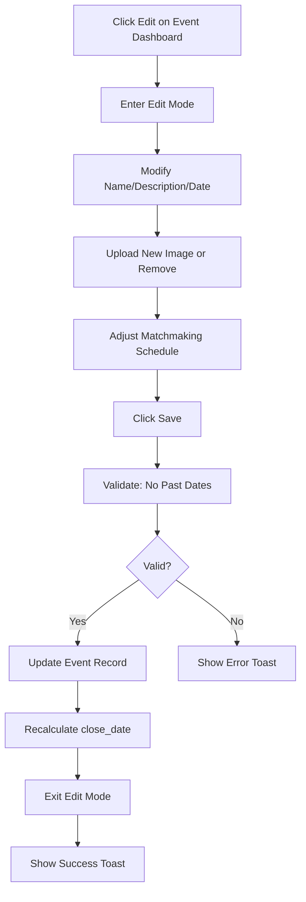

**Steps:**
1. Host clicks edit button on event dashboard
2. Enter inline edit mode
3. Modify event name, description, or date
4. Upload new image and crop, or remove existing
5. Adjust matchmaking schedule if needed
6. Click "Save Changes"
7. Validate: Cannot set event date to past
8. If valid: Update `events` table
9. Trigger recalculates `close_date`
10. Exit edit mode
11. Show success toast

---

### 4. Hide/Unhide Events (NEW)

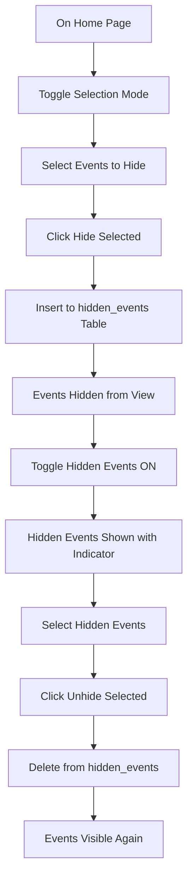

**Steps:**
1. Navigate to Home page
2. Toggle selection mode ON
3. Select one or more events
4. Click "Hide Selected" button
5. Insert records to `hidden_events` table
6. Events disappear from main view
7. Toggle "Hidden Events" ON
8. Hidden events appear with visual indicator
9. Select events to unhide
10. Click "Unhide Selected"
11. Delete from `hidden_events` table
12. Events return to main view

---

### 5. Join Event

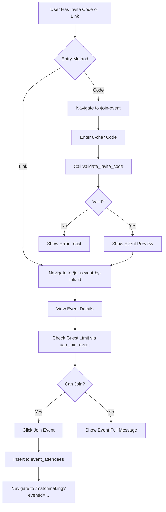

**Steps:**
1. User receives invite code or shareable link
2. **If Code:** Navigate to `/join-event` → Enter code → Validate
3. **If Link:** Navigate directly to `/join-event-by-link/{eventId}`
4. View event preview (image, name, date, guest count)
5. System checks if user can join via `can_join_event()`
6. If Free plan and ≥10 guests: Show "Event Full" error
7. If can join: Click "Join Event" button
8. Insert to `event_attendees` table
9. Navigate to `/matchmaking?eventId={id}` or `/`

---

### 6. Leave Event (NEW)

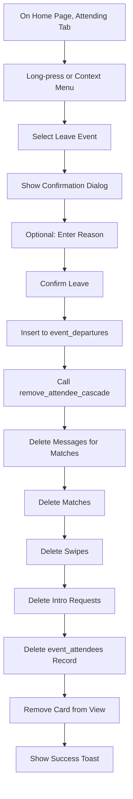

**Steps:**
1. Navigate to Home page, "I'm Attending" tab
2. Long-press or open context menu on event
3. Select "Leave Event" option
4. Confirmation dialog appears
5. Optional: Enter reason for leaving
6. Confirm departure
7. Insert to `event_departures` table
8. Call `remove_attendee_cascade()` function
9. Cascade delete: messages, matches, swipes, intro requests
10. Delete `event_attendees` record
11. Remove event card from view
12. Show success toast

---

### 7. Matchmaking with Scheduling (UPDATED)

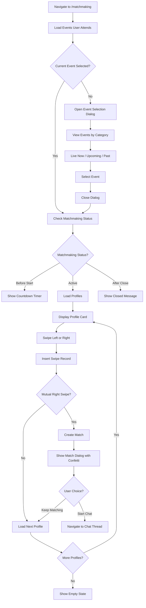

**Steps:**
1. User navigates to `/matchmaking`
2. System loads all events user attends
3. If no event selected: Open event selection dialog
4. Dialog shows events in 3 categories:
   - "Live Now": Where matchmaking is currently active
   - "Upcoming": With countdown timers
   - "Past": Closed events
5. User selects event → Close dialog
6. Check matchmaking status:
   - **Before start:** Show countdown to matchmaking_start_date/time
   - **Active:** matchmaking_start ≤ now < matchmaking_close_date
   - **After close:** now >= matchmaking_close_date
7. If active: Load profiles excluding swiped users and blocked users
8. Display profile card with photos, bio, interests, prompts
9. User swipes left (pass) or right (like)
10. Insert swipe record
11. If mutual right swipe: Create match → Show FullScreenMatchDialog with confetti
12. User chooses: "Start Chatting" (navigate to thread) or "Keep Matching"
13. Load next profile
14. Repeat until no profiles remain

---

### 8. Undo Swipe (5-Second Window)

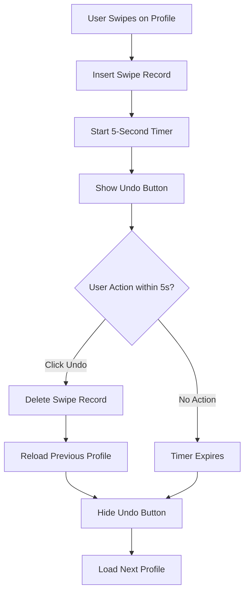

**Steps:**
1. User swipes on profile (left or right)
2. Insert swipe record to database
3. Start 5-second countdown timer
4. Display undo button at top of screen
5. **If user clicks undo within 5s:**
   - Delete swipe record from database
   - Reload previous profile to screen
   - Hide undo button
6. **If timer expires:**
   - Hide undo button
   - Continue to next profile

---

### 9. Unmatch User (NEW)

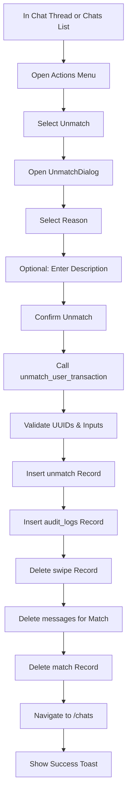

**Steps:**
1. User in chat thread or chats list
2. Open actions menu (three dots)
3. Select "Unmatch" option
4. UnmatchDialog opens
5. User selects reason from predefined list
6. Optional: Enter custom description (max 500 chars)
7. Confirm unmatch action
8. Call `unmatch_user_transaction()` function
9. Function validates all inputs and UUIDs
10. Insert record to `unmatches` table
11. Insert action to `audit_logs`
12. Delete swipe (allows re-swiping later)
13. Delete all messages for the match
14. Delete match record
15. Navigate back to `/chats`
16. Show success toast

---

### 10. Report User (NEW)

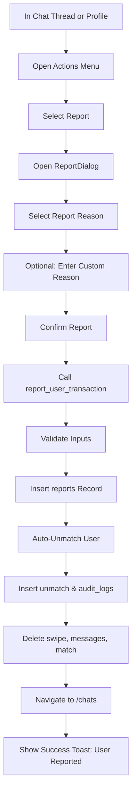

**Steps:**
1. User in chat thread or viewing profile
2. Open actions menu
3. Select "Report" option
4. ReportDialog opens
5. Select reason (inappropriate content, harassment, etc.)
6. Optional: Enter custom reason details
7. Confirm report
8. Call `report_user_transaction()` function
9. Function validates inputs
10. Insert to `reports` table
11. **Auto-unmatch:** Same actions as unmatch flow
12. Insert to `unmatches` and `audit_logs`
13. Delete swipe, messages, match
14. Navigate to `/chats`
15. Show success toast: "User reported"

---

### 11. Upgrade to Premium

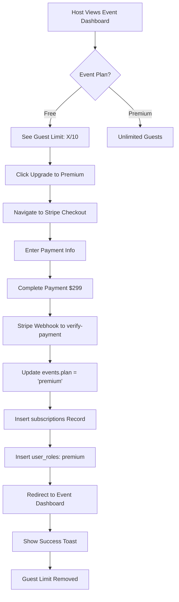

**Steps:**
1. Host views event dashboard for Free event
2. Sees guest limit indicator (e.g., "5/10 guests")
3. Clicks "Upgrade to Premium" button (Settings tab)
4. Navigate to Stripe checkout flow
5. Enter payment information
6. Complete payment ($299 one-time)
7. Stripe sends webhook to `/verify-payment` edge function
8. Edge function updates `events.plan` to 'premium'
9. Insert record to `subscriptions` table
10. Insert 'premium' role to `user_roles`
11. Redirect to event dashboard
12. Show success toast
13. Guest limit removed, unlimited guests allowed

---

### 12. Change Language (NEW)

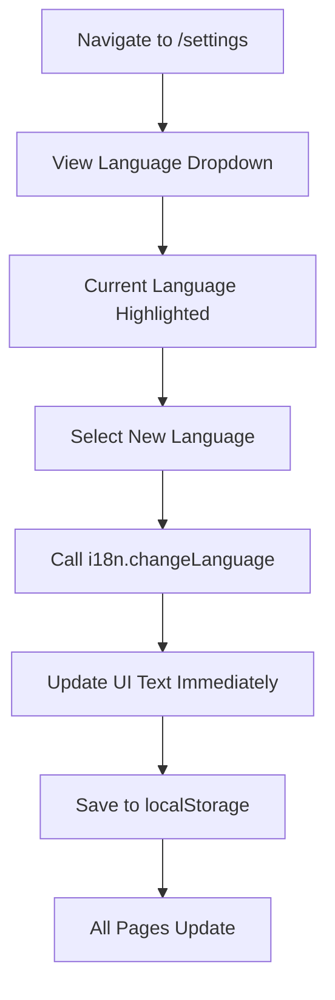

**Steps:**
1. User navigates to `/settings`
2. View language selection dropdown
3. Current language is highlighted (English/Spanish)
4. User selects new language
5. Call `i18n.changeLanguage(lng)` from i18next
6. All UI text updates immediately
7. Save preference to localStorage
8. Navigate to any page → Language persists

---

## Technical Architecture

### Frontend Stack
- **Framework:** React 18.3.1 with TypeScript
- **Build Tool:** Vite
- **Routing:** React Router v6.30.1
- **Styling:** Tailwind CSS v3 with custom design system
- **UI Components:** shadcn/ui (Radix UI primitives)
- **State Management:** React Query (TanStack Query v5.83.0)
- **Forms:** React Hook Form v7.61.1 with Zod validation
- **Internationalization:** i18next v25.6.0 + react-i18next v16.1.6 + i18next-browser-languagedetector v8.2.0
- **Drag & Drop:** @dnd-kit/core v6.3.1 (photo reordering)
- **Image Cropping:** react-easy-crop v5.5.3
- **Date Handling:** date-fns v3.6.0
- **Animations:** react-confetti v6.4.0
- **Icons:** Lucide React v0.462.0

### Backend Stack (Lovable Cloud / Supabase)
- **Database:** PostgreSQL (Supabase)
- **Authentication:** Supabase Auth (Email, Google OAuth)
- **Storage:** Supabase Storage (profile-photos, event-photos)
- **Realtime:** Supabase Realtime (message subscriptions)
- **Edge Functions:** 
  - `create-premium-checkout` - Stripe checkout session creation
  - `verify-payment` - Stripe payment verification
  - `send-matchmaking-notifications` - Notification system (future)
- **Payments:** Stripe (Premium plan $299)

### Key Libraries
- `@supabase/supabase-js` v2.75.0 - Backend integration
- `@tanstack/react-query` v5.83.0 - API state management
- `react-hook-form` v7.61.1 - Form handling
- `zod` v3.25.76 - Schema validation
- `i18next` v25.6.0 - Internationalization
- `react-i18next` v16.1.6 - React i18n bindings
- `i18next-browser-languagedetector` v8.2.0 - Auto language detection
- `@dnd-kit/*` v6.3.1+ - Drag and drop
- `react-easy-crop` v5.5.3 - Image cropping
- `react-confetti` v6.4.0 - Match celebrations
- `date-fns` v3.6.0 - Date formatting
- `sonner` v1.7.4 - Toast notifications
- `lucide-react` v0.462.0 - Icon system
- `class-variance-authority` v0.7.1 - Component variants
- `tailwind-merge` v2.6.0 - Class merging
- `clsx` v2.1.1 - Conditional classes

### Project Structure
```
src/
├── assets/               # Static assets (logos, icons)
│   ├── konfetti_black.svg
│   ├── konfetti_white.svg
│   ├── match-icon-normal.svg
│   └── match-icon-purple.svg
├── components/           # Reusable components
│   ├── ui/              # shadcn UI components
│   ├── KonfettiLogo.tsx # Theme-aware logo
│   ├── LanguageSwitcher.tsx # Language selection dropdown
│   ├── Layout.tsx       # App layout wrapper
│   ├── ImageCropDialog.tsx # Image cropping modal
│   ├── FullScreenMatchDialog.tsx # Match celebration
│   ├── ProfileViewDialog.tsx # Profile preview modal
│   ├── UnmatchDialog.tsx # Unmatch confirmation
│   ├── ReportDialog.tsx # Report user modal
│   ├── ChatActionsMenu.tsx # Chat thread actions
│   └── SortablePhoto.tsx # Draggable photo component
├── contexts/            # React contexts
│   └── ThemeContext.tsx # Theme provider (sunset/dark)
├── hooks/               # Custom React hooks
│   ├── use-mobile.tsx   # Mobile breakpoint detection
│   └── use-toast.ts     # Toast notifications hook
├── i18n/                # Internationalization
│   ├── config.ts        # i18next configuration
│   ├── locales/         # Translation files
│   │   ├── en.json      # English translations
│   │   └── es.json      # Spanish translations
│   └── translations.csv # Translation source
├── integrations/        # Third-party integrations
│   └── supabase/        # Supabase client & types (auto-generated)
│       ├── client.ts
│       └── types.ts
├── lib/                 # Utility libraries
│   ├── utils.ts         # Helper functions
│   ├── validation.ts    # Zod schemas
│   └── errorHandling.ts # Error utilities
├── pages/               # Route pages
│   ├── Auth.tsx         # Authentication (sign in/up)
│   ├── Home.tsx         # Event list (attending/hosting tabs)
│   ├── CreateEvent.tsx  # Create/edit event
│   ├── EventDashboard.tsx # Event management
│   ├── Matchmaking.tsx  # Swipe interface
│   ├── Chats.tsx        # Chat list
│   ├── ChatThread.tsx   # Individual chat
│   ├── LikedYou.tsx     # Who liked you
│   ├── Profile.tsx      # View profile
│   ├── EditProfile.tsx  # Edit profile
│   ├── Settings.tsx     # Account settings
│   ├── JoinEvent.tsx    # Join by code
│   ├── JoinEventByLink.tsx # Join by link
│   └── NotFound.tsx     # 404 page
├── App.tsx              # App component with routing
├── main.tsx             # App entry point
└── index.css            # Global styles & design tokens

supabase/
├── functions/           # Edge functions
│   ├── create-premium-checkout/
│   │   └── index.ts     # Stripe checkout creation
│   ├── verify-payment/
│   │   └── index.ts     # Payment verification
│   └── send-matchmaking-notifications/
│       └── index.ts     # Notification sender (future)
├── config.toml          # Supabase configuration
└── migrations/          # Database migrations (auto-generated)
```

### Routing Structure
```
/ (Home)
/auth (Authentication)
/profile (View Profile)
/edit-profile (Edit Profile)
/settings (NEW - Settings & Account)
/create-event (Create Event)
/create-event?edit={id} (Edit Event - query param)
/event-dashboard/:id (Event Dashboard)
/matchmaking?eventId={id} (Matchmaking - query param)
/join-event (Join by Code)
/join-event-by-link/:eventId (Join by Link)
/chats (Chat List)
/chat-thread/:matchId (Chat Thread)
/liked-you (Liked You)
/404 (Not Found)
```

### Data Flow
1. **Component** renders with React Query hooks
2. **Query/Mutation** calls Supabase client
3. **Supabase Client** enforces RLS policies
4. **PostgreSQL** returns filtered data
5. **React Query** caches and updates UI
6. **Real-time:** Supabase subscriptions for messages

### Authentication Flow
1. User signs up/in via Supabase Auth
2. JWT token stored in localStorage
3. Token sent with all API requests
4. RLS policies check `auth.uid()` for authorization
5. Session persists across page refreshes

### Real-time Messaging
1. User sends message → Insert to `messages` table
2. Supabase Realtime broadcasts insert event
3. Other user's chat subscribes to channel
4. New message appears instantly
5. Read receipt updated on view

---

## Internationalization

### Overview
The platform supports multiple languages with full UI translation capabilities using i18next.

### Supported Languages
1. **English (en)** - Default language
2. **Spanish (es)** - Full translation

### Implementation

#### i18next Configuration
**File:** `src/i18n/config.ts`

```typescript
import i18n from 'i18next';
import { initReactI18next } from 'react-i18next';
import LanguageDetector from 'i18next-browser-languagedetector';
import en from './locales/en.json';
import es from './locales/es.json';

i18n
  .use(LanguageDetector)
  .use(initReactI18next)
  .init({
    resources: {
      en: { translation: en },
      es: { translation: es },
    },
    fallbackLng: 'en',
    debug: false,
    interpolation: {
      escapeValue: false,
    },
    detection: {
      order: ['localStorage', 'navigator'],
      caches: ['localStorage'],
    },
  });
```

#### Language Detection
- **Priority 1:** localStorage (user's saved preference)
- **Priority 2:** Browser navigator language
- **Persistence:** Language choice saved to localStorage

#### Translation Files
**English:** `src/i18n/locales/en.json`
**Spanish:** `src/i18n/locales/es.json`

**Structure:**
```json
{
  "common": {
    "select": "Select",
    "cancel": "Cancel",
    "edit": "Edit",
    "save": "Save"
  },
  "home": {
    "title": "My Events",
    "attending": "I'm Attending",
    "hosting": "I'm Hosting"
  },
  "matchmaking": {
    "title": "Matchmaking",
    "countdown": "Matchmaking opens in..."
  }
}
```

#### Usage in Components
```typescript
import { useTranslation } from 'react-i18next';

function MyComponent() {
  const { t, i18n } = useTranslation();
  
  return (
    <div>
      <h1>{t('home.title')}</h1>
      <button onClick={() => i18n.changeLanguage('es')}>
        {t('common.changeLanguage')}
      </button>
    </div>
  );
}
```

#### Language Switcher Component
**File:** `src/components/LanguageSwitcher.tsx`

- Dropdown menu in header/settings
- Shows current language
- Lists available languages
- Immediate UI update on change
- Persists to localStorage

#### Translated Elements
**Full coverage of:**
- All UI labels and buttons
- Form placeholders and validation messages
- Navigation menus
- Toast notifications
- Dialog titles and messages
- Empty state messages
- Error messages
- Success confirmations

### Adding New Languages

**Steps to add a new language:**
1. Create translation file: `src/i18n/locales/{locale}.json`
2. Copy structure from `en.json`
3. Translate all keys
4. Import in `src/i18n/config.ts`:
   ```typescript
   import fr from './locales/fr.json';
   ```
5. Add to resources:
   ```typescript
   resources: {
     en: { translation: en },
     es: { translation: es },
     fr: { translation: fr }, // New language
   }
   ```
6. Update LanguageSwitcher component to show new option

### Translation Coverage

**Pages with full translation:**
- Authentication
- Home (event lists)
- Create/Edit Event
- Event Dashboard
- Matchmaking
- Chats & Chat Thread
- Liked You
- Profile & Edit Profile
- Settings
- Join Event flows
- Dialogs (Match, Unmatch, Report, etc.)

**System messages:**
- Validation errors
- Success toasts
- Error toasts
- Empty states
- Loading states
- Confirmation dialogs

---

## UI/UX Design System

### Design Philosophy
- **Modern & Clean:** Minimalist interface with focus on content
- **Gradient-First:** Extensive use of gradient overlays and accents
- **Card-Based:** Information grouped in elevated cards
- **Responsive:** Mobile-first design that scales to desktop
- **Accessible:** High contrast, semantic HTML, ARIA labels
- **Themed:** Support for multiple color themes (sunset/dark)

### Color System (HSL-based)

**Design Tokens (index.css):**
```css
:root {
  /* Base Colors */
  --background: 0 0% 100%;
  --foreground: 222.2 84% 4.9%;
  
  /* Primary Colors */
  --primary: 222.2 47.4% 11.2%;
  --primary-foreground: 210 40% 98%;
  
  /* Secondary Colors */
  --secondary: 210 40% 96.1%;
  --secondary-foreground: 222.2 47.4% 11.2%;
  
  /* Accent Colors */
  --accent: 210 40% 96.1%;
  --accent-foreground: 222.2 47.4% 11.2%;
  
  /* Muted Colors */
  --muted: 210 40% 96.1%;
  --muted-foreground: 215.4 16.3% 46.9%;
  
  /* Destructive */
  --destructive: 0 84.2% 60.2%;
  --destructive-foreground: 210 40% 98%;
  
  /* Borders */
  --border: 214.3 31.8% 91.4%;
  --input: 214.3 31.8% 91.4%;
  --ring: 222.2 84% 4.9%;
  
  /* Status Colors */
  --success: 142 71% 45%;
  --warning: 38 92% 50%;
  --error: 0 84% 60%;
  
  /* Gradient Overlays */
  --gradient-overlay: linear-gradient(to bottom, rgba(0,0,0,0), rgba(0,0,0,0.7));
  --gradient-primary: linear-gradient(135deg, hsl(var(--primary)), hsl(var(--accent)));
}

.dark {
  --background: 222.2 84% 4.9%;
  --foreground: 210 40% 98%;
  /* ... dark mode variants */
}
```

### Typography

**Font Stack:**
```css
body {
  font-family: -apple-system, BlinkMacSystemFont, "Segoe UI", Roboto, "Helvetica Neue", Arial, sans-serif;
}
```

**Text Scales:**
- **Heading 1:** `text-4xl` (2.25rem / 36px)
- **Heading 2:** `text-3xl` (1.875rem / 30px)
- **Heading 3:** `text-2xl` (1.5rem / 24px)
- **Body:** `text-base` (1rem / 16px)
- **Small:** `text-sm` (0.875rem / 14px)
- **Tiny:** `text-xs` (0.75rem / 12px)

**Font Weights:**
- Regular: `font-normal` (400)
- Medium: `font-medium` (500)
- Semibold: `font-semibold` (600)
- Bold: `font-bold` (700)

### Date & Time Formatting

**Standard Format:**
All dates across the application use a consistent format: `dd / MMM / yyyy`

**Examples:**
- `15 / Jan / 2025`
- `28 / Oct / 2024`
- `03 / Dec / 2025`

**Implementation:**
```tsx
import { format } from 'date-fns';

// Date only
format(new Date(date), 'dd / MMM / yyyy')

// Date with time
format(new Date(date), 'dd / MMM / yyyy • h:mm a')
```

**Used in:**
- Event dates on Home page
- Event creation/edit dates
- Matchmaking dates
- Event dashboard dates
- Join event preview dates

### Component Variants

#### Button Variants
**File:** `src/components/ui/button.tsx`

1. **Default:** Primary color, solid background
   ```tsx
   <Button variant="default">Click Me</Button>
   ```

2. **Destructive:** Red color for dangerous actions
   ```tsx
   <Button variant="destructive">Delete</Button>
   ```

3. **Outline:** Border only, transparent background
   ```tsx
   <Button variant="outline">Cancel</Button>
   ```

4. **Secondary:** Muted background
   ```tsx
   <Button variant="secondary">Secondary</Button>
   ```

5. **Ghost:** Transparent, hover effect only
   ```tsx
   <Button variant="ghost">Ghost</Button>
   ```

6. **Link:** Text link style
   ```tsx
   <Button variant="link">Link</Button>
   ```

**Sizes:**
- Default: `h-10 px-4 py-2`
- Small: `h-9 px-3`
- Large: `h-11 px-8`
- Icon: `h-10 w-10`

#### Card Component
**File:** `src/components/ui/card.tsx`

**Structure:**
```tsx
<Card>
  <CardHeader>
    <CardTitle>Title</CardTitle>
    <CardDescription>Description</CardDescription>
  </CardHeader>
  <CardContent>
    {/* Main content */}
  </CardContent>
  <CardFooter>
    {/* Actions */}
  </CardFooter>
</Card>
```

**Styling:**
- Background: `bg-card`
- Border: `border`
- Shadow: `shadow-card` (custom class)
- Radius: `rounded-lg`
- Padding: `p-6`

**Custom Classes:**
```css
.shadow-card {
  box-shadow: 0 1px 3px 0 rgb(0 0 0 / 0.1), 0 1px 2px -1px rgb(0 0 0 / 0.1);
}

.hover-lift {
  transition: transform 0.2s ease;
}

.hover-lift:hover {
  transform: translateY(-2px);
}
```

#### Badge Variants
**Status Badges:**
- **Draft:** `bg-yellow-100 text-yellow-800` (Yellow)
- **Active:** `bg-green-100 text-green-800` (Green)
- **Closed:** `bg-red-100 text-red-800` (Red)

```tsx
<Badge variant="default">Active</Badge>
<Badge variant="secondary">Draft</Badge>
<Badge variant="destructive">Closed</Badge>
```

### Layout Patterns

#### Page Layout
```tsx
<div className="container max-w-7xl mx-auto px-4 py-8">
  <header className="mb-8">
    <h1 className="text-4xl font-bold">Page Title</h1>
  </header>
  <main>
    {/* Content */}
  </main>
</div>
```

#### Grid Layout
```tsx
<div className="grid grid-cols-1 md:grid-cols-2 lg:grid-cols-3 gap-6">
  {items.map(item => (
    <Card key={item.id}>...</Card>
  ))}
</div>
```

#### Tabs Layout
```tsx
<Tabs defaultValue="tab1">
  <TabsList>
    <TabsTrigger value="tab1">Tab 1</TabsTrigger>
    <TabsTrigger value="tab2">Tab 2</TabsTrigger>
  </TabsList>
  <TabsContent value="tab1">
    {/* Tab 1 content */}
  </TabsContent>
  <TabsContent value="tab2">
    {/* Tab 2 content */}
  </TabsContent>
</Tabs>
```

### Spacing System
**Tailwind Scale (0.25rem = 4px base):**
- `p-1`: 0.25rem (4px)
- `p-2`: 0.5rem (8px)
- `p-4`: 1rem (16px)
- `p-6`: 1.5rem (24px)
- `p-8`: 2rem (32px)

**Common Patterns:**
- Card padding: `p-6`
- Section spacing: `mb-8`
- Element gap: `gap-4`
- Page padding: `px-4 py-8`

### Responsive Breakpoints
```css
sm: 640px   /* Small tablets */
md: 768px   /* Tablets */
lg: 1024px  /* Laptops */
xl: 1280px  /* Desktops */
2xl: 1536px /* Large screens */
```

**Usage:**
```tsx
<div className="grid grid-cols-1 md:grid-cols-2 lg:grid-cols-3">
  {/* 1 column mobile, 2 tablet, 3 desktop */}
</div>
```

### Animation & Transitions

**Tailwind Transitions:**
```tsx
<div className="transition-all duration-300 ease-in-out">
  {/* Smooth transitions */}
</div>
```

**Common Animations:**
- **Hover Lift:** `hover:translate-y-[-2px] transition-transform`
- **Fade In:** `animate-in fade-in duration-500`
- **Slide Up:** `animate-in slide-in-from-bottom duration-300`

**React Confetti (Match Celebration):**
```tsx
import Confetti from 'react-confetti';

<Confetti
  width={windowWidth}
  height={windowHeight}
  recycle={false}
  numberOfPieces={500}
/>
```

### Icon System (Lucide React)

**Usage:**
```tsx
import { Heart, MessageCircle, Users, Settings } from 'lucide-react';

<Heart className="w-5 h-5 text-red-500" />
<MessageCircle className="w-4 h-4" />
```

**Common Icons:**
- Heart: Likes
- MessageCircle: Messages
- Users: Guests/Attendees
- Settings: Settings/Config
- Calendar: Dates
- Image: Photos
- X: Close/Delete
- Check: Confirm/Success
- ChevronRight: Navigation

### Form Styling

**Input Fields:**
```tsx
<Input
  type="text"
  placeholder="Enter text"
  className="w-full"
/>
```

**Styling:**
- Background: `bg-background`
- Border: `border border-input`
- Focus: `focus:ring-2 focus:ring-ring`
- Padding: `px-3 py-2`
- Radius: `rounded-md`

**Labels:**
```tsx
<Label htmlFor="name" className="text-sm font-medium">
  Name
</Label>
```

**Validation Errors:**
```tsx
<p className="text-sm text-destructive mt-1">
  {errors.name?.message}
</p>
```

### Modals & Dialogs

**Dialog Pattern:**
```tsx
<Dialog open={isOpen} onOpenChange={setIsOpen}>
  <DialogContent>
    <DialogHeader>
      <DialogTitle>Dialog Title</DialogTitle>
      <DialogDescription>
        Description text
      </DialogDescription>
    </DialogHeader>
    <div className="py-4">
      {/* Content */}
    </div>
    <DialogFooter>
      <Button variant="outline" onClick={onCancel}>
        Cancel
      </Button>
      <Button onClick={onConfirm}>
        Confirm
      </Button>
    </DialogFooter>
  </DialogContent>
</Dialog>
```

### Toast Notifications

**Usage:**
```tsx
import { useToast } from '@/hooks/use-toast';

const { toast } = useToast();

toast({
  title: "Success",
  description: "Your changes have been saved.",
});

toast({
  title: "Error",
  description: "Something went wrong.",
  variant: "destructive",
});
```

**Styling:**
- Success: Default variant
- Error: `variant="destructive"`
- Position: Bottom-right
- Duration: 5 seconds (customizable)

### Loading States

**Skeleton:**
```tsx
<Skeleton className="h-20 w-full" />
```

**Spinner:**
```tsx
<div className="flex items-center justify-center">
  <div className="animate-spin rounded-full h-8 w-8 border-b-2 border-primary"></div>
</div>
```

### Empty States

**Pattern:**
```tsx
<div className="flex flex-col items-center justify-center py-12 text-center">
  <Icon className="w-16 h-16 text-muted-foreground mb-4" />
  <h3 className="text-lg font-semibold mb-2">No items found</h3>
  <p className="text-muted-foreground">
    Get started by creating your first item.
  </p>
  <Button className="mt-4">Create Item</Button>
</div>
```

---

## Feature Status Matrix

### ✅ Fully Implemented Features

| Feature | Status | Notes |
|---------|--------|-------|
| **Authentication** |
| Email/Password Auth | ✅ | With auto-confirmation |
| Google OAuth | ✅ | Single sign-on |
| **User Profiles** |
| Profile Creation | ✅ | Auto-created on signup |
| Photo Upload (max 6) | ✅ | With crop functionality |
| Photo Reordering | ✅ | Drag and drop |
| Interests (max 10) | ✅ | Tag-based |
| Prompts (max 3) | ✅ | Q&A format |
| Gender Selection | ✅ | Man/Woman/Non-binary |
| Interested In | ✅ | Men/Women/Both |
| Age Preferences | ✅ | Min/Max sliders |
| Theme Preference | ✅ | Sunset/Dark modes |
| **Event Management** |
| Create Event | ✅ | With all fields |
| Edit Event | ✅ | Inline editing |
| Event Cover Image | ✅ | Upload & crop |
| Event Date | ✅ | With past date validation |
| Matchmaking Scheduling | ✅ | Start date/time, close date |
| Invite Code Generation | ✅ | Unique 6-char codes |
| Join via Code | ✅ | With validation |
| Join via Link | ✅ | With preview |
| Event Dashboard | ✅ | Tabbed interface |
| Guest Management | ✅ | View, remove guests |
| Event Statistics | ✅ | Matches, swipes, rate |
| Close Event | ✅ | Manual close |
| Leave Event | ✅ | With reason tracking |
| Hide/Unhide Events | ✅ | Bulk operations |
| **Pricing & Plans** |
| Free Plan (10 guests) | ✅ | Guest limit enforced |
| Premium Plan | ✅ | Unlimited guests, $299 |
| Stripe Checkout | ✅ | Payment processing |
| Payment Verification | ✅ | Webhook integration |
| Upgrade Flow | ✅ | Free → Premium |
| **Matchmaking** |
| Swipe Left/Right | ✅ | Pass/Like |
| Undo Swipe (5s window) | ✅ | Delete swipe record |
| Mutual Match Detection | ✅ | Auto-create match |
| Match Dialog | ✅ | With confetti animation |
| Event Selection | ✅ | Multi-event support |
| Matchmaking Countdown | ✅ | For scheduled events |
| Profile Count Display | ✅ | Per event |
| Event Categorization | ✅ | Live/Upcoming/Past |
| **Messaging** |
| Match-based Chat | ✅ | 1-on-1 messaging |
| Real-time Messages | ✅ | Supabase Realtime |
| Read Receipts | ✅ | Mark as read |
| Message Timestamps | ✅ | Created/read times |
| **Safety & Moderation** |
| Unmatch User | ✅ | With reason |
| Report User | ✅ | With auto-unmatch |
| Block User | ✅ | Bi-directional |
| Audit Logs | ✅ | Full action tracking |
| **Liked You** |
| View Likers | ✅ | Right swipes on user |
| Like from Liked You | ✅ | Create match |
| Pass from Liked You | ✅ | Dismiss |
| **Settings** |
| Change Email | ✅ | With verification |
| Change Password | ✅ | Secure update |
| Language Switcher | ✅ | English/Spanish |
| Logout | ✅ | Session clear |
| **Internationalization** |
| English Translation | ✅ | Full coverage |
| Spanish Translation | ✅ | Full coverage |
| Language Detection | ✅ | Auto-detect + localStorage |
| Language Persistence | ✅ | Saved preference |
| **Database** |
| All Core Tables | ✅ | 16 tables implemented |
| RLS Policies | ✅ | Comprehensive security |
| Database Functions | ✅ | 14 functions |
| Storage Buckets | ✅ | Private & public |
| **UI/UX** |
| Responsive Design | ✅ | Mobile-first |
| Dark Mode Support | ✅ | Theme toggle |
| Toast Notifications | ✅ | Success/error feedback |
| Loading States | ✅ | Skeletons & spinners |
| Empty States | ✅ | Friendly messages |
| Error Handling | ✅ | User-friendly errors |

### 🚧 Partially Implemented Features

| Feature | Status | Missing Pieces |
|---------|--------|----------------|
| Intro Requests | 🚧 | Frontend UI not built (DB ready) |
| Host Facilitated Matches | 🚧 | Frontend UI not built (function ready) |
| Notifications | 🚧 | Edge function exists, not integrated |

### ⏳ Planned Features (Future Roadmap)

| Feature | Priority | Description |
|---------|----------|-------------|
| Push Notifications | High | Match alerts, new messages |
| Advanced Filters | Medium | Filter by interests, distance |
| Event Categories | Medium | Dating, networking, professional |
| Event Templates | Low | Pre-filled event types |
| Analytics Dashboard | Medium | Detailed host insights |
| In-app Messaging to Host | Low | Attendee → Host communication |
| Profile Verification | High | Photo/ID verification |
| Video Profiles | Low | Short video intros |
| Icebreaker Prompts | Medium | Conversation starters |

### ❌ Deprecated/Removed Features

| Feature | Reason |
|---------|--------|
| Age Attestation Fields | Removed for simplicity (18+ assumed) |
| DOB Validation | Removed (age field sufficient) |
| Adult Only Flag | Removed (all events 18+) |

---

## Future Roadmap

### Phase 1: Enhanced Communication (Q1 2026)
- ✅ **Completed:** Real-time messaging
- **Upcoming:**
  - Push notifications for matches and messages
  - Read receipts enhancement
  - Typing indicators
  - Message reactions (emoji)
  - GIF support in messages
  - Voice messages (audio recording)

### Phase 2: Advanced Matching (Q2 2026)
- **Intro Requests UI:** Complete frontend for host-facilitated introductions
- **Smart Matching:** ML-based compatibility scores
- **Filters & Search:**
  - Filter by interests
  - Filter by distance (geo)
  - Age range filtering
  - Gender preference filtering
- **Icebreakers:** Auto-suggested conversation starters
- **Match Suggestions:** "You might like" recommendations

### Phase 3: Event Enhancements (Q3 2026)
- **Event Categories:** Dating, networking, professional, social
- **Event Templates:** Pre-filled events (wedding, conference, mixer)
- **Co-hosting:** Multiple hosts per event
- **Event Analytics:**
  - Detailed match insights
  - Swipe patterns
  - Engagement metrics
  - Export reports
- **Event Photos:** Gallery of event photos (shared by attendees)
- **Event Check-in:** QR code check-in at physical events

### Phase 4: Profile & Discovery (Q4 2026)
- **Profile Verification:**
  - Photo verification
  - ID verification
  - Social media linking
  - Verified badge
- **Video Profiles:** 15-30 second video intros
- **Profile Insights:** Who viewed your profile
- **Advanced Prompts:** More prompt categories, trending prompts
- **Profile Completion Score:** Encourage full profiles

### Phase 5: Monetization & Growth (Q1 2027)
- **Subscription Plans:**
  - Premium Plus: Advanced features
  - Host Pro: Analytics, unlimited events
  - Attendee Premium: Unlimited swipes, see who liked you
- **In-app Purchases:**
  - Boost profile visibility
  - Undo unlimited swipes
  - Super likes
- **Referral System:** Invite friends, earn rewards
- **Affiliate Program:** Host incentives

### Phase 6: Community & Safety (Q2 2027)
- **Community Guidelines:** Clear rules and moderation
- **AI Moderation:**
  - Automatic profile photo screening
  - Message content filtering
  - Spam detection
- **Safety Center:**
  - Safety tips
  - How to report
  - Block management
- **Trust & Safety Team:** Human review of reports
- **Background Checks:** Optional for hosts (future)

### Phase 7: Platform Expansion (Q3 2027)
- **Mobile Apps:**
  - iOS native app (React Native or Swift)
  - Android native app (React Native or Kotlin)
  - Push notifications
  - Location services
- **Web Optimization:**
  - Progressive Web App (PWA)
  - Offline support
  - App-like experience
- **Integrations:**
  - Calendar sync (Google, Apple)
  - Social media sharing
  - Email invitations

### Phase 8: Scale & Performance (Q4 2027)
- **Performance Optimization:**
  - CDN for images
  - Lazy loading everywhere
  - Code splitting
  - Server-side rendering (SSR)
- **Database Optimization:**
  - Query optimization
  - Index tuning
  - Read replicas
  - Caching layer (Redis)
- **Monitoring:**
  - Error tracking (Sentry)
  - Performance monitoring
  - User analytics
  - A/B testing

---

## Security Considerations

### Implemented Security Measures

#### Authentication Security
- ✅ Supabase Auth with JWT tokens
- ✅ Auto-confirm email signups (non-production)
- ✅ Google OAuth integration
- ✅ Session persistence in localStorage
- ✅ Auto-refresh tokens
- ✅ Password strength requirements (Supabase default)

#### Data Privacy
- ✅ **Row-Level Security (RLS)** on all tables
- ✅ Profile visibility limited to shared active events
- ✅ Photos accessible only via signed URLs to event members
- ✅ Messages visible only to match participants
- ✅ Event departure tracking (users hidden after leaving)
- ✅ Blocked users excluded from all interactions

#### Data Integrity
- ✅ **UUID Format Validation** in transaction functions
- ✅ **Input Sanitization** (trim whitespace, length limits)
- ✅ **Zod Schema Validation** on frontend
- ✅ **CHECK Constraints** in database (photo limit, self-block prevention)
- ✅ **Unique Constraints** (invite codes, match pairs, blocks)
- ✅ **Foreign Key Constraints** for referential integrity

#### API Security
- ✅ **RLS Enforcement** on all database operations
- ✅ **Function Security** (SECURITY DEFINER with search_path)
- ✅ **Parameterized Queries** (SQL injection prevention)
- ✅ **Rate Limiting** (Supabase default)
- ✅ **CORS Headers** on edge functions

#### Storage Security
- ✅ **Private Bucket** for profile photos (RLS-protected)
- ✅ **Public Bucket** for event photos (shareable)
- ✅ **Signed URLs** for profile photo access
- ✅ **File Size Limits** (5MB profile, 10MB event)
- ✅ **File Type Restrictions** (JPEG, PNG, WebP only)

#### Database Security
- ✅ **Security Definer Functions** prevent privilege escalation
- ✅ **Explicit `search_path = public`** in all functions
- ✅ **No Raw SQL Execution** (client methods only)
- ✅ **Audit Logging** for moderation actions
- ✅ **Transaction Atomicity** for critical operations

### Security Enhancements Needed (Future)

#### Advanced Authentication
- ⏳ Two-Factor Authentication (2FA)
- ⏳ Email verification for new accounts (production)
- ⏳ Password change notifications
- ⏳ Suspicious login detection
- ⏳ Device management

#### Content Moderation
- ⏳ AI-powered photo screening
- ⏳ Message content filtering
- ⏳ Spam detection algorithms
- ⏳ Automated flag escalation
- ⏳ Human moderation queue

#### Enhanced Privacy
- ⏳ Profile visibility controls (public/private)
- ⏳ Last seen status toggle
- ⏳ Read receipt toggle
- ⏳ Incognito mode (hide from Liked You)
- ⏳ Data export (GDPR compliance)
- ⏳ Account deletion with data cleanup

#### Compliance
- ⏳ GDPR compliance (EU)
- ⏳ CCPA compliance (California)
- ⏳ Privacy Policy
- ⏳ Terms of Service
- ⏳ Cookie Consent
- ⏳ Age verification (enhanced)

#### Monitoring & Alerting
- ⏳ Security event logging
- ⏳ Anomaly detection
- ⏳ Failed login tracking
- ⏳ Unusual activity alerts
- ⏳ Admin dashboard for security

---

## Pre-Launch Checklist

### Security Testing ✅

- [x] **RLS Policy Review:** All tables have appropriate policies
- [x] **Function Security:** All functions use SECURITY DEFINER safely
- [x] **Input Validation:** All user inputs validated
- [x] **SQL Injection:** Parameterized queries everywhere
- [x] **XSS Prevention:** React auto-escapes, no dangerouslySetInnerHTML
- [x] **CSRF Protection:** Supabase handles via JWT
- [x] **Storage Access:** RLS on storage buckets tested
- [x] **Authentication Flow:** Sign up, login, logout tested
- [x] **Authorization:** RLS prevents unauthorized access
- [x] **Sensitive Data:** No passwords or tokens in client logs

### Functional Testing 🚧

**Authentication:**
- [x] Sign up with email/password
- [x] Sign up with Google OAuth
- [x] Login with email/password
- [x] Login with Google
- [x] Logout
- [x] Session persistence

**Profile:**
- [x] Create profile on signup
- [x] Edit profile (all fields)
- [x] Upload photos (max 6)
- [x] Crop photos
- [x] Reorder photos (drag-drop)
- [x] Delete photos
- [x] Set interests (max 10)
- [x] Add prompts (max 3)
- [x] Set preferences (gender, age range)

**Events:**
- [x] Create event (all fields)
- [x] Upload event image
- [x] Crop event image
- [x] Edit event (all fields)
- [x] Join event via code
- [x] Join event via link
- [x] Leave event
- [x] Hide event
- [x] Unhide event
- [x] View event dashboard
- [x] View guests
- [x] Remove guest (host)
- [x] View statistics
- [x] Close event (host)
- [ ] Upgrade to Premium (needs Stripe test mode)

**Matchmaking:**
- [x] View profiles in event
- [x] Swipe left (pass)
- [x] Swipe right (like)
- [x] Undo swipe (5s window)
- [x] Create match (mutual like)
- [x] View match dialog
- [x] Navigate to chat from match
- [x] Switch between events
- [x] View countdown for upcoming matchmaking
- [x] Blocked users excluded from deck

**Messaging:**
- [x] Send message in match
- [x] Receive real-time message
- [x] Mark message as read
- [x] View chat list
- [x] View chat thread
- [x] Message timestamps
- [x] Read receipts

**Safety:**
- [x] Unmatch user (with reason)
- [x] Report user (with reason)
- [x] Block user
- [x] Blocked user excluded from swipes
- [x] Blocked user excluded from Liked You
- [x] Audit logs created

**Liked You:**
- [x] View users who liked you
- [x] Like user from Liked You (create match)
- [x] Pass user from Liked You

**Settings:**
- [ ] Change email (needs email verification in prod)
- [x] Change password
- [x] Switch language (English/Spanish)
- [x] Logout

**Internationalization:**
- [x] UI in English
- [x] UI in Spanish
- [x] Language persists across sessions
- [x] All pages translated

### Performance Testing ⏳

- [ ] Page load times < 3 seconds
- [ ] Time to interactive < 5 seconds
- [ ] Image loading optimized (lazy loading)
- [ ] Database query performance (< 100ms)
- [ ] Real-time message latency (< 500ms)
- [ ] Mobile performance (60fps animations)
- [ ] Large event handling (1000+ attendees)

### Accessibility Testing ⏳

- [ ] Keyboard navigation works
- [ ] Screen reader compatibility
- [ ] ARIA labels on interactive elements
- [ ] Color contrast ratios (WCAG AA)
- [ ] Focus indicators visible
- [ ] Error messages accessible
- [ ] Form labels properly associated

### Browser/Device Testing ⏳

**Desktop Browsers:**
- [ ] Chrome (latest)
- [ ] Firefox (latest)
- [ ] Safari (latest)
- [ ] Edge (latest)

**Mobile Devices:**
- [ ] iOS Safari (iPhone)
- [ ] Android Chrome
- [ ] Android Firefox

**Responsive Breakpoints:**
- [x] Mobile (320px - 640px)
- [x] Tablet (640px - 1024px)
- [x] Desktop (1024px+)

### Monitoring Setup ⏳

- [ ] Error tracking (Sentry or similar)
- [ ] Performance monitoring (Web Vitals)
- [ ] User analytics (privacy-friendly)
- [ ] Database monitoring (Supabase dashboard)
- [ ] Uptime monitoring
- [ ] Alert notifications

### Documentation ✅

- [x] PRD comprehensive and up-to-date
- [x] API documentation (database functions)
- [x] Component documentation (inline comments)
- [x] Deployment guide
- [x] User guide (tooltips in app)
- [ ] Privacy Policy
- [ ] Terms of Service

### Deployment Preparation ⏳

- [ ] Environment variables configured
- [ ] Production Supabase project setup
- [ ] Domain configured
- [ ] SSL certificate (HTTPS)
- [ ] CDN for static assets
- [ ] Backup strategy
- [ ] Rollback plan
- [ ] Monitoring alerts configured

---

## Appendix

### Environment Variables

**Required Variables (.env):**
```
VITE_SUPABASE_URL=https://wyvaygkvuhayqyphngab.supabase.co
VITE_SUPABASE_PUBLISHABLE_KEY=eyJhbGciOiJIUzI1NiIsInR5cCI6IkpXVCJ9...
VITE_SUPABASE_PROJECT_ID=wyvaygkvuhayqyphngab
```

**Edge Function Secrets (Supabase Dashboard):**
```
STRIPE_SECRET_KEY=sk_test_... (Stripe test key)
RESEND_API_KEY=re_... (Email service)
CRON_SECRET=... (Scheduled functions)
```

### Database Statistics

**Tables:** 16 tables
**Functions:** 14 functions
**RLS Policies:** 50+ policies
**Storage Buckets:** 2 buckets
**Edge Functions:** 3 functions
**Supported Languages:** 2 (English, Spanish)

### Key Dependencies

**Production:**
- React 18.3.1
- TypeScript 5.x
- Vite 6.x
- Tailwind CSS 3.x
- Supabase JS 2.75.0
- React Query 5.83.0
- React Hook Form 7.61.1
- Zod 3.25.76
- i18next 25.6.0
- React i18next 16.1.6

**Development:**
- ESLint
- PostCSS
- Autoprefixer

### Contact & Support

**Platform:** Lovable Cloud  
**Version:** 3.0  
**Last Updated:** 2025-10-28  
**Status:** Pre-Launch Ready

---

**END OF DOCUMENT**