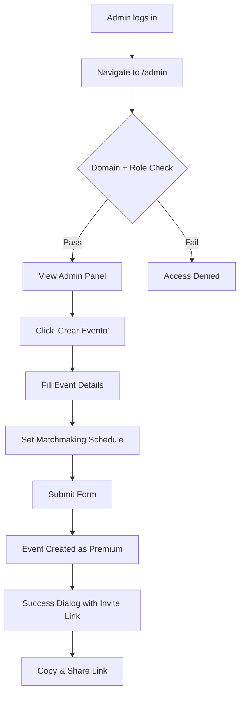
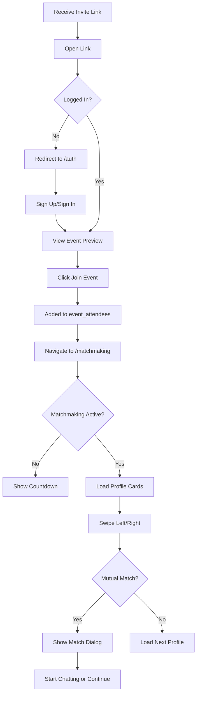
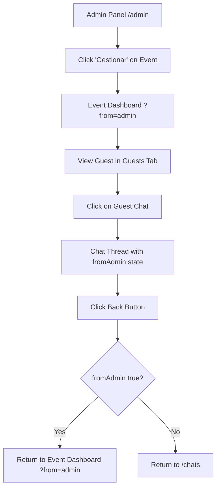

# Product Requirements Document (PRD)
## Event-Based Matchmaking Platform

**Last Updated:** 2026-01-22  
**Version:** 4.0 - Admin-Only Hosting Model & Platform Consolidation  
**Status:** Production Ready

---

## Table of Contents
1. [Product Overview](#product-overview)
2. [Business Model](#business-model)
3. [Core Features](#core-features)
4. [User Roles & Permissions](#user-roles--permissions)
5. [Page-by-Page Functionality Guide](#page-by-page-functionality-guide)
6. [Admin Panel](#admin-panel)
7. [Database Schema](#database-schema)
8. [Database Functions](#database-functions)
9. [Row-Level Security Policies](#row-level-security-policies)
10. [User Flows](#user-flows)
11. [Technical Architecture](#technical-architecture)
12. [Internationalization](#internationalization)
13. [UI/UX Design System](#uiux-design-system)
14. [Feature Status Matrix](#feature-status-matrix)
15. [Security Architecture](#security-architecture)
16. [Future Roadmap](#future-roadmap)
17. [Appendix](#appendix)

---

## Product Overview

### Vision
An event-based matchmaking platform that enables curated dating/networking experiences at exclusive events (weddings, private parties, corporate gatherings). The platform operates as a managed service where the platform administrators create and manage all events on behalf of clients.

### Core Value Proposition
- **For Clients (Couples/Organizers):** Request custom matchmaking events for their weddings or parties without technical complexity—pricing is quote-based and tailored to guest count
- **For Attendees:** Discover potential matches within curated, event-specific communities with scheduled matchmaking windows and privacy-first design
- **Unique Differentiators:** Admin-managed events, time-gated matchmaking, event-scoped matching, privacy-first design, scheduled matchmaking windows, internationalization (EN/ES)

### Target Users

| User Type | Description | Access Level |
|-----------|-------------|--------------|
| **Super Admin** | Platform operator with full system access | Full CRUD on all events, user management, system configuration |
| **Event Attendees** | Users joining events via invite link to meet potential matches | Profile creation, matchmaking, messaging within event scope |
| **Matched Users** | Pairs who have mutually liked each other | Private 1:1 messaging, unmatch/report capabilities |

### Business Model Change (v4.0)

**Previous Model (v3.x and earlier):**
- Self-service event creation by any authenticated user
- "I'm Hosting" tab on user dashboard
- Free (10 guests) / Premium ($299 unlimited) pricing tiers
- Users managed their own events

**Current Model (v4.0):**
- **Admin-only event creation** via dedicated admin panel (`/admin`)
- All events are created as `premium` with unlimited guests
- Variable pricing based on guest count (contact-based quotes)
- Users contact `hello@konfetti.app` or WhatsApp for event requests
- Regular users only see "I'm Attending" events on their dashboard
- No self-service event creation for regular users

---

## Business Model

### Service Request Flow

```mermaid
graph TD
    A[Couple/Organizer Contacts Konfetti] --> B{Via Which Channel?}
    B -->|Email| C[hello@konfetti.app]
    B -->|WhatsApp| D[WhatsApp Business]
    B -->|Website Form| E[/contact Route]
    C --> F[Lead Created in Admin Panel]
    D --> F
    E --> F
    F --> G[Admin Reviews & Quotes]
    G --> H[Quote Sent to Client]
    H --> I{Client Accepts?}
    I -->|Yes| J[Payment Processed]
    J --> K[Admin Creates Event in Panel]
    K --> L[Invite Link Generated]
    L --> M[Client Distributes to Guests]
    I -->|No| N[Lead Marked as Lost]
```

### Pricing Model

| Aspect | Details |
|--------|---------|
| **Pricing Structure** | Variable, based on guest count |
| **Quote Request** | Contact required (no public pricing) |
| **Payment Processing** | External (Stripe/Manual) before event creation |
| **Event Type** | All events created as `premium` (unlimited guests) |
| **Admin Workflow** | Lead → Contacted → Paid → Event Created |

### Lead Management Statuses

| Status | Description | UI Color |
|--------|-------------|----------|
| `pending` | New request, not yet reviewed | Yellow |
| `contacted` | Admin has reached out to client | Blue |
| `paid` | Payment received, ready for event creation | Green |
| `lost` | Client declined or unresponsive | Red/Gray |

---

## Core Features

### 1. Authentication & User Profiles

#### Authentication
- **Email/Password Authentication** with auto-confirmation enabled
- **Social Authentication:** Google OAuth (single sign-on)
- **Multi-language Support:** English and Spanish on auth screens
- **Session Management:** JWT tokens with auto-refresh, stored in localStorage

#### Profile Management
| Field | Type | Constraints | Description |
|-------|------|-------------|-------------|
| `name` | text | Required | Display name |
| `age` | integer | 18-120 | User's age |
| `gender` | text | man/woman/non-binary | User's gender identity |
| `interested_in` | text | men/women/both | Dating preference |
| `bio` | text | Max 500 chars | Personal biography |
| `photos` | text[] | Max 6 items | Array of photo URLs |
| `interests` | text[] | Max 10 items | Tag-based interests |
| `prompts` | jsonb | Max 3 items | Q&A format prompts |
| `age_min` | integer | 18-99 | Minimum age preference |
| `age_max` | integer | 18-99 | Maximum age preference |
| `theme_preference` | text | sunset/dark | UI theme choice |

#### Profile Photo Storage
- **Bucket:** `profile-photos` (PRIVATE)
- **Access Method:** Signed URLs with event-scoped RLS
- **File Structure:** `{user_id}/{filename}`
- **Supported Formats:** JPEG, PNG, WebP
- **Max Size:** 5MB per image
- **Privacy:** Only visible to users in shared active events

### 2. Event Management (Admin-Only)

#### Event Creation (Admin Panel Only)

**Access Control:**
- Route: `/admin`
- Domain Restriction: Only accessible from `konfetti-capacitor-integration.lovable.app` or `localhost`
- Role Requirement: User must have `admin` role in `user_roles` table
- Authentication: Mandatory login required

**Event Fields:**

| Field | Type | Required | Default | Description |
|-------|------|----------|---------|-------------|
| `name` | text | Yes | - | Event name |
| `description` | text | No | - | Event description |
| `image_url` | text | No | - | Cover image URL |
| `date` | date | Yes | - | Event date (cannot be past) |
| `close_date` | date | Auto | date + 3 days | When event closes |
| `matchmaking_start_date` | date | No | - | When matchmaking opens |
| `matchmaking_start_time` | time | No | 09:00:00 | Start time for matchmaking |
| `matchmaking_close_date` | date | No | - | When matchmaking ends |
| `status` | text | Auto | active | Event status |
| `invite_code` | text | Auto | Generated | Unique 6-char code |
| `plan` | text | Auto | premium | Always premium in v4.0 |
| `created_by` | uuid | Auto | Admin's user_id | Event creator (super admin) |

#### Matchmaking Scheduling Options

| Option | Description |
|--------|-------------|
| Opens when event is created | Immediate matchmaking |
| 1 day before event | `date - 1 day` |
| 1 week before event | `date - 7 days` (default) |
| 2 weeks before event | `date - 14 days` |
| Custom date and time | Manual date/time selection |

### 3. Attendee Event Experience

#### Event Discovery & Joining
- Join via **invite code** (6-character alphanumeric)
- Join via **shareable link** (`/join-event-by-link/:eventId`)
- View event details before joining (preview mode)
- Side selection for coupled events (bride/groom)
- Guest count display

#### Home Dashboard (Regular Users)

**Simplified Interface (v4.0):**
- Single view: "I'm Attending" events only
- No "I'm Hosting" tab (removed for regular users)
- No "Create Event" FAB (removed for regular users)

**Event Card Display:**
- Event cover image
- Event name and date
- Status badge (Active/Closed)
- Invite code
- Navigation to matchmaking

**Available Actions:**
- Filter by status (All/Active/Closed)
- Sort by (Name/Date/Status)
- Hide/unhide events
- Leave event with optional reason

### 4. Matchmaking System

#### Pre-Matchmaking Phase
- Countdown timer to matchmaking start
- "Matchmaking opens in..." display
- Days, hours, minutes, seconds countdown

#### Active Matchmaking Phase

**Profile Card Display:**
- Photo carousel (swipeable)
- Name and age
- Bio
- Interest tags (pills)
- Prompts (Q&A cards)

**Swipe Actions:**
| Action | Button | Result |
|--------|--------|--------|
| Pass | Left (Red X) | Insert swipe (direction: 'left') |
| Like | Right (Green Heart) | Insert swipe (direction: 'right'), check for match |
| Undo | Top button (5s window) | Delete last swipe record |

**Match Detection:**
- Automatic match creation on mutual right swipes
- Full-screen match dialog with confetti animation
- Options: "Start Chatting" or "Keep Matching"

#### Profile Filtering Logic

```typescript
// Profiles excluded from matchmaking pool:
const excludedProfiles = [
  currentUserId,           // Self
  hostId,                  // Event creator (always admin)
  ...adminUserIds,         // All users with 'admin' role
  ...blockedUserIds,       // Users blocked by current user
  ...alreadySwipedIds,     // Already swiped profiles
  ...unmatchedUserIds,     // Previously unmatched users
];
```

**CRITICAL (v4.0):** Admin users are now explicitly filtered from the matchmaking pool to ensure platform operators never appear as potential matches.

#### Post-Matchmaking Phase
- "Matchmaking has closed" message
- No swiping available
- Existing matches remain accessible

### 5. Messaging System

#### Real-time Chat
- **Match-based:** Only matched users can message
- **Technology:** Supabase Realtime (postgres_changes)
- **Message Limit:** 5000 characters per message

#### Message Features
| Feature | Implementation |
|---------|----------------|
| Real-time delivery | Supabase channel subscription |
| Read receipts | `read_at` timestamp update |
| Chronological display | Ordered by `created_at` |
| Auto-scroll | Scroll to bottom on new message |

### 6. Safety & Moderation

#### Unmatch Transaction
**Function:** `unmatch_user_transaction()`

**Atomic Operations:**
1. Validate UUID formats
2. Verify both users are event attendees
3. Insert unmatch record (idempotent)
4. Insert audit log entry
5. Delete swipe record (allows re-swiping in future)
6. Delete all messages
7. Delete match record

#### Report Transaction
**Function:** `report_user_transaction()`

**Atomic Operations:**
1. All unmatch operations PLUS
2. Insert report record with reason
3. Auto-unmatch triggered

#### Blocking System
- Bi-directional blocking
- Blocked users excluded from: swipe decks, liked lists, profile searches

---

## User Roles & Permissions

### Role Architecture

```mermaid
graph TD
    A[User Signs Up] --> B[Profile Created]
    B --> C{Has admin role?}
    C -->|Yes| D[Super Admin Access]
    C -->|No| E[Regular User Access]
    D --> F[/admin Route Access]
    D --> G[Event Creation]
    D --> H[Lead Management]
    D --> I[Global Event View]
    E --> J[/home Attendee View]
    E --> K[Matchmaking]
    E --> L[Messaging]
```

### Super Admin Permissions

| Capability | Access Level | Implementation |
|------------|--------------|----------------|
| Admin Panel Access | `/admin` route | Domain + role check |
| Event Creation | Full CRUD | `AdminEventCreationDialog` |
| Lead Management | Full CRUD | Status workflow in admin panel |
| Global Event View | All events | Query all events, not just `created_by` |
| Event Dashboard Access | All events | Via `?from=admin` context |
| Guest Management | All events | Remove attendees, view stats |
| **Excluded from Matchmaking** | N/A | Filtered from swipe pools |

### Regular User Permissions

| Capability | Access Level | Restriction |
|------------|--------------|-------------|
| Event Joining | Via invite only | Must have valid invite code/link |
| Profile Management | Own profile | Standard RLS |
| Matchmaking | Within joined events | Event-scoped, time-gated |
| Messaging | With matches only | Match-based RLS |
| Safety Actions | Unmatch/Report/Block | Full access |

### Role Storage

**Table:** `user_roles`

| Column | Type | Description |
|--------|------|-------------|
| id | uuid | Primary key |
| user_id | uuid | Reference to auth.users |
| role | app_role (enum) | 'admin' \| 'moderator' \| 'user' |
| granted_at | timestamptz | When role was assigned |

**Security Function:**
```sql
CREATE FUNCTION public.has_role(_user_id uuid, _role app_role)
RETURNS boolean
LANGUAGE sql STABLE SECURITY DEFINER
SET search_path = public
AS $$
  SELECT EXISTS (
    SELECT 1 FROM public.user_roles
    WHERE user_id = _user_id AND role = _role
  )
$$;
```

---

## Page-by-Page Functionality Guide

### Authentication Page (`/auth`)

| Element | Type | Behavior |
|---------|------|----------|
| Email Input | text | Required, email format |
| Password Input | password | Required, min length |
| Sign In Button | button | Authenticate → Redirect to `/` |
| Sign Up Button | button | Create account → Redirect to `/edit-profile` |
| Google OAuth | button | OAuth flow → Redirect to `/` |
| Language Switcher | dropdown | EN/ES toggle, persists to localStorage |

### Home Page (`/`) - Regular Users

**v4.0 Changes:**
- ❌ Removed "I'm Hosting" tab
- ❌ Removed "Create Event" FAB
- ✅ Simplified to attendee-only view

| Element | Type | Behavior |
|---------|------|----------|
| Event Cards | list | Shows joined events only |
| Filter Dropdown | select | All/Active/Closed |
| Sort Dropdown | select | Name/Date/Status |
| Selection Mode | toggle | Bulk hide/unhide |
| Hidden Toggle | switch | Show/hide hidden events |

### Admin Panel (`/admin`)

**Access Requirements:**
1. Domain: `konfetti-capacitor-integration.lovable.app` OR `localhost`
2. Authentication: Logged in user
3. Role: `admin` in `user_roles` table

**Dual-Tab Interface:**

#### Solicitudes Tab (Leads)
| Element | Type | Behavior |
|---------|------|----------|
| Stats Cards | display | Pending/Contacted/Paid/Lost counts |
| Lead Table | table | All event requests |
| Status Dropdown | select | Update lead status |
| Details Button | button | View full request details |

#### Eventos Tab (Events)
| Element | Type | Behavior |
|---------|------|----------|
| Stats Cards | display | Draft/Active/Closed counts |
| Event Table | table | All events (global view) |
| Create Button | button | Opens `AdminEventCreationDialog` |
| Manage Button | button | Navigate to `/event-dashboard/:id?from=admin` |

### Event Dashboard (`/event-dashboard/:id`)

**Admin Context (v4.0):**
- Activated via `?from=admin` query parameter
- Back button navigates to `/admin` instead of `/`
- Context preserved through guest chat navigation

| Tab | Contents | Admin Actions |
|-----|----------|---------------|
| Guests | Attendee list with avatars | Remove guest (cascade delete) |
| Stats | Matches, swipes, match rate | View only |
| Settings | Event details, invite code | Edit event, close event |

### Matchmaking Page (`/matchmaking`)

**Profile Exclusion (v4.0):**
```typescript
// Admin users are excluded from matchmaking
const { data: adminUsers } = await supabase
  .from("user_roles")
  .select("user_id")
  .eq("role", "admin");

const adminUserIds = adminUsers?.map(a => a.user_id) || [];

// Filter applied to attendee list
const eligibleAttendees = attendees.filter(id => 
  id !== currentUserId &&
  id !== hostId &&
  !adminUserIds.includes(id)
);
```

### Chat Thread (`/chat-thread/:matchId`)

**Admin Context Preservation (v4.0):**
```typescript
const handleBack = () => {
  if (chatDetails.fromAdmin && chatDetails.eventId) {
    navigate(`/event-dashboard/${chatDetails.eventId}?from=admin`);
  } else {
    navigate("/chats");
  }
};
```

---

## Admin Panel

### Architecture

```mermaid
graph LR
    A[/admin Route] --> B{Domain Check}
    B -->|Invalid Domain| C[Redirect to /]
    B -->|Valid Domain| D{Auth Check}
    D -->|Not Logged In| E[Redirect to /auth]
    D -->|Logged In| F{Role Check}
    F -->|No Admin Role| G[Access Denied]
    F -->|Has Admin Role| H[Render Admin Panel]
    H --> I[Solicitudes Tab]
    H --> J[Eventos Tab]
```

### Domain Restriction Implementation

**File:** `src/pages/Admin.tsx`

```typescript
const ADMIN_DOMAINS = [
  'konfetti-capacitor-integration.lovable.app',
  'localhost'
];

const isAdminDomain = () => {
  const hostname = window.location.hostname;
  return ADMIN_DOMAINS.some(domain => 
    hostname === domain || hostname.endsWith(`.${domain}`)
  );
};
```

### Lead Management Workflow

| Status | Action Available | Next Status |
|--------|------------------|-------------|
| pending | Mark as Contacted | contacted |
| contacted | Mark as Paid | paid |
| contacted | Mark as Lost | lost |
| paid | Create Event | (event created) |
| lost | (terminal state) | - |

### Event Creation Dialog

**Component:** `AdminEventCreationDialog`

**Fields:**
- Event Name (required)
- Event Description
- Event Date (required, min: today)
- Event Image (optional, with crop)
- Matchmaking Schedule (dropdown + custom)

**On Submit:**
1. Validate required fields
2. Generate unique invite code
3. Insert event with `plan: 'premium'`
4. Set `created_by` to admin's user_id
5. Show success dialog with invite link
6. Refresh event list

### Navigation Context

**Admin → Event Dashboard:**
```typescript
navigate(`/event-dashboard/${eventId}?from=admin`);
```

**Event Dashboard → Guest Chat:**
```typescript
navigate(`/chat-thread/${matchId}`, { 
  state: { fromAdmin: true, eventId } 
});
```

**Guest Chat → Event Dashboard:**
```typescript
navigate(`/event-dashboard/${eventId}?from=admin`);
```

---

## Database Schema

### Tables Overview

```
┌─────────────────────────────────────────────────────────────────┐
│                        CORE TABLES                               │
├─────────────────────────────────────────────────────────────────┤
│ profiles          │ User profile data                            │
│ events            │ Event configuration                          │
│ event_attendees   │ Event participation                          │
│ swipes            │ Swipe actions (left/right)                   │
│ matches           │ Mutual matches                               │
│ messages          │ Chat messages                                │
├─────────────────────────────────────────────────────────────────┤
│                       SAFETY TABLES                              │
├─────────────────────────────────────────────────────────────────┤
│ blocks            │ User blocking                                │
│ reports           │ User reports                                 │
│ unmatches         │ Unmatch records                              │
│ audit_logs        │ Moderation audit trail                       │
├─────────────────────────────────────────────────────────────────┤
│                       SYSTEM TABLES                              │
├─────────────────────────────────────────────────────────────────┤
│ user_roles        │ Role assignments (admin/moderator/user)      │
│ hidden_events     │ User's hidden events                         │
│ event_departures  │ Leave event tracking                         │
│ subscriptions     │ Payment records                              │
│ notification_logs │ Notification tracking                        │
│ intro_requests    │ Host introductions (future)                  │
└─────────────────────────────────────────────────────────────────┘
```

### Table: `user_roles` (Critical for v4.0)

**Purpose:** Role-based access control, admin identification

| Column | Type | Nullable | Default | Description |
|--------|------|----------|---------|-------------|
| id | uuid | No | gen_random_uuid() | Primary key |
| user_id | uuid | No | - | Reference to auth.users |
| role | app_role | No | - | Enum: admin/moderator/user |
| granted_at | timestamptz | No | now() | Assignment timestamp |

**Constraints:**
- UNIQUE on `(user_id, role)`
- Foreign key to auth.users with CASCADE delete

**Current Admin:**
- User ID: `9ddacdf6-a94c-412a-a718-358d9889d6e1`
- Email: `ketochiesesoyyo@gmail.com`

### Table: `events`

| Column | Type | Nullable | Default | Description |
|--------|------|----------|---------|-------------|
| id | uuid | No | gen_random_uuid() | Primary key |
| created_by | uuid | No | - | Admin user_id (always super admin in v4.0) |
| name | text | No | - | Event name |
| description | text | Yes | - | Event description |
| image_url | text | Yes | - | Cover image URL |
| date | date | Yes | - | Event date |
| close_date | date | No | CURRENT_DATE + 3 | Auto-calculated |
| matchmaking_start_date | date | Yes | - | Matchmaking open date |
| matchmaking_start_time | time | Yes | 09:00:00 | Matchmaking open time |
| matchmaking_close_date | date | Yes | - | Matchmaking close date |
| status | text | No | 'active' | Event status |
| invite_code | text | No | - | Unique 6-char code |
| plan | text | No | 'premium' | Always 'premium' in v4.0 |
| created_at | timestamptz | No | now() | Creation timestamp |
| updated_at | timestamptz | No | now() | Update timestamp |

### Table: `profiles`

| Column | Type | Nullable | Default | Constraint |
|--------|------|----------|---------|------------|
| id | uuid | No | gen_random_uuid() | Primary key |
| user_id | uuid | No | - | Unique, FK to auth.users |
| name | text | No | - | Required |
| age | integer | Yes | - | 18-120 |
| gender | text | Yes | - | man/woman/non-binary |
| interested_in | text | Yes | - | men/women/both |
| bio | text | Yes | - | Max 500 chars |
| photos | text[] | Yes | {} | Max 6 items |
| interests | text[] | Yes | {} | Max 10 items |
| prompts | jsonb | Yes | [] | Max 3 items |
| theme_preference | text | Yes | 'sunset' | sunset/dark |
| age_min | integer | Yes | 18 | Min age preference |
| age_max | integer | Yes | 99 | Max age preference |
| created_at | timestamptz | No | now() | - |
| updated_at | timestamptz | No | now() | - |

### Storage Buckets

| Bucket | Access | Purpose | Structure |
|--------|--------|---------|-----------|
| `profile-photos` | Private | User profile photos | `{user_id}/{filename}` |
| `event-photos` | Public | Event cover images | `{event_id}/{filename}` |

---

## Database Functions

### Security Helper Functions

#### `has_role(_user_id uuid, _role app_role)`
**Purpose:** Check if user has specific role (used for admin access)

```sql
CREATE FUNCTION public.has_role(_user_id uuid, _role app_role)
RETURNS boolean
LANGUAGE sql STABLE SECURITY DEFINER
SET search_path = public
AS $$
  SELECT EXISTS (
    SELECT 1 FROM public.user_roles
    WHERE user_id = _user_id AND role = _role
  )
$$;
```

#### `users_share_active_event(user_a uuid, user_b uuid)`
**Purpose:** Check if two users share an active event (for profile visibility)

```sql
CREATE FUNCTION public.users_share_active_event(user_a uuid, user_b uuid)
RETURNS boolean
LANGUAGE sql STABLE SECURITY DEFINER
SET search_path = public
AS $$
  SELECT EXISTS (
    SELECT 1
    FROM public.event_attendees ea1
    INNER JOIN public.event_attendees ea2 ON ea1.event_id = ea2.event_id
    INNER JOIN public.events e ON e.id = ea1.event_id
    WHERE ea1.user_id = user_a
      AND ea2.user_id = user_b
      AND e.status = 'active'
      AND e.close_date >= CURRENT_DATE
      AND NOT EXISTS (
        SELECT 1 FROM event_departures ed
        WHERE ed.event_id = e.id AND ed.user_id IN (user_a, user_b)
      )
  )
$$;
```

#### `user_is_event_host(_user_id uuid, _event_id uuid)`
**Purpose:** Check if user is the creator of an event

```sql
CREATE FUNCTION public.user_is_event_host(_user_id uuid, _event_id uuid)
RETURNS boolean
LANGUAGE sql STABLE SECURITY DEFINER
SET search_path = public
AS $$
  SELECT EXISTS (
    SELECT 1 FROM public.events
    WHERE id = _event_id AND created_by = _user_id
  )
$$;
```

### Transaction Functions

#### `unmatch_user_transaction(...)`
**Purpose:** Atomic unmatch with cascade delete

**Parameters:**
- `_unmatcher_id uuid`
- `_unmatched_user_id uuid`
- `_event_id uuid`
- `_match_id uuid`
- `_reason text`
- `_description text`

**Operations:**
1. UUID format validation
2. Input sanitization
3. Attendee verification
4. Insert `unmatches` record
5. Insert `audit_logs` entry
6. Delete `swipes` record
7. Delete `messages` records
8. Delete `matches` record

#### `report_user_transaction(...)`
**Purpose:** Atomic report with auto-unmatch

**Parameters:**
- `_reporter_id uuid`
- `_reported_user_id uuid`
- `_event_id uuid`
- `_match_id uuid`
- `_reason text`
- `_custom_reason text`

**Operations:**
1. All unmatch operations PLUS
2. Insert `reports` record

### Trigger Functions

#### `handle_new_user()`
**Trigger:** AFTER INSERT on auth.users
**Purpose:** Auto-create profile on signup

#### `set_event_close_date()`
**Trigger:** BEFORE INSERT OR UPDATE on events
**Purpose:** Auto-calculate close_date = date + 3 days

#### `update_updated_at_column()`
**Trigger:** BEFORE UPDATE on multiple tables
**Purpose:** Auto-update `updated_at` timestamp

---

## Row-Level Security Policies

### Critical Security Patterns

#### Profile Visibility
```sql
CREATE POLICY "Users can view profiles in active shared events"
ON profiles FOR SELECT
USING (
  user_id = auth.uid() 
  OR users_share_active_event(auth.uid(), user_id)
);
```

#### Event Access
```sql
-- Attendees can view events they're part of
CREATE POLICY "Attendees can view their events"
ON events FOR SELECT
USING (
  user_is_event_attendee(auth.uid(), id)
  OR created_by = auth.uid()
);

-- Admins can view all events
CREATE POLICY "Admins can view all events"
ON events FOR SELECT
USING (has_role(auth.uid(), 'admin'));

-- Only admins can create events
CREATE POLICY "Only admins can create events"
ON events FOR INSERT
WITH CHECK (has_role(auth.uid(), 'admin'));
```

#### Message Privacy
```sql
CREATE POLICY "Users can view their own messages"
ON messages FOR SELECT
USING (
  sender_id = auth.uid() 
  OR recipient_id = auth.uid()
);
```

---

## User Flows

### Admin Event Creation Flow



### Guest Matchmaking Flow



### Admin → Guest Chat Navigation Flow



---

## Technical Architecture

### Frontend Stack

| Technology | Version | Purpose |
|------------|---------|---------|
| React | 18.3.1 | UI Framework |
| TypeScript | - | Type Safety |
| Vite | - | Build Tool |
| React Router | 6.30.1 | Routing |
| Tailwind CSS | 3.x | Styling |
| shadcn/ui | - | Component Library |
| TanStack Query | 5.83.0 | API State Management |
| React Hook Form | 7.61.1 | Form Handling |
| Zod | 3.25.76 | Schema Validation |
| i18next | 25.6.0 | Internationalization |
| @dnd-kit | 6.3.1 | Drag & Drop |
| react-easy-crop | 5.5.3 | Image Cropping |
| date-fns | 3.6.0 | Date Formatting |
| Lucide React | 0.462.0 | Icons |

### Backend Stack (Lovable Cloud)

| Component | Technology | Purpose |
|-----------|------------|---------|
| Database | PostgreSQL | Data Storage |
| Authentication | Supabase Auth | User Management |
| Storage | Supabase Storage | File Storage |
| Realtime | Supabase Realtime | Live Updates |
| Edge Functions | Deno | Serverless Functions |
| Payments | Stripe | Payment Processing |

### Project Structure

```
src/
├── assets/                 # Static assets
├── components/
│   ├── admin/             # Admin-specific components
│   │   ├── AdminEventCreationDialog.tsx
│   │   └── AdminEventSuccessDialog.tsx
│   ├── landing/           # Landing page components
│   ├── ui/                # shadcn components
│   └── [shared components]
├── contexts/
│   └── ThemeContext.tsx
├── hooks/
├── i18n/
│   ├── config.ts
│   └── locales/
│       ├── en.json
│       └── es.json
├── integrations/
│   └── supabase/
│       ├── client.ts      # Auto-generated
│       └── types.ts       # Auto-generated
├── lib/
│   ├── domain.ts          # Domain utilities
│   ├── utils.ts
│   └── validation.ts
├── pages/
│   ├── Admin.tsx          # Admin panel (v4.0)
│   ├── Auth.tsx
│   ├── Home.tsx           # Attendee dashboard
│   ├── Matchmaking.tsx
│   ├── EventDashboard.tsx
│   └── [other pages]
└── [entry files]

supabase/
├── functions/
│   ├── contact-form/
│   ├── event-request-notification/
│   ├── like-notification/
│   ├── match-notification/
│   ├── new-message-notification/
│   └── send-matchmaking-notifications/
└── config.toml
```

### Routing Structure

```
/                          # Home (attendee dashboard)
/auth                      # Authentication
/admin                     # Admin panel (domain-restricted)
/profile                   # View profile
/edit-profile              # Edit profile
/settings                  # Account settings
/matchmaking?eventId=      # Matchmaking interface
/event-dashboard/:id       # Event management
/join-event                # Join by code
/join-event-by-link/:id    # Join by link
/chats                     # Chat list
/chat-thread/:matchId      # Individual chat
/liked-you                 # Who liked you
/contact                   # Contact form
/for-couples               # Couples landing
/wedding-planners          # Planners landing
```

---

## Internationalization

### Supported Languages

| Language | Code | Coverage |
|----------|------|----------|
| English | en | 100% |
| Spanish | es | 100% |

### Implementation

**Configuration:** `src/i18n/config.ts`

```typescript
import i18n from 'i18next';
import { initReactI18next } from 'react-i18next';
import LanguageDetector from 'i18next-browser-languagedetector';

i18n
  .use(LanguageDetector)
  .use(initReactI18next)
  .init({
    resources: {
      en: { translation: enTranslations },
      es: { translation: esTranslations },
    },
    fallbackLng: 'en',
    detection: {
      order: ['localStorage', 'navigator'],
      caches: ['localStorage'],
    },
  });
```

### Translation File Structure

```json
{
  "common": {
    "select": "Select",
    "cancel": "Cancel",
    "save": "Save"
  },
  "home": {
    "title": "My Events",
    "attending": "I'm Attending"
  },
  "admin": {
    "title": "Admin Panel",
    "leads": "Leads",
    "events": "Events",
    "createEvent": "Create Event"
  }
}
```

---

## UI/UX Design System

### Design Tokens (HSL-based)

```css
:root {
  --background: 0 0% 100%;
  --foreground: 222.2 84% 4.9%;
  --primary: 222.2 47.4% 11.2%;
  --primary-foreground: 210 40% 98%;
  --secondary: 210 40% 96.1%;
  --muted: 210 40% 96.1%;
  --muted-foreground: 215.4 16.3% 46.9%;
  --accent: 210 40% 96.1%;
  --destructive: 0 84.2% 60.2%;
  --border: 214.3 31.8% 91.4%;
}
```

### Date Format Standard

**Format:** `dd / MMM / yyyy`

**Examples:**
- `15 / Jan / 2025`
- `28 / Oct / 2024`

**Implementation:**
```typescript
import { format } from 'date-fns';
format(new Date(date), 'dd / MMM / yyyy');
```

### Status Badge Colors

| Status | Background | Text |
|--------|------------|------|
| Draft | Yellow | Dark |
| Active | Green | White |
| Closed | Red | White |
| Pending | Yellow | Dark |
| Contacted | Blue | White |
| Paid | Green | White |
| Lost | Gray | White |

---

## Feature Status Matrix

### ✅ Fully Implemented (v4.0)

| Feature | Status | Notes |
|---------|--------|-------|
| Admin-only event creation | ✅ | Via `/admin` panel |
| Domain-restricted admin access | ✅ | `konfetti-capacitor-integration.lovable.app` |
| Lead management workflow | ✅ | Pending → Contacted → Paid → Lost |
| Admin exclusion from matchmaking | ✅ | Role-based filtering |
| Admin navigation context | ✅ | `?from=admin` preservation |
| Simplified user dashboard | ✅ | Attendee-only view |
| Email/Password auth | ✅ | Auto-confirm enabled |
| Google OAuth | ✅ | - |
| Profile management (photos, bio, etc.) | ✅ | - |
| Matchmaking with scheduling | ✅ | - |
| Real-time messaging | ✅ | Supabase Realtime |
| Unmatch/Report/Block | ✅ | Atomic transactions |
| Internationalization (EN/ES) | ✅ | Full coverage |

### 🚧 Partially Implemented

| Feature | Status | Notes |
|---------|--------|-------|
| Intro Requests | 🚧 | DB ready, no frontend |
| Push Notifications | 🚧 | Edge functions exist, not integrated |

### ❌ Removed in v4.0

| Feature | Reason |
|---------|--------|
| Self-service event creation | Moved to admin-only model |
| "I'm Hosting" tab for users | Regular users can't host |
| Create Event FAB on home | Admin panel only |
| Free plan (10 guests) | All events are premium |
| Public pricing display | Contact-based quotes |

---

## Security Architecture

### Access Control Layers

```
┌─────────────────────────────────────────────────────────────┐
│                    LAYER 1: DOMAIN CHECK                     │
│  Client-side: Only allow admin routes on approved domains   │
│  Domains: konfetti-capacitor-integration.lovable.app,       │
│           localhost                                          │
├─────────────────────────────────────────────────────────────┤
│                 LAYER 2: AUTHENTICATION                      │
│  Supabase Auth: JWT-based session management                 │
│  Required for all protected routes                           │
├─────────────────────────────────────────────────────────────┤
│                   LAYER 3: ROLE CHECK                        │
│  Database: user_roles table with has_role() function         │
│  SECURITY DEFINER prevents RLS recursion                     │
├─────────────────────────────────────────────────────────────┤
│                 LAYER 4: RLS POLICIES                        │
│  Row-Level Security on all tables                            │
│  Event-scoped access for attendees                           │
│  Match-based access for messages                             │
├─────────────────────────────────────────────────────────────┤
│              LAYER 5: FUNCTION SECURITY                      │
│  SECURITY DEFINER functions with SET search_path             │
│  Input validation (UUID format, length limits)               │
│  Atomic transactions for safety operations                   │
└─────────────────────────────────────────────────────────────┘
```

### Security Best Practices Implemented

| Practice | Implementation |
|----------|----------------|
| Roles in separate table | `user_roles` table, not on profiles |
| Server-side role validation | `has_role()` function, not client-side |
| RLS on all tables | Comprehensive policies |
| Input sanitization | Zod validation + DB constraints |
| UUID format validation | Transaction functions validate format |
| Atomic safety operations | `unmatch_user_transaction()`, `report_user_transaction()` |
| Signed URLs for private storage | `profile-photos` bucket |
| Auto-confirm (dev only) | Production should disable |

### Security Warnings

| Issue | Severity | Recommendation |
|-------|----------|----------------|
| Auto-confirm enabled | Medium | Disable for production |
| Domain check is client-side | Low | Add server-side verification |
| No 2FA | Medium | Implement for admin accounts |

---

## Future Roadmap

### Phase 1: Enhanced Safety (Q2 2026)
- AI-powered content moderation
- Photo verification
- Enhanced reporting dashboard
- Trust & Safety team tools

### Phase 2: Mobile Apps (Q3 2026)
- Native iOS app (Capacitor)
- Native Android app (Capacitor)
- Push notifications integration
- Offline support

### Phase 3: Advanced Analytics (Q4 2026)
- Admin analytics dashboard
- Host engagement metrics
- Match success tracking
- Revenue reporting

### Phase 4: Scale & Performance (Q1 2027)
- CDN for images
- Redis caching layer
- Database read replicas
- Performance monitoring

---

## Appendix

### Environment Variables

| Variable | Description | Location |
|----------|-------------|----------|
| VITE_SUPABASE_URL | Supabase project URL | .env |
| VITE_SUPABASE_PUBLISHABLE_KEY | Supabase anon key | .env |
| VITE_SUPABASE_PROJECT_ID | Supabase project ID | .env |

### Key Dependencies

| Package | Version | Purpose |
|---------|---------|---------|
| @supabase/supabase-js | 2.75.0 | Backend client |
| @tanstack/react-query | 5.83.0 | API state |
| react-router-dom | 6.30.1 | Routing |
| i18next | 25.6.0 | i18n |
| date-fns | 3.6.0 | Dates |
| zod | 3.25.76 | Validation |

### Project URLs

| Environment | URL |
|-------------|-----|
| Preview | https://id-preview--7a0a3a9e-8f38-4e9e-a88e-1ba73be4e2cc.lovable.app |
| Production | https://konfetti-capacitor-integration.lovable.app |
| Admin Domain | konfetti-capacitor-integration.lovable.app |

### Current Super Admin

| Field | Value |
|-------|-------|
| User ID | 9ddacdf6-a94c-412a-a718-358d9889d6e1 |
| Email | ketochiesesoyyo@gmail.com |
| Role | admin |

### Contact

- **Email:** hello@konfetti.app
- **Support:** Contact via WhatsApp

---

*Document Version: 4.0*  
*Last Updated: 2026-01-22*  
*Status: Production Ready*
