# Product Requirements Document (PRD)
## Event-Based Matchmaking Platform

**Last Updated:** 2025-10-10  
**Version:** 1.0  
**Status:** In Development

---

## Table of Contents
1. [Product Overview](#product-overview)
2. [Core Features](#core-features)
3. [User Roles & Permissions](#user-roles--permissions)
4. [Database Schema](#database-schema)
5. [Database Functions](#database-functions)
6. [Row-Level Security Policies](#row-level-security-policies)
7. [User Flows](#user-flows)
8. [Technical Architecture](#technical-architecture)
9. [Future Roadmap](#future-roadmap)
10. [Security Considerations](#security-considerations)

---

## Product Overview

### Vision
An event-based matchmaking platform that enables hosts to create exclusive dating/networking events where attendees can browse profiles, swipe on potential matches, and connect with mutual interests.

### Core Value Proposition
- **For Event Hosts:** Create and manage dating/networking events with full control over attendee matching
- **For Attendees:** Discover potential matches within curated, event-specific communities
- **Unique Features:** Host-facilitated introductions, time-gated intro requests, event-scoped matching

### Target Users
1. **Event Hosts:** Individuals or organizations creating matchmaking events
2. **Event Attendees:** Users joining events to meet potential matches
3. **Matched Users:** Pairs who have mutually liked each other or been introduced by hosts

---

## Core Features

### 1. Authentication & User Profiles
- **Email/Password Authentication** with auto-confirmation
- **Profile Management:**
  - Name, age, gender, bio
  - Multiple photo uploads (up to 6)
  - Custom interests (tags)
  - Custom prompts (Q&A format)
- **Profile Photo Storage:** Secure cloud storage in `profile-photos` bucket
- **Image Cropping:** Built-in image crop functionality for profile photos

### 2. Event Management

#### Event Creation
- Event name and description
- Event date and close date (default: 3 days after event)
- Invite code generation (unique per event)
- Allow/disallow intro requests toggle
- Status management (active/closed)

#### Event Discovery
- Join via invite code
- Join via shareable link
- View event attendees
- Host dashboard for event management

### 3. Matchmaking System

#### Swipe Mechanism
- **Card-based interface** for browsing profiles
- **Left/Right swiping** (pass/like)
- **Event-scoped:** Only see profiles from your current event
- **Match Creation:** Automatic match when mutual right swipes occur
- **Profile Details:** View photos, bio, age, interests, prompts

#### Intro Request System
- **Eligibility Rules:**
  - Must be event attendee
  - Must have right-swiped target 24+ hours ago
  - No existing match with target
  - Maximum 1 request per event per user
  - Event must allow intro requests
- **Host Approval:** Event hosts review and approve/reject requests
- **Facilitated Matching:** Host can create match with custom introduction message
- **Status Tracking:** Pending, approved, rejected states

#### Match Management
- View all matches
- Access match chat threads
- See match creation date
- Match tied to specific event

### 4. Messaging System
- **Match-based Messaging:** Only matched users can message
- **Real-time Messaging:** Instant message delivery
- **Message Status:** Created timestamp, read status
- **Host Introduction Messages:** Host can send initial intro message when facilitating matches
- **Thread View:** Chronological message display with sender identification

### 5. "Liked You" Feature
- View users who have right-swiped you
- See their profile information
- Make decision to match or pass
- Event-scoped visibility

---

## User Roles & Permissions

### Event Host
- Create events
- Update own events
- View all event attendees
- View intro requests for their events
- Approve/reject intro requests
- Create facilitated matches
- Send introduction messages

### Event Attendee
- Join events via code or link
- Browse other attendees
- Swipe on profiles
- Create intro requests (if eligible)
- Delete own pending intro requests
- View own matches
- Send/receive messages in matches
- Leave events

### Profile Owner
- Update own profile
- Upload/delete own photos
- Manage own interests and prompts
- View profiles of users in shared events

---

## Database Schema

### Tables Overview
```
profiles
├── event_attendees (via user_id)
├── events (as created_by)
├── swipes (as user_id or swiped_user_id)
├── matches (as user1_id or user2_id)
├── messages (as sender_id)
└── intro_requests (as requester_id or target_id)

events
├── event_attendees
├── matches
├── swipes
└── intro_requests

matches
└── messages
```

### Table: `profiles`
**Purpose:** Store user profile information

| Column | Type | Nullable | Default | Description |
|--------|------|----------|---------|-------------|
| id | uuid | No | gen_random_uuid() | Primary key |
| user_id | uuid | No | - | Foreign key to auth.users |
| name | text | No | - | User's display name |
| age | integer | Yes | - | User's age |
| gender | text | Yes | - | User's gender |
| bio | text | Yes | - | User biography |
| photos | text[] | Yes | {} | Array of photo URLs |
| interests | text[] | Yes | {} | Array of interest tags |
| prompts | jsonb | Yes | [] | Array of {question, answer} objects |
| created_at | timestamptz | No | now() | Record creation timestamp |
| updated_at | timestamptz | No | now() | Last update timestamp |

**Indexes:** Primary key on `id`, unique constraint on `user_id`

**Relationships:**
- `user_id` references `auth.users(id)` (managed by Supabase Auth)

---

### Table: `events`
**Purpose:** Store event information

| Column | Type | Nullable | Default | Description |
|--------|------|----------|---------|-------------|
| id | uuid | No | gen_random_uuid() | Primary key |
| created_by | uuid | No | - | Host user_id |
| name | text | No | - | Event name |
| description | text | Yes | - | Event description |
| date | date | No | - | Event date |
| close_date | date | No | CURRENT_DATE + 3 days | When event closes |
| status | text | No | 'active' | Event status |
| invite_code | text | No | - | Unique invite code |
| allow_intro_requests | boolean | No | true | Toggle intro requests |
| created_at | timestamptz | No | now() | Record creation timestamp |
| updated_at | timestamptz | No | now() | Last update timestamp |

**Indexes:** Primary key on `id`, unique constraint on `invite_code`

**Relationships:**
- `created_by` references user in profiles table

---

### Table: `event_attendees`
**Purpose:** Track event participation

| Column | Type | Nullable | Default | Description |
|--------|------|----------|---------|-------------|
| id | uuid | No | gen_random_uuid() | Primary key |
| event_id | uuid | No | - | Foreign key to events |
| user_id | uuid | No | - | Foreign key to profiles |
| joined_at | timestamptz | No | now() | Join timestamp |

**Indexes:** Primary key on `id`, unique constraint on `(event_id, user_id)`

**Relationships:**
- `event_id` → `events(id)`
- `user_id` → `profiles(user_id)`

---

### Table: `swipes`
**Purpose:** Record user swipe actions

| Column | Type | Nullable | Default | Description |
|--------|------|----------|---------|-------------|
| id | uuid | No | gen_random_uuid() | Primary key |
| event_id | uuid | No | - | Event context |
| user_id | uuid | No | - | User who swiped |
| swiped_user_id | uuid | No | - | User being swiped |
| direction | text | No | - | 'left' or 'right' |
| created_at | timestamptz | No | now() | Swipe timestamp |

**Indexes:** Primary key on `id`, unique constraint on `(event_id, user_id, swiped_user_id)`

**Relationships:**
- `event_id` → `events(id)`
- `user_id` → `profiles(user_id)`
- `swiped_user_id` → `profiles(user_id)`

---

### Table: `matches`
**Purpose:** Store matched user pairs

| Column | Type | Nullable | Default | Description |
|--------|------|----------|---------|-------------|
| id | uuid | No | gen_random_uuid() | Primary key |
| event_id | uuid | No | - | Event where match occurred |
| user1_id | uuid | No | - | First user in match |
| user2_id | uuid | No | - | Second user in match |
| matched_at | timestamptz | No | now() | Match creation timestamp |

**Indexes:** Primary key on `id`, unique constraint on `(event_id, user1_id, user2_id)`

**Relationships:**
- `event_id` → `events(id)`
- `user1_id` → `profiles(user_id)`
- `user2_id` → `profiles(user_id)`

---

### Table: `messages`
**Purpose:** Store chat messages between matches

| Column | Type | Nullable | Default | Description |
|--------|------|----------|---------|-------------|
| id | uuid | No | gen_random_uuid() | Primary key |
| match_id | uuid | No | - | Foreign key to matches |
| sender_id | uuid | No | - | Message sender |
| content | text | No | - | Message content |
| created_at | timestamptz | No | now() | Send timestamp |
| read_at | timestamptz | Yes | - | Read timestamp |

**Indexes:** Primary key on `id`, index on `match_id`

**Relationships:**
- `match_id` → `matches(id)`
- `sender_id` → `profiles(user_id)`

---

### Table: `intro_requests`
**Purpose:** Track host-facilitated introduction requests

| Column | Type | Nullable | Default | Description |
|--------|------|----------|---------|-------------|
| id | uuid | No | gen_random_uuid() | Primary key |
| event_id | uuid | No | - | Event context |
| requester_id | uuid | No | - | User requesting intro |
| target_id | uuid | No | - | User being requested |
| message | text | Yes | - | Requester's message |
| status | text | No | 'pending' | pending/approved/rejected |
| host_note | text | Yes | - | Host's note when approving |
| created_at | timestamptz | No | now() | Request timestamp |
| updated_at | timestamptz | No | now() | Last update timestamp |

**Indexes:** Primary key on `id`, unique constraint on `(event_id, requester_id, target_id)`

**Relationships:**
- `event_id` → `events(id)`
- `requester_id` → `profiles(user_id)`
- `target_id` → `profiles(user_id)`

---

### Storage Buckets

#### `profile-photos`
- **Public Access:** Yes
- **Purpose:** Store user profile photos
- **File Structure:** `{user_id}/{filename}`
- **Supported Formats:** JPEG, PNG, WebP
- **Max File Size:** 5MB per image

---

## Database Functions

### 1. `handle_new_user()`
**Type:** Trigger Function  
**Security:** DEFINER  
**Purpose:** Automatically create profile when user signs up

```sql
CREATE OR REPLACE FUNCTION public.handle_new_user()
RETURNS trigger
LANGUAGE plpgsql
SECURITY DEFINER
SET search_path TO 'public'
AS $$
BEGIN
  INSERT INTO public.profiles (user_id, name, age)
  VALUES (
    NEW.id,
    COALESCE(NEW.raw_user_meta_data->>'name', 'User'),
    COALESCE((NEW.raw_user_meta_data->>'age')::INTEGER, NULL)
  );
  RETURN NEW;
END;
$$;
```

**Trigger:** Fires AFTER INSERT on `auth.users`

---

### 2. `update_updated_at_column()`
**Type:** Trigger Function  
**Security:** DEFINER  
**Purpose:** Automatically update `updated_at` timestamp

```sql
CREATE OR REPLACE FUNCTION public.update_updated_at_column()
RETURNS trigger
LANGUAGE plpgsql
SECURITY DEFINER
SET search_path TO 'public'
AS $$
BEGIN
  NEW.updated_at = now();
  RETURN NEW;
END;
$$;
```

**Triggers:** Applied to `profiles`, `events`, `intro_requests`

---

### 3. `users_share_event(user_a uuid, user_b uuid)`
**Type:** Security Helper Function  
**Returns:** boolean  
**Security:** DEFINER, STABLE  
**Purpose:** Check if two users are in the same event

```sql
CREATE OR REPLACE FUNCTION public.users_share_event(user_a uuid, user_b uuid)
RETURNS boolean
LANGUAGE sql
STABLE
SECURITY DEFINER
SET search_path TO 'public'
AS $$
  SELECT EXISTS (
    SELECT 1
    FROM public.event_attendees ea1
    INNER JOIN public.event_attendees ea2 ON ea1.event_id = ea2.event_id
    WHERE ea1.user_id = user_a
      AND ea2.user_id = user_b
  );
$$;
```

**Usage:** Used in RLS policies for profile visibility

---

### 4. `user_is_event_attendee(_user_id uuid, _event_id uuid)`
**Type:** Security Helper Function  
**Returns:** boolean  
**Security:** DEFINER, STABLE  
**Purpose:** Check if user is attending specific event

```sql
CREATE OR REPLACE FUNCTION public.user_is_event_attendee(_user_id uuid, _event_id uuid)
RETURNS boolean
LANGUAGE sql
STABLE
SECURITY DEFINER
SET search_path TO 'public'
AS $$
  SELECT EXISTS (
    SELECT 1
    FROM public.event_attendees
    WHERE user_id = _user_id
      AND event_id = _event_id
  )
$$;
```

**Usage:** Used in RLS policies for event-scoped actions

---

### 5. `check_intro_request_eligibility(_requester_id uuid, _target_id uuid, _event_id uuid)`
**Type:** Business Logic Function  
**Returns:** boolean  
**Security:** DEFINER, STABLE  
**Purpose:** Validate intro request eligibility

**Validation Rules:**
1. Event must allow intro requests
2. Requester must have right-swiped target
3. Right swipe must be at least 24 hours old
4. No existing match between users
5. No existing intro request
6. Requester hasn't exceeded 1 request per event

```sql
CREATE OR REPLACE FUNCTION public.check_intro_request_eligibility(
  _requester_id uuid, 
  _target_id uuid, 
  _event_id uuid
)
RETURNS boolean
LANGUAGE plpgsql
STABLE
SECURITY DEFINER
SET search_path TO 'public'
AS $$
DECLARE
  _event_allows_requests BOOLEAN;
  _has_right_swipe BOOLEAN;
  _swipe_is_old_enough BOOLEAN;
  _has_match BOOLEAN;
  _already_requested BOOLEAN;
  _request_count INTEGER;
BEGIN
  -- Check if event allows intro requests
  SELECT allow_intro_requests INTO _event_allows_requests
  FROM events WHERE id = _event_id;
  
  IF NOT _event_allows_requests THEN RETURN FALSE; END IF;
  
  -- Check if requester swiped right on target at least 24 hours ago
  SELECT 
    EXISTS(SELECT 1 FROM swipes 
           WHERE user_id = _requester_id 
           AND swiped_user_id = _target_id 
           AND event_id = _event_id 
           AND direction = 'right'),
    EXISTS(SELECT 1 FROM swipes 
           WHERE user_id = _requester_id 
           AND swiped_user_id = _target_id 
           AND event_id = _event_id 
           AND direction = 'right' 
           AND created_at < now() - interval '24 hours')
  INTO _has_right_swipe, _swipe_is_old_enough;
  
  IF NOT _has_right_swipe OR NOT _swipe_is_old_enough THEN RETURN FALSE; END IF;
  
  -- Check if they already have a match
  SELECT EXISTS(
    SELECT 1 FROM matches
    WHERE event_id = _event_id
    AND ((user1_id = _requester_id AND user2_id = _target_id) 
         OR (user1_id = _target_id AND user2_id = _requester_id))
  ) INTO _has_match;
  
  IF _has_match THEN RETURN FALSE; END IF;
  
  -- Check if already requested
  SELECT EXISTS(
    SELECT 1 FROM intro_requests
    WHERE requester_id = _requester_id
    AND target_id = _target_id
    AND event_id = _event_id
  ) INTO _already_requested;
  
  IF _already_requested THEN RETURN FALSE; END IF;
  
  -- Check if requester hasn't exceeded 1 request per event
  SELECT COUNT(*) INTO _request_count
  FROM intro_requests
  WHERE requester_id = _requester_id AND event_id = _event_id;
  
  IF _request_count >= 1 THEN RETURN FALSE; END IF;
  
  RETURN TRUE;
END;
$$;
```

---

### 6. `create_facilitated_match(_intro_request_id uuid, _host_note text)`
**Type:** Business Logic Function  
**Returns:** uuid (match_id)  
**Security:** DEFINER  
**Purpose:** Create match from approved intro request

**Actions:**
1. Fetch intro request details
2. Get host ID from event
3. Create match record
4. Send introduction message from host
5. Update intro request status to 'approved'

```sql
CREATE OR REPLACE FUNCTION public.create_facilitated_match(
  _intro_request_id uuid, 
  _host_note text
)
RETURNS uuid
LANGUAGE plpgsql
SECURITY DEFINER
SET search_path TO 'public'
AS $$
DECLARE
  _match_id UUID;
  _requester_id UUID;
  _target_id UUID;
  _event_id UUID;
  _host_id UUID;
  _requester_name TEXT;
  _target_name TEXT;
BEGIN
  -- Get intro request details
  SELECT requester_id, target_id, event_id
  INTO _requester_id, _target_id, _event_id
  FROM intro_requests WHERE id = _intro_request_id;
  
  -- Get host ID
  SELECT created_by INTO _host_id
  FROM events WHERE id = _event_id;
  
  -- Get user names
  SELECT name INTO _requester_name FROM profiles WHERE user_id = _requester_id;
  SELECT name INTO _target_name FROM profiles WHERE user_id = _target_id;
  
  -- Create match
  INSERT INTO matches (user1_id, user2_id, event_id)
  VALUES (_requester_id, _target_id, _event_id)
  RETURNING id INTO _match_id;
  
  -- Send introduction message from host
  INSERT INTO messages (match_id, sender_id, content)
  VALUES (
    _match_id,
    _host_id,
    'Hey ' || _requester_name || ' and ' || _target_name || '! ' || 
    COALESCE(_host_note, 'I think you two should connect! Say hi! 👋')
  );
  
  -- Update intro request status
  UPDATE intro_requests
  SET status = 'approved', host_note = _host_note, updated_at = now()
  WHERE id = _intro_request_id;
  
  RETURN _match_id;
END;
$$;
```

---

## Row-Level Security Policies

### Table: `profiles`

#### SELECT Policy: "Users can view profiles of people in same events"
```sql
CREATE POLICY "Users can view profiles of people in same events"
ON profiles FOR SELECT
USING (
  user_id = auth.uid() 
  OR users_share_event(auth.uid(), user_id)
);
```

#### INSERT Policy: "Users can insert their own profile"
```sql
CREATE POLICY "Users can insert their own profile"
ON profiles FOR INSERT
WITH CHECK (auth.uid() = user_id);
```

#### UPDATE Policy: "Users can update their own profile"
```sql
CREATE POLICY "Users can update their own profile"
ON profiles FOR UPDATE
USING (auth.uid() = user_id);
```

#### DELETE Policy: "Users can delete their own profile only"
```sql
CREATE POLICY "Users can delete their own profile only"
ON profiles FOR DELETE
USING (auth.uid() = user_id);
```

---

### Table: `events`

#### SELECT Policy: "Users can view events they attend or created"
```sql
CREATE POLICY "Users can view events they attend or created"
ON events FOR SELECT
USING (
  created_by = auth.uid() 
  OR EXISTS (
    SELECT 1 FROM event_attendees
    WHERE event_attendees.event_id = events.id
    AND event_attendees.user_id = auth.uid()
  )
);
```

#### INSERT Policy: "Users can create events"
```sql
CREATE POLICY "Users can create events"
ON events FOR INSERT
WITH CHECK (auth.uid() = created_by);
```

#### UPDATE Policy: "Event creators can update their events"
```sql
CREATE POLICY "Event creators can update their events"
ON events FOR UPDATE
USING (auth.uid() = created_by);
```

---

### Table: `event_attendees`

#### SELECT Policy: "Users can view attendees of their events"
```sql
CREATE POLICY "Users can view attendees of their events"
ON event_attendees FOR SELECT
USING (user_is_event_attendee(auth.uid(), event_id));
```

#### INSERT Policy: "Users can join events"
```sql
CREATE POLICY "Users can join events"
ON event_attendees FOR INSERT
WITH CHECK (auth.uid() = user_id);
```

#### DELETE Policy: "Users can leave events they joined"
```sql
CREATE POLICY "Users can leave events they joined"
ON event_attendees FOR DELETE
USING (auth.uid() = user_id);
```

---

### Table: `swipes`

#### SELECT Policy: "Users can view their own swipes and who liked them"
```sql
CREATE POLICY "Users can view their own swipes and who liked them"
ON swipes FOR SELECT
USING (
  user_is_event_attendee(auth.uid(), event_id)
  AND (
    user_id = auth.uid()
    OR (swiped_user_id = auth.uid() AND direction = 'right')
  )
);
```

#### INSERT Policy: "Users can create swipes in their events"
```sql
CREATE POLICY "Users can create swipes in their events"
ON swipes FOR INSERT
WITH CHECK (
  auth.uid() = user_id 
  AND user_is_event_attendee(auth.uid(), event_id)
);
```

---

### Table: `matches`

#### SELECT Policy: "Users can view their own matches only"
```sql
CREATE POLICY "Users can view their own matches only"
ON matches FOR SELECT
USING (
  (user1_id = auth.uid() OR user2_id = auth.uid())
  AND user_is_event_attendee(auth.uid(), event_id)
);
```

#### INSERT Policy: "Users can create matches in their events"
```sql
CREATE POLICY "Users can create matches in their events"
ON matches FOR INSERT
WITH CHECK (
  (user1_id = auth.uid() OR user2_id = auth.uid())
  AND user_is_event_attendee(auth.uid(), event_id)
);
```

---

### Table: `messages`

#### SELECT Policy: "Users can view messages in their matches only"
```sql
CREATE POLICY "Users can view messages in their matches only"
ON messages FOR SELECT
USING (
  EXISTS (
    SELECT 1 FROM matches
    WHERE matches.id = messages.match_id
    AND (matches.user1_id = auth.uid() OR matches.user2_id = auth.uid())
  )
);
```

#### INSERT Policy: "Users can send messages in their matches only"
```sql
CREATE POLICY "Users can send messages in their matches only"
ON messages FOR INSERT
WITH CHECK (
  auth.uid() = sender_id
  AND EXISTS (
    SELECT 1 FROM matches
    WHERE matches.id = messages.match_id
    AND (matches.user1_id = auth.uid() OR matches.user2_id = auth.uid())
  )
);
```

#### UPDATE Policy: "Users can mark messages as read"
```sql
CREATE POLICY "Users can mark messages as read"
ON messages FOR UPDATE
USING (
  EXISTS (
    SELECT 1 FROM matches
    WHERE matches.id = messages.match_id
    AND (matches.user1_id = auth.uid() OR matches.user2_id = auth.uid())
  )
);
```

---

### Table: `intro_requests`

#### SELECT Policy: "Users can view their own intro requests or hosts can view event requests"
```sql
CREATE POLICY "Users can view their own intro requests or hosts can view event requests"
ON intro_requests FOR SELECT
USING (
  requester_id = auth.uid()
  OR EXISTS (
    SELECT 1 FROM events
    WHERE events.id = intro_requests.event_id
    AND events.created_by = auth.uid()
  )
);
```

#### INSERT Policy: "Users can create intro requests"
```sql
CREATE POLICY "Users can create intro requests"
ON intro_requests FOR INSERT
WITH CHECK (
  requester_id = auth.uid()
  AND user_is_event_attendee(auth.uid(), event_id)
);
```

#### UPDATE Policy: "Event hosts can update intro requests"
```sql
CREATE POLICY "Event hosts can update intro requests"
ON intro_requests FOR UPDATE
USING (
  EXISTS (
    SELECT 1 FROM events
    WHERE events.id = intro_requests.event_id
    AND events.created_by = auth.uid()
  )
);
```

#### DELETE Policy: "Users can delete their pending intro requests"
```sql
CREATE POLICY "Users can delete their pending intro requests"
ON intro_requests FOR DELETE
USING (
  requester_id = auth.uid()
  AND status = 'pending'
);
```

---

## User Flows

### 1. New User Onboarding


**Steps:**
1. User signs up with email/password
2. System auto-creates profile via trigger
3. User redirected to profile edit page
4. User uploads photos (required)
5. User fills in bio, age, gender, interests
6. User answers custom prompts
7. Profile ready for events

---

### 2. Event Creation (Host Flow)

```mermaid
graph TD
    A[Click Create Event] --> B{Payment Dialog}
    B --> |Free: ≤10 guests| C[Continue Free]
    B --> |Paid: 11-50| D[Select Fun Plan - $49.99]
    B --> |Paid: 51-200| E[Select Party Hard - $149.99]
    B --> |Paid: 201-500| F[Select Extreme - $549.99]
    B --> |Paid: 501+| G[Select Masses - $1049.99]
    C --> H[Fill Event Details]
    D --> I[Mock Payment]
    E --> I
    F --> I
    G --> I
    I --> H
    H --> J[Set Date & Close Date]
    J --> K[Toggle Intro Requests]
    K --> L[Generate Invite Code]
    L --> M[Event Created]
    M --> N[Share Invite Link/Code]
```



**Steps:**
1. Host clicks "Create Event"
2. **NEW:** Select pricing plan based on expected guests
3. **NEW:** Mock payment flow (will integrate Stripe later)
4. Enter event details (name, description)
5. Set event date and close date
6. Toggle "Allow Intro Requests"
7. System generates unique invite code
8. Event created and added to host's events
9. Host shares invite code or link

**Pricing Plans (Mock - Future Stripe Integration):**
- **Free Plan:** Up to 10 guests - $0
- **Fun Plan:** 11-50 guests - $49.99
- **Party Hard Plan:** 51-200 guests - $149.99
- **Extreme Party Plan:** 201-500 guests - $549.99
- **Fun for the Masses Plan:** 501+ guests - $1,049.99

---

### 3. Event Joining (Attendee Flow)


**Steps:**
1. User receives invite code or link
2. User navigates to join page or clicks link
3. User enters code (if applicable)
4. System verifies event exists and is active
5. User joins event (record created)
6. User can now see other attendees
7. User can start swiping

---

### 4. Matchmaking Flow


**Steps:**
1. User navigates to matchmaking page
2. System shows profiles of other attendees (event-scoped)
3. User views profile details (photos, bio, interests, prompts)
4. User swipes left (pass) or right (like)
5. System records swipe in database
6. If mutual right swipe detected, create match
7. Both users notified of match
8. Chat thread available immediately

---

### 5. Intro Request Flow


**Eligibility Checks:**
- ✅ Event allows intro requests
- ✅ Right swipe exists
- ✅ Right swipe is 24+ hours old
- ✅ No existing match
- ✅ No prior request for this pair
- ✅ User hasn't exceeded 1 request/event

**Steps:**
1. User right-swipes on target profile
2. User waits 24 hours
3. User requests introduction via "Request Intro" button
4. System validates eligibility
5. Host sees request in dashboard
6. Host approves or rejects
7. If approved, system creates match + host intro message
8. Both users get access to chat

---

### 6. Messaging Flow


**Steps:**
1. User navigates to "Matches" page
2. User selects match
3. Chat thread opens with message history
4. User types message
5. Message stored in database
6. Real-time delivery to recipient
7. Recipient can mark as read

---

### 7. "Liked You" Flow


**Steps:**
1. Other users right-swipe on your profile
2. System stores swipe with direction='right'
3. You navigate to "Liked You" page
4. See filtered list of users who liked you
5. View their full profiles
6. Swipe right to match or left to pass
7. If you swipe right, match created immediately

---

## Technical Architecture

### Frontend Stack
- **Framework:** React 18.3.1
- **Build Tool:** Vite
- **Styling:** Tailwind CSS + shadcn/ui components
- **Routing:** React Router DOM v6
- **State Management:** React Query (@tanstack/react-query)
- **Forms:** React Hook Form + Zod validation
- **UI Components:** Radix UI primitives
- **Drag & Drop:** dnd-kit for photo reordering
- **Image Handling:** react-easy-crop for profile photos
- **Theming:** next-themes for dark/light mode

### Backend Stack (Lovable Cloud / Supabase)
- **Database:** PostgreSQL
- **Authentication:** Supabase Auth (email/password)
- **Storage:** Supabase Storage (profile-photos bucket)
- **Real-time:** Supabase Realtime (for messages)
- **Edge Functions:** Supabase Edge Functions (future)
- **Security:** Row-Level Security (RLS) policies

### Key Libraries
- `@supabase/supabase-js`: Database client
- `react-router-dom`: Client-side routing
- `date-fns`: Date manipulation
- `lucide-react`: Icon library
- `sonner`: Toast notifications
- `zod`: Schema validation
- `class-variance-authority`: Component variants

### File Structure
```
src/
├── components/
│   ├── ui/                    # shadcn/ui components
│   ├── Layout.tsx             # Main app layout
│   ├── ImageCropDialog.tsx    # Profile photo cropping
│   └── SortablePhoto.tsx      # Drag-drop photo ordering
├── pages/
│   ├── Auth.tsx               # Login/Signup
│   ├── Home.tsx               # Landing page
│   ├── EditProfile.tsx        # Profile editor
│   ├── CreateEvent.tsx        # Event creation with pricing
│   ├── JoinEvent.tsx          # Join via code
│   ├── JoinEventByLink.tsx    # Join via link
│   ├── EventDashboard.tsx     # Host dashboard
│   ├── Matchmaking.tsx        # Swipe interface
│   ├── LikedYou.tsx           # Users who liked you
│   ├── Chats.tsx              # Match list
│   ├── ChatThread.tsx         # Message thread
│   └── Profile.tsx            # Profile viewer
├── integrations/supabase/
│   ├── client.ts              # Supabase client (auto-generated)
│   └── types.ts               # DB types (auto-generated)
├── hooks/
│   ├── use-mobile.tsx         # Mobile detection
│   └── use-toast.ts           # Toast notifications
├── lib/
│   └── utils.ts               # Utility functions
└── main.tsx                   # App entry point
```

### Routing Structure
```
/ ..................... Landing page
/auth ................. Login/Signup
/profile/edit ......... Edit own profile
/profile/:userId ...... View user profile
/create-event ......... Create new event (with pricing)
/join-event ........... Join via code
/join/:inviteCode ..... Join via link
/event/:eventId ....... Event dashboard
/matchmaking/:eventId . Swipe interface
/liked-you/:eventId ... Liked you page
/chats ................ Match list
/chat/:matchId ........ Message thread
```

---

## Future Roadmap

### Phase 1: Pricing & Payments (Next Priority)
**Goal:** Monetize event creation with Stripe integration

#### New Database Tables

**Table: `pricing_plans`**
```sql
CREATE TABLE public.pricing_plans (
  id uuid PRIMARY KEY DEFAULT gen_random_uuid(),
  name text NOT NULL,
  description text,
  price_cents integer NOT NULL,
  min_guests integer NOT NULL,
  max_guests integer,
  stripe_price_id text UNIQUE,
  features jsonb,
  is_active boolean DEFAULT true,
  created_at timestamptz DEFAULT now()
);
```

**Table: `event_purchases`**
```sql
CREATE TABLE public.event_purchases (
  id uuid PRIMARY KEY DEFAULT gen_random_uuid(),
  event_id uuid REFERENCES events(id) NOT NULL UNIQUE,
  user_id uuid NOT NULL,
  plan_id uuid REFERENCES pricing_plans(id) NOT NULL,
  stripe_payment_intent_id text,
  amount_paid_cents integer NOT NULL,
  purchased_at timestamptz DEFAULT now(),
  status text DEFAULT 'completed'
);
```

#### Pricing Plans (To Be Implemented)
| Plan | Min Guests | Max Guests | Price | Stripe Integration |
|------|-----------|-----------|-------|-------------------|
| Free Plan | 1 | 10 | $0 | None |
| Fun Plan | 11 | 50 | $49.99 | Required |
| Party Hard Plan | 51 | 200 | $149.99 | Required |
| Extreme Party Plan | 201 | 500 | $549.99 | Required |
| Fun for the Masses | 501+ | ∞ | $1,049.99 | Required |

#### Implementation Tasks
- [ ] Integrate Stripe SDK
- [ ] Create pricing_plans table with seed data
- [ ] Create event_purchases table
- [ ] Build plan selection UI (✅ DONE - Mock UI)
- [ ] Implement Stripe checkout flow
- [ ] Add guest count enforcement
- [ ] Create host upgrade flow
- [ ] Add payment history page
- [ ] Handle iOS payment restrictions (external browser flow)

#### iOS App Considerations
- **Payment Flow:** Redirect to web app (Safari) for Stripe checkout
- **Deep Linking:** Return to iOS app after successful payment
- **Status Sync:** Poll database for payment confirmation
- **Reader App Compliance:** No in-app purchases or payment UI

---

### Phase 2: Enhanced Features (Future)
- [ ] Video profiles (30-second clips)
- [ ] Event discovery feed
- [ ] Push notifications
- [ ] In-app voice/video calls
- [ ] Advanced filters (age range, distance, interests)
- [ ] Event analytics for hosts
- [ ] Referral system
- [ ] Multi-language support

### Phase 3: Scale & Performance
- [ ] Caching layer (Redis)
- [ ] CDN for profile photos
- [ ] Database query optimization
- [ ] Load testing
- [ ] Monitoring & alerting
- [ ] Geographic distribution

---

## Security Considerations

### Authentication & Authorization
✅ **Implemented:**
- Email/password authentication via Supabase Auth
- Auto-confirm email signups (for testing)
- Session management with secure tokens
- RLS policies on all tables
- Security definer functions for cross-table checks

⚠️ **To Consider:**
- Email verification for production
- Password complexity requirements
- Rate limiting on auth endpoints
- Multi-factor authentication (MFA)
- Session timeout policies

### Data Privacy
✅ **Implemented:**
- Profile visibility limited to shared events
- Swipe data only visible to swiper and host
- Messages only visible to matched users
- Event data only visible to attendees and host

⚠️ **To Consider:**
- GDPR compliance (data export, deletion)
- User data anonymization
- Audit logging for sensitive operations
- Terms of service & privacy policy

### Input Validation
✅ **Implemented:**
- Zod schemas for form validation
- Client-side validation
- Database constraints (NOT NULL, UNIQUE)

⚠️ **To Consider:**
- Server-side validation in edge functions
- SQL injection prevention (using parameterized queries)
- XSS prevention
- File upload validation (size, type, content)

### API Security
✅ **Implemented:**
- Row-Level Security on all tables
- Supabase API key rotation
- HTTPS-only connections

⚠️ **To Consider:**
- Rate limiting per user
- API key environment variables
- CORS policies
- DDoS protection

### Storage Security
✅ **Implemented:**
- Public bucket for profile photos (read-only for all)
- File path namespacing by user_id

⚠️ **To Consider:**
- File size limits enforced at storage level
- Malware scanning for uploads
- Storage access policies
- Image optimization & compression

---

## Monitoring & Analytics (Future)

### Key Metrics to Track
- **User Engagement:**
  - Daily/monthly active users
  - Average swipes per user
  - Match rate
  - Message response rate
  - Session duration

- **Event Metrics:**
  - Events created per day
  - Average attendees per event
  - Event completion rate
  - Intro request approval rate

- **Business Metrics (Post-Payment):**
  - Conversion rate (free → paid)
  - Average revenue per event
  - Churn rate
  - Refund rate

### Error Tracking
- Client-side errors (React error boundaries)
- Server-side errors (Supabase logs)
- Failed authentications
- Failed database operations

---

## Appendix

### Environment Variables
```env
VITE_SUPABASE_URL=https://injbeqiuwswbqfhrypwv.supabase.co
VITE_SUPABASE_PUBLISHABLE_KEY=eyJhbGciOiJIUzI1NiIsInR5cCI6IkpXVCJ9...
VITE_SUPABASE_PROJECT_ID=injbeqiuwswbqfhrypwv
```

### Supabase Project Details
- **Project ID:** injbeqiuwswbqfhrypwv
- **Region:** US East
- **Database:** PostgreSQL 15
- **Auth:** Enabled with email provider
- **Storage:** profile-photos bucket (public)
- **Realtime:** Enabled for messages table

### Dependencies Summary
**Core:**
- react ^18.3.1
- react-dom ^18.3.1
- react-router-dom ^6.30.1

**Backend:**
- @supabase/supabase-js ^2.75.0
- @tanstack/react-query ^5.83.0

**UI:**
- tailwindcss ^3.x (via postcss)
- @radix-ui/* components
- lucide-react ^0.462.0
- next-themes ^0.3.0

**Forms & Validation:**
- react-hook-form ^7.61.1
- zod ^3.25.76
- @hookform/resolvers ^3.10.0

**Utilities:**
- date-fns ^3.6.0
- clsx ^2.1.1
- tailwind-merge ^2.6.0

---

## Change Log

| Version | Date | Changes |
|---------|------|---------|
| 1.0 | 2025-10-10 | Initial PRD created with full schema, features, and flows |

---

**Document Maintainer:** AI Assistant  
**Last Review:** 2025-10-10  
**Next Review:** Upon major feature updates or schema changes

---

## Contact & Support

For technical questions or feature requests, refer to:
- Project repository (if applicable)
- Lovable Cloud documentation: https://docs.lovable.dev
- Supabase documentation: https://supabase.com/docs

---

*This PRD serves as the single source of truth for the event-based matchmaking platform. All development should reference this document for schema, business logic, and security implementations.*